# PROSPI 26 STUDIO 사용 설명서

이 설명서는 0.7.220의 처음 실행부터 선수 편집, 경기 조작, 각 모드의 육성·관리, 설정 보관과 종료까지 안내합니다. 로컬·오프라인 싱글플레이 전용 비공식 도구이며 Cheat Engine을 별도로 실행하지 않습니다. 온라인 플레이는 지원하지 않습니다.

누적 비교 기준인 공개판 0.7.158 이후의 모든 버전별 변경은 별도 변경 기록에 있습니다. 직전 공개판 0.7.219 이후의 사용법(스타 전술 경기 튕김의 원인 수정, 모션 LAB의 새 투구폼 만들기·내 폼 파일·키 프레임·화면 정리, 드래프트의 게임 현재 목록과 내 후보, 전술 경기의 내 선수 차례만 1배속, 페넌트 훈련 효과 배율)은 74~78장에, 0.7.219 사용법(스타 전술 경기 튕김 대응과 안정 모드, 전술 경기의 고유 카드·전령·횟수 무제한·내 선수만 전술 카드, 관전 모드, 빠른 진행의 자동 진행·고속경기 배속, 다음 내 차례까지 건너뛰기, 통합 상황실의 자동 유지·직접 효과·계약·자금·외부 설정과 고시엔·엑시비전 보기, 고시엔 상대 학교, 오타니 쇼헤이의 스위퍼, 세이브 편집의 스타 본인 선수 가져오기, 자유행동일 하루 1번과 휴일 아이템, DIRECT 특능 표시와 등급형 안전 MAX·청특 지우기, 화면 오류 안내, 센트럴 리그 DH 제도와 이도류 옵션, 일정 탭의 경기 표시)은 57~73장에, 0.7.218 사용법(빠른 진행(내 차례만 1배속), 드래프트의 발굴된 후보 보기와 발굴, 세이브 편집의 선수 가져오기, 통합 상황실 1단계)은 53~56장에, 0.7.216~217 사용법(세이브 편집의 DIRECT와 같은 선수 편집과 구종 긴빠이, 모드별 기능 OFF, F6·F7·F8을 켠 채 대상 바꾸기, 전술 경기의 3루 주자 도루와 속도 표시, 스트라이크 존 핫존·콜드존, 외출 장소 전부 열기, 자유행동일을 경기 있는 날·없는 날에도)은 46~52장에, 그 전 0.7.214~215 사용법은 36~45장에 있습니다.

## 1 처음 실행하기

게임 세이브를 먼저 별도 폴더에 백업하세요. 능력·아이템·성장·외모 변경은 게임 저장에 남을 수 있으며, Studio의 기능 OFF나 앱 버전 복구가 세이브 원복을 대신하지 않습니다.

GitHub Releases에서 Prospi26Studio.Single.exe를 받습니다. Source code 압축파일은 실행파일이 아닙니다. Windows x64, .NET 6 Desktop Runtime x64, Microsoft Edge WebView2 Runtime이 필요합니다. 단일 EXE에 이 런타임까지 포함된 것은 아닙니다. .NET 6은 지원 종료된 런타임이며 이번 배포에서 런타임 세대가 바뀌지는 않았습니다.

다른 Studio·트레이너·CT가 같은 게임을 수정하고 있다면 기능을 끄고 정상 종료합니다. 게임을 켜고 원하는 오프라인 모드의 저장을 불러온 뒤 Studio를 한 번 실행하세요. 게임 폴더의 실행파일을 덮어쓸 필요는 없습니다. 첫 실행은 내부 파일을 전용 캐시에 풀고 검사하므로 잠시 기다립니다.

대시보드에서 게임 인식과 호환성 안내를 확인합니다. 기준 게임 빌드는 2.2.0입니다. 같은 버전 표기라도 임의로 바뀐 실행파일은 지원되지 않을 수 있습니다. 이름·학교 같은 데이터만 바꾼 한글패치 실행파일은 게임 코드가 순정과 같으면 그대로 사용합니다(34장). 호환성 경고는 문구를 확인하고, 설정 폴더를 삭제하거나 알 수 없는 패치를 강제로 허용하지 마세요.

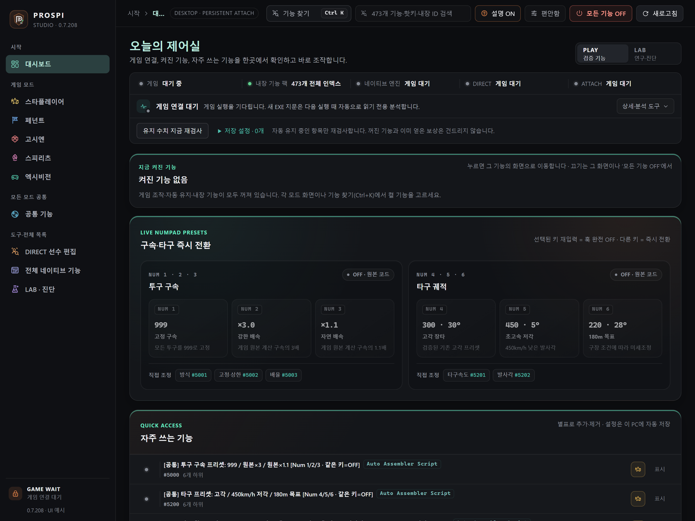

## 2 화면을 찾고 상태를 읽기

왼쪽에서 스타플레이어·페넌트·고시엔·스피리츠·엑시비션을 고릅니다. 경기 중 공통 효과는 공통 기능, 한 선수의 상세 편집은 DIRECT 선수 편집, 연구·진단 및 이전 패널은 LAB에서 찾습니다. 왼쪽 위 **실시간 | 세이브 편집** 스위치는 세이브 파일 편집 화면(33장)을 엽니다. 기본은 실시간이며 실시간 화면과 기능은 그대로입니다.

Ctrl+K의 기능 찾기는 이름·설명·내장 ID와 초성으로 화면을 찾는 도구입니다. 검색 결과를 눌렀다고 기능이 켜지는 것은 아닙니다. 대시보드의 지금 켜진 기능을 누르면 해당 기능 화면으로 이동합니다. 상단 설명 스위치는 마우스나 키보드 초점에 따라 나오는 도움말을 제어합니다.

ON은 기능이 준비되었다는 뜻이지 모든 장면에서 효과가 난다는 뜻은 아닙니다. 게임 대기, 대상 불일치, 투구 선택 대기, 경로 통과, 최근 적용값을 함께 확인하세요. LAB·실험 표시는 별도 백업에서 먼저 확인할 기능입니다. 화면을 접거나 다른 탭으로 이동해도 켜진 유지 기능은 계속될 수 있습니다.

## 3 적용과 유지와 복원을 구분하기

| 조작 | 의미 |
| --- | --- |
| 읽기 또는 목록 새로고침 | 현재 값을 가져옵니다. 읽기만으로 게임 값을 바꾸지는 않습니다. |
| 적용 또는 한 번 적용 | 확인한 대상의 지원 값을 한 번 변경합니다. 다음 게임 처리에서 달라질 수 있습니다. |
| 유지 또는 ON | 해당 기능이 켜진 동안 조건을 확인하며 계속 개입합니다. |
| OFF 또는 전체 중지 | 추가 개입을 중단합니다. 이미 지급한 능력·자원·성장까지 되감지는 않습니다. |
| 되돌리기 또는 직전 복원 | 그 기능이 보관한 대상·세션·범위 안에서만 복원합니다. 무제한 실행 취소가 아닙니다. |
| 설정 저장 | 입력값이나 지원 목록을 보관합니다. 게임 저장과는 다른 파일입니다. |

한 기능의 웹 UI와 같은 기능의 내장 원본 패널을 중복으로 켜지 마세요. 충돌 안내가 나오면 이름이 표시된 쪽을 먼저 OFF합니다. 기존 기능을 모두 껐다는 뜻으로 창을 숨기거나 작업 관리자에서 종료하지 마세요.

## 4 공통 경기기능의 대상 고르기

공통 기능의 경기 조작 화면에서 공통 경기기능 적용 대상을 찾습니다. 기본은 직접 조작 선수이며 직접 조작 선수 포함은 ON입니다. 기능 자체는 시작할 때 켜지지 않습니다.

직접 조작 선수는 고정 조작 선수가 있는 선수 플레이용입니다. 내 팀 전체는 자동으로 움직이는 동료를 포함한 내 팀의 현재 행동 선수를 대상으로 합니다. 내 팀 선수 여러 명 선택은 지금 경기 명단에서 여러 명을 체크하는 방식입니다. 이 대상 설정은 F6·F7·F8·F9와 구속·타구·구위 계열의 관련 보정이 공유합니다.

동료 두 명만 고르려면 F8·수동 묶음·관련 개별 효과를 끄고 내 팀 명단 불러오기를 누릅니다. 여러 명 선택에서 동료 두 명을 체크하고 직접 조작 선수 포함을 OFF한 뒤 적용 대상 저장을 누릅니다. 대상 저장만으로 효과가 켜지지 않으므로 원하는 기능은 이후에 켭니다. 내 선수도 함께 쓰려면 포함 스위치를 ON으로 둡니다.

조작 선수 줄은 위 포함 스위치로 관리하므로 개별 체크가 잠겨 있을 수 있습니다. 투타 겸업 선수의 타자·투수 행은 한 선수로 묶입니다. 번호키만 켜진 경우에는 대상 변경 후 같은 값으로 다시 적용하지만, F8·묶음·개별 훅 때문에 잠긴 경우에는 안내된 기능부터 OFF하세요.

고시엔 및 스타·페넌트의 전술 경기는 고정 조작 선수가 없어 기본 대상도 내 팀 전체에 적용됩니다. 그 밖의 일반 팀 조작은 내 팀 전체나 여러 명 선택을 사용하세요. 고정 조작 선수가 없는 장면에서 포함을 OFF하면 제외할 선수를 확인할 수 없어 적용을 보류할 수 있습니다. 이는 현재 수비 커서의 선수만 자동으로 제외하는 기능이 아닙니다.

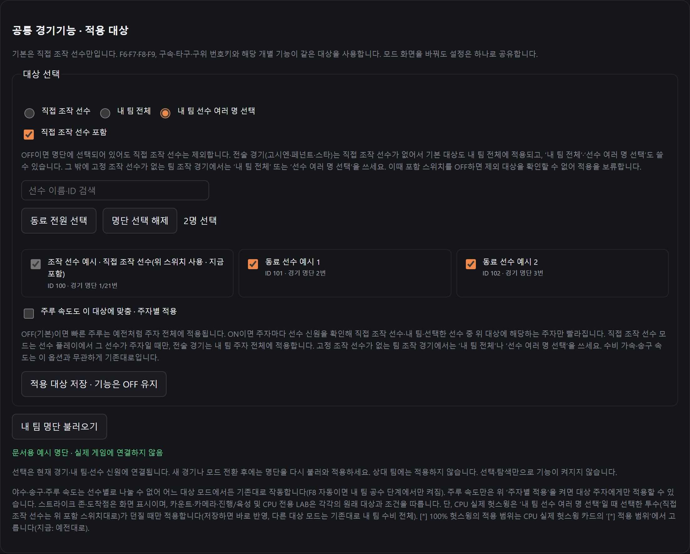

## 5 속도 기능의 범위

수비 이동·송구 공속·주루 속도는 이전 버전의 사용 범위를 유지합니다. 직접 조작 대상이라고 해서 속도 3종을 못 켜게 하지 않습니다. 동시에 이 세 가지가 기본적으로 모두 내 선수 한 명만 바꾼다는 뜻도 아닙니다.

주루만 선택한 선수에게 적용하고 싶으면 주루 속도도 이 대상에 맞춤을 켜고 대상을 저장합니다. 이 옵션은 기본 OFF입니다. ON에서는 주자마다 신원을 대조해 내 선수·내 팀·선택 선수 중 해당하는 주자의 경로 속도만 바꿉니다. 직접 조작 선수 모드에서는 그 선수가 주자일 때 적용하며, 전술 경기 기본 대상은 내 팀입니다.

수비·송구 속도는 위 주루 선택과 관계없이 기존 범위입니다. F8에서는 내 팀의 해당 공수 단계에 켜지만, 개별 훅을 켠 모든 순간에 선수별 필터가 생기는 것은 아닙니다. 주루의 별도 모션 배율 보조는 게임 2.2.0에서 효과가 확인되지 않았으므로 경로 속도 효과와 같은 것으로 보장하지 않습니다.

## 6 F6 F7 F8 F9 사용하기

F6은 투구·수비 묶음, F7은 공격 묶음입니다. 같은 키를 다시 누르면 해당 묶음을 끕니다. 반대 역할로 바꾸면 이전 역할 전용 기능을 복구합니다. 수동 F6에는 투수 체력·베스트 피치·존·도착점·수비·송구와 투구 무게 단계가, 수동 F7에는 타격면·타이밍 보정·표시·주루가 포함됩니다.

0.7.208부터는 F6·F7을 사용한 뒤 F8을 눌러도 해당 묶음을 먼저 해제하고 자동 전환으로 넘어갑니다. F2·F3·F4 등 이미 켜진 **F8 선택 구성요소**는 F8이 이어받아 해당 공수 단계에 맞춰 복구하고 F8 OFF 때 끕니다. 선택하지 않은 개별 기능은 원래 조작에 남습니다. F8 중 F2·F3·F4나 수동 F6·F7을 누르면 종전처럼 F8을 먼저 끕니다. F8이 선택을 받아들이지 못하면 수동 묶음은 유지합니다.

구종별 구위 값을 설정한 인스턴트 투수가 연결돼 있어도 F6·F8이 그 구위 LAB을 공유하고, F7이나 묶음 OFF가 구종 규칙의 LAB을 없애지 않습니다. F6·F7의 한 부가 단계가 설치에 실패하면 나머지는 적용하고 건너뛴 단계를 알립니다. 다만 F7의 핵심 타격·타이밍 세 단계는 함께 성공해야 합니다. 알림에서 빠진 단계를 확인하고 실제 경기 적용 여부를 따로 확인하세요.

F8은 선택한 구성으로 공수를 자동 전환합니다. 자동 전환 패널에서 수비·공격 항목을 체크한 뒤 선택 적용·자동 ON을 누르세요. 이후 F8은 마지막으로 적용한 구성을 켜고 끕니다. 체크만 바꾸고 적용하지 않은 내용은 반영되지 않습니다. F8의 기본 구성은 수비 6개·공격 4개이며 타이밍은 별도입니다.

F9는 타이밍·정타 보정을 따로 제어합니다. F8 중에도 자동 감지를 유지하면서 선택할 수 있습니다. 수비 중 켜면 공격까지 기다립니다. 수동 F7에는 타이밍이 포함되지만, F8 공격 구성과 F9는 구분합니다. 자동 스윙을 해 주는 기능은 아니므로 타격 입력은 직접 해야 합니다.

F8의 수비 전환음은 짧게 한 번, 공격은 빠르게 두 번입니다. 메뉴·로딩·리플레이·대상 확인 대기에서는 효과를 해제하고 기다릴 수 있습니다. 일부 설치가 일시적으로 실패하면 구성요소별로 재시도하고, 세 번 실패한 구성요소는 상태에 알리고 건너뜁니다. 다른 구성요소의 실패 횟수를 합산하지 않습니다.

0.7.193 이후에는 반복 전환의 메모리 공간 소모를 줄였고, 0.7.204에서는 재시도 단위를 고쳤습니다. 장시간 실제 경기의 모든 전환을 보장한다는 뜻은 아닙니다. 다시 실패하면 기능명과 공격에서 수비인지 반대인지 함께 제보해 주세요. 번호키·[*]의 새 적용 범위는 27장에 있습니다. F6·F7·F8 자체의 기존 대상과 수비·송구·주루 속도 범위는 바꾸지 않았습니다.

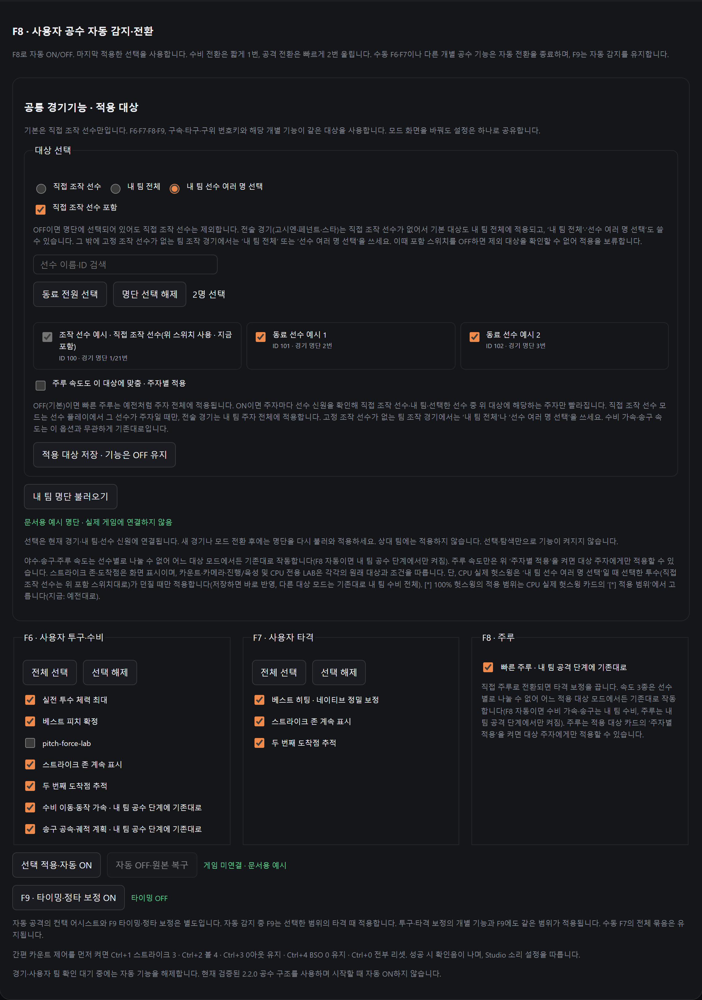

## 7 번호키와 개별 경기 기능

| 키 | 기능 |
| --- | --- |
| Num 1 2 3 | 투구 구속 고정 999, 원본 ×3.0, 원본 ×1.1 |
| Num 4 5 6 | 타구 300km/h·30도, 450km/h·5도, 220km/h·28도 프리셋 |
| Num 7 8 9 | 투구 구위·무게 계열의 화면에 표시된 프리셋 |
| F2 | 베스트 피치. 투구 입력은 직접 수행 |
| F3 | 베스트 히팅. 스윙은 직접 수행 |
| F4 | 스트라이크 존 표시 |
| Num * | CPU 실제 헛스윙의 100% 전환 ON 또는 OFF |

키보드 윗줄 숫자와 숫자패드 키는 다릅니다. 선택 중인 번호를 다시 누르면 끕니다. 구속·타구·구위 계열을 함께 쓰려면 번호키 계열 제어의 동시 사용을 확인하세요. 세 계열 전체 OFF·ON과 마지막 선택 복원도 이 영역에서 관리합니다. F8 OFF와 번호키 OFF는 별개입니다.

직접 입력은 화면의 고정값·배율·상한 또는 속도·각도를 입력한 뒤 CUSTOM 적용을 누릅니다. 180m 목표는 프리셋 이름이며 모든 공의 비거리를 보장하지 않습니다. 스트라이크 존·두 번째 도착점·볼 커서는 표시 기능입니다. 도착점을 켠다고 실제 공이 그 점을 향해 바뀌는 것은 아닙니다.

간편 카운트 제어는 먼저 공통 패널의 부모 기능을 켭니다. Ctrl+1 스트라이크 3, Ctrl+2 볼 4, Ctrl+3 0아웃, Ctrl+4 0/0/0 유지, Ctrl+0 리셋을 사용합니다. 이미 끝난 득점과 경기 이력을 되돌리는 버튼은 아닙니다.

## 8 현재 투수의 구종별 설정

공통 기능의 인스턴트 투수·구종 규칙에서 사용자 투구 장면의 현재 투수 연결을 누릅니다. 투수 이름과 12개 구종 칸을 확인한 뒤 각 칸의 구속·구위·무게·변화 및 헛스윙 항목을 정합니다.

전역 번호키 따름은 전체 기본값을 사용하고, 이 구종 원본 유지는 그 구종의 해당 항목만 보정하지 않습니다. 구종별 프리셋·직접값은 해당 구종의 예외가 됩니다. 프리셋은 선택 시, 직접 입력은 적용 시 반영합니다. 여러 구종을 각각 다르게 설정할 수 있습니다.

선택형 스피리츠 UI는 같은 설정을 게임식 등급·막대로 보여 줍니다. 변화 직접 입력은 1~20, 예리함은 0~9의 지원 범위를 따릅니다. S+와 경기 중 배율은 저장된 기본 구종 등급을 무조건 그 값으로 바꾼다는 뜻이 아닙니다.

0.7.207부터 스피리츠 타일은 구종마다 같은 작은 크기로 보입니다. 스피리츠의 등급 버튼은 입력·원래대로·적용 다음 줄로 분리했습니다. 각 블록의 제목을 누르면 **모든 구종 카드에서 그 종류의 블록**이 한 줄 요약으로 접힙니다. 위쪽 모두 접기·모두 펼치기는 안내·전역 번호키·규칙 진단까지 함께 정리합니다. 접힌 상태는 이 PC에 기억되지만 처음 설치 시에는 펼쳐져 있습니다. 접기는 보정값이나 기능 ON/OFF를 변경하지 않습니다.

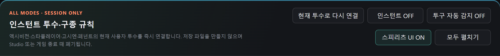

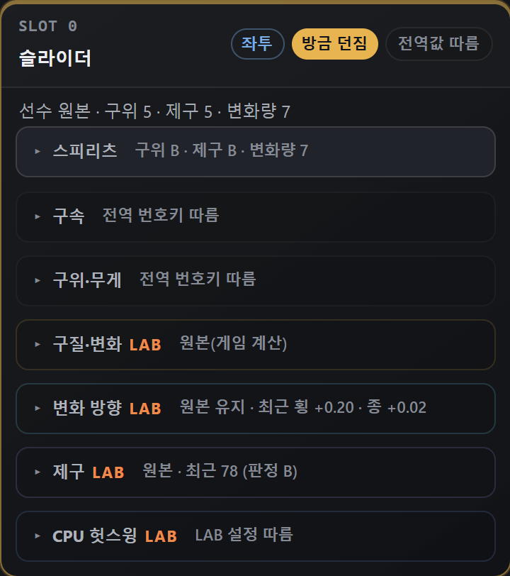

0.7.206의 스피리츠 UI ON에서는 구종 계열에 맞춰 변화 막대가 뻗습니다. 투수 뒤 게임 화면 기준으로 우투의 슬라이더계는 왼쪽, 커브계는 왼쪽 아래, 포크계는 아래, 싱커계는 오른쪽 아래, 슈트계는 오른쪽입니다. 좌투는 좌우를 반전하고 직구계에는 막대가 없습니다. 투타 정보가 아직 없으면 우투 방향으로 그리므로 연결 후 우투·좌투 표시를 확인하세요.

타일이 첫 단계이고 그 뒤에 다섯 칸과 화살촉이 있습니다. 변화량 6은 다섯 칸까지만, 7(S)은 화살촉까지 모두 채웁니다. 8·9처럼 7보다 큰 값은 가득 찬 상태에 S+가 붙습니다. 0.7.205보다 채워진 칸이 하나 적게 보여도 실제 변화값을 낮춘 것이 아닙니다. 선수 성장 능력 카드도 같은 채움 기준을 사용하며 카드 배치는 유지합니다.

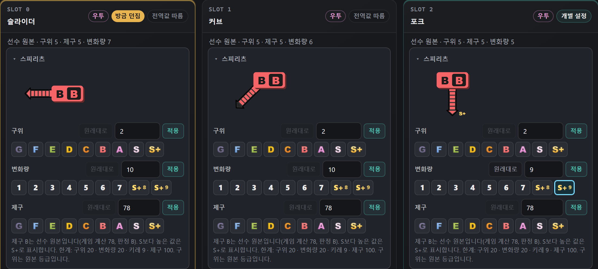

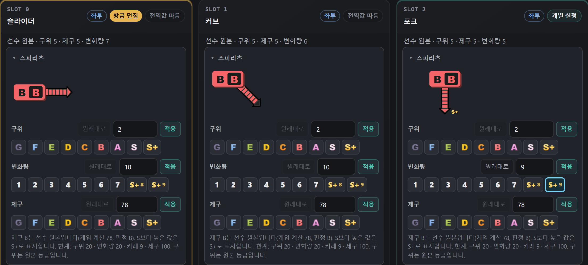

스피리츠 UI는 기본 OFF이며 숫자 편집 화면도 그대로 사용할 수 있습니다. 등급·직접값 버튼의 명령과 범위는 0.7.205와 같고, 막대 방향은 구종 계열을 나타냅니다. 별도 변화 방향 LAB에서 계수를 반대로 넣었다고 구종 계열 타일이 다른 계열의 표시로 바뀌는 것은 아닙니다.

0.7.205의 투구 자동 감지는 기본 OFF입니다. OFF에서는 투수 교체 뒤 현재 투수로 다시 연결하는 기존 방식을 사용합니다. ON으로 두면 마운드의 사용자 투수를 따라 연결하고 방금 던진 구종에 표시를 붙여 해당 카드로 스크롤합니다. 개별 보정 규칙이 없어도 감지가 켜져 있으면 원본 변화값을 관측합니다.

중요: 0.7.205·206에서는 변화 방향의 직접 적용, 제구 LAB의 직접 적용, 자동 감지 버튼이 `CT 레코드 ID가 올바르지 않습니다` 오류로 앱 처리부에 전달되지 않았습니다. 0.7.207에서 명령 연결을 고쳤습니다. 현재 버튼이 처리되더라도 자연 경기의 실제 방향·제구 효과와 투수 교체 후 복귀는 별도의 확인 단계입니다.

자동 감지는 이번 Studio 실행에서 투수별 설정을 보관합니다. 이전 투수가 다시 나왔고 12개 구종 구성이 같으면 그 투수의 설정을 되찾습니다. 처음 보는 투수는 새로 연결하며 다른 투수의 규칙을 복제하지 않습니다. 인스턴트 OFF·모든 기능 OFF는 자동 감지도 끝냅니다. 게임 프로세스가 새로 시작되면 보관한 투수 설정을 잊으므로 다시 확인하세요. 저장형 프로필과 다른 현재 실행용 설정입니다.

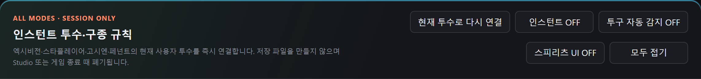

변화 방향 LAB은 일반 구종과 오리지널 구종 모두에서 사용합니다. 각 구종의 우투·좌투 표시와 화살표를 먼저 확인하세요. 원본 유지는 게임이 계산한 방향을 그대로 씁니다. 직접을 고르고 횡·종 값을 입력한 뒤 적용을 누르면 그 구종의 방향 계수를 바꿉니다. 지원 범위는 각각 −20~+20이며 변화량 등급 1~20과는 다른 값입니다. 원본값·×1.5·×2·좌우 반전·위아래 반전으로 입력을 만들 수도 있습니다.

| 인스턴트 방향 입력 | 의미 |
| --- | --- |
| 횡 + | 투수의 슬라이더 쪽. 우투는 투수 뒤 화면에서 왼쪽, 좌투는 오른쪽 |
| 횡 − | 투수의 슈트 쪽. 우투는 오른쪽, 좌투는 왼쪽 |
| 종 + | 아래로 휘는 방향 |
| 종 − | 위로 휘는 방향 |

0.7.205에서 0.7.204 대비 바뀐 동작이며 0.7.206에서도 유지됩니다. 이전 인스턴트 오리지널 구종의 직접 계수는 좌투의 좌우 반전이 반영되지 않았고 종 +가 위였습니다. 0.7.205에서는 위 표의 부호로 바뀌었으므로 이전 숫자를 그대로 옮기지 말고 투타와 방향을 다시 확인하세요. 또한 구질·변화의 직접 설정이 오리지널 구종의 횡·종을 함께 덮어쓰지 않습니다. 방향은 별도 블록에서 설정하며 처음 연결할 때는 원본 유지입니다.

예를 들어 슬라이더의 원본 횡이 +0.20이면 직접 −0.20은 슈트 쪽으로 휘게 하는 설정입니다. 구종 이름 자체를 슈트로 바꾸는 기능은 아닙니다. 원본보다 크게 입력하면 존 중심을 노려도 밖으로 벗어날 수 있습니다. 화면은 최근 게임 계산값, 규칙상 예상값, 원본 대비 배율과 홈에서의 대략적인 cm를 구분합니다. 화살표·존 안내는 추정치이며 실제 궤적이나 스트라이크 판정을 보장하지 않습니다. 최근 값이 없으면 자동 감지를 켠 뒤 해당 구종을 실제로 던져 관측하세요.

오리지널 설정의 횡·종은 베이스 구종에 더하는 기록값입니다. DIRECT에서 싱커·슈트·투심 베이스의 횡 +는 그 베이스의 슈트 방향을 더합니다. 이는 인스턴트 최종 방향에서 횡 +가 슬라이더 쪽이라는 규칙과 다릅니다. 0.7.205는 DIRECT의 이 설명을 바로잡았으며 저장값과 쓰기 동작은 바꾸지 않았습니다. 카드의 베이스 기본값 → 오리지널 설정 반영 → 변화량 계산 줄을 함께 읽으세요.

제구 LAB의 원본은 현재 구종에 대해 게임이 계산한 제구를 유지합니다. 최근 계산값과 판정 S~G를 확인하고 직접 0~100을 입력한 뒤 적용합니다. 예를 들어 85는 판정 A이며 100은 S입니다. 스피리츠 UI의 제구 등급·직접 입력·원본 복귀도 같은 기능을 조작합니다. 등급 버튼은 G~S에 25~95, S+에 100을 넣습니다. 저장된 제구 등급과 컨디션 등을 반영한 실제 계산값·판정은 서로 다를 수 있습니다.

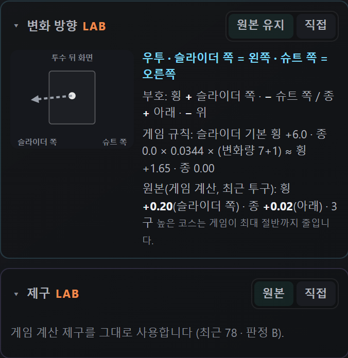

제구는 구속·변화 방향이나 무조건 스트라이크와 다릅니다. 사용자 릴리스 오차와 CPU 릴리스 판정에 쓰는 게임 계산값이며, 베스트 피칭이 켜져 있으면 사용자 쪽 제구 변화가 눈에 잘 드러나지 않을 수 있습니다. 비교하려면 베스트 피칭을 끄고 같은 구종을 던져 보세요. 원본으로 돌리면 게임 계산값을 다시 사용합니다. 이 조작은 세이브의 기본 제구 등급을 편집하지 않습니다.

진단 횟수는 계산 경로 횟수이며 투구 수와 일대일로 같지 않습니다. 이번 방향·제구·자동 감지는 코드·격리 테스트·UI·배포 검증을 통과했지만, 좌투 실제 궤적·교체 뒤 재연결·제구의 체감 차이 등 자연 경기 검증은 아직 남아 있습니다.

## 9 CPU 조준 오차와 실제 헛스윙

CPU 헛스윙·조준 오차 LAB은 조준 오차 배율과 그 배율을 사용할 확률을 정합니다. 적용 확률 50%는 헛스윙 50%가 아닙니다. 확률만 적용은 기존 배율을 유지하고 적용 빈도만 바꿉니다.

CPU 실제 헛스윙 LAB은 내 팀 수비 중 CPU가 공을 맞힐 것으로 판정된 스윙에 개입합니다. 단순 확률 또는 구위 등급 S~G와 구종 칸별 결과 비율을 사용합니다. 표에서는 헛스윙·파울·땅볼·뜬공 비율을 정하고 남는 비율은 자연 타격입니다. 자연 헛스윙도 있기 때문에 단순 확률은 전체 투구 중 헛스윙 비율과 같지 않습니다.

정밀 비율 맞춤은 관측 결과를 다음 추첨에 반영합니다. 짧은 몇 타석에서 표의 비율과 정확히 일치하지 않을 수 있습니다. 파울·땅볼·뜬공은 지원 타구 처리에 개입하는 것이며 주자 결과·안타·아웃까지 보장하지 않습니다.

Num *는 원래 맞을 CPU 스윙을 모두 헛스윙으로 바꾸는 빠른 전환입니다. 인스턴트 투수 연결이 필수는 아닙니다. 별도 옵션인 * 적용 범위는 예전대로, 넘버키와 같게, 적용 대상과 관계없이 중 고릅니다. 마지막 선택도 내 팀 수비의 CPU 스윙 조건까지 없애지는 않습니다.

인스턴트 구종별 설정 우선을 켜면 해당 구종의 설정이 *보다 우선합니다. 번호키 계열 규칙 따르기를 켜면 *도 계열 전체 ON·OFF, 마지막 선택, 동시 사용 규칙에 참여합니다. 이 옵션들은 기본적으로 예전 동작을 유지하며 현재 실행에 적용됩니다. 0.7.204에서는 *의 범위가 일반 LAB·인스턴트 규칙의 범위를 함께 넓히거나 막던 문제를 분리했습니다.

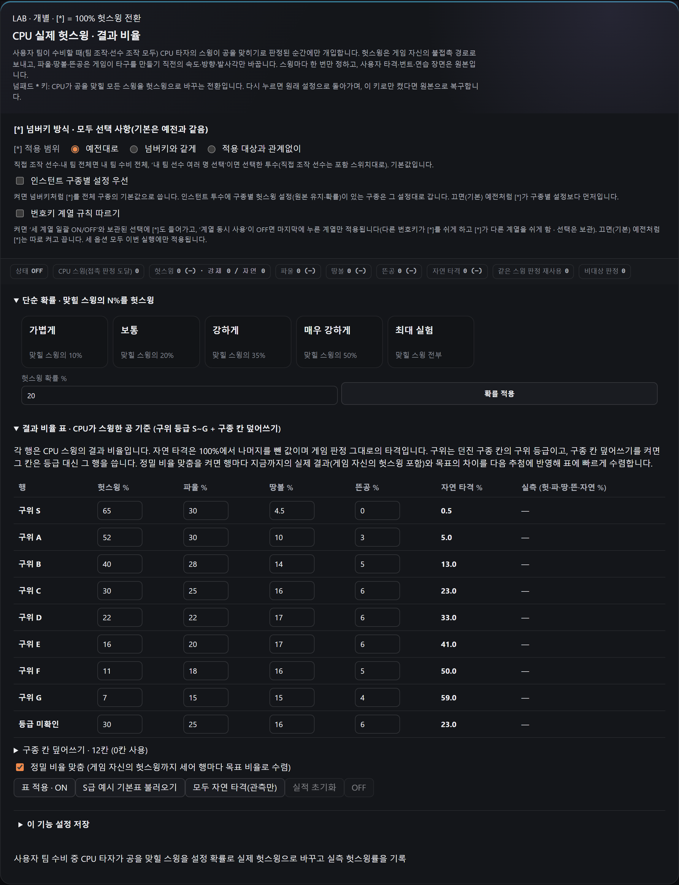

## 10 난입과 교체 요청

공통 경기 조작의 난입·교체 LAB에서 현재 모드·조작 선수·명단을 확인합니다. 스타플레이어와 페넌트·고시엔의 선수 플레이를 위한 요청이며 공통 효과의 선택 선수 목록을 난입 대상으로 쓰는 기능은 아닙니다.

Num /는 다음 수비 판단의 등판, Num -는 다음 공격 판단의 대타, Num +는 자진 강판, Num .은 물러나기입니다. 지원되는 요청은 같은 키로 취소할 수 있습니다. 후속 투수·대체 선수를 지정하거나 사용 가능한 선수를 찾도록 할 수 있습니다. 이미 교체됐거나 출전 자격이 없는 선수를 다시 투입하지 않습니다.

버튼을 눌러도 일시정지 중에는 교체 판단이 오지 않습니다. 요청 대기·판단 경로 통과·실제 적용·거부 사유를 나눠 확인하세요. 0.7.175부터 사용자 팀의 처리 경로도 연결했지만, 모든 자연 교체 상황이 실경기로 검증된 것은 아닙니다.

예약에서는 시작 이닝과 무관·리드·세이브 상황·동점·뒤질 때 같은 점수 조건, 이번 경기 또는 매 경기 적용을 고릅니다. 유지 옵션은 해당 선수의 지원 포지션에서 CPU 교체를 막습니다. 실제 교체 가능성과 남은 선수 조건은 여전히 적용됩니다.

## 11 캘린더의 날짜별 계획

난입·교체 LAB의 캘린더에서 경력과 오늘 날짜가 현재 게임과 맞는지 확인합니다. 날짜를 골라 선발·중간 투입·대타·물러날 이닝 및 유지 계획을 저장하고, 자동으로 실행하려면 캘린더 계획 자동 적용도 켭니다.

스타 투수형 선수의 미래 선발 투수 계획은 게임의 다음 선발 날짜와 연결됩니다. 오늘의 선발 일정은 다음 계획 때문에 되돌리지 않습니다. 계획 삭제·해제 시 복원은 같은 게임 세션·스타·시즌의 소유 범위 안에서만 처리합니다. 모든 야수의 경기 전 선발 라인업을 강제로 편성하는 기능은 아닙니다.

저장 계획과 실행 중 예약 의도는 다릅니다. 모든 기능 OFF는 자동 적용 의도를 멈추지만 저장된 계획을 모두 지우지 않습니다. 게임을 다시 불러온 뒤에는 경력·날짜를 재확인하세요. 0.7.219부터 게임의 DH 설정을 바꾼 시즌에도 경기 날짜가 표시됩니다(73장).

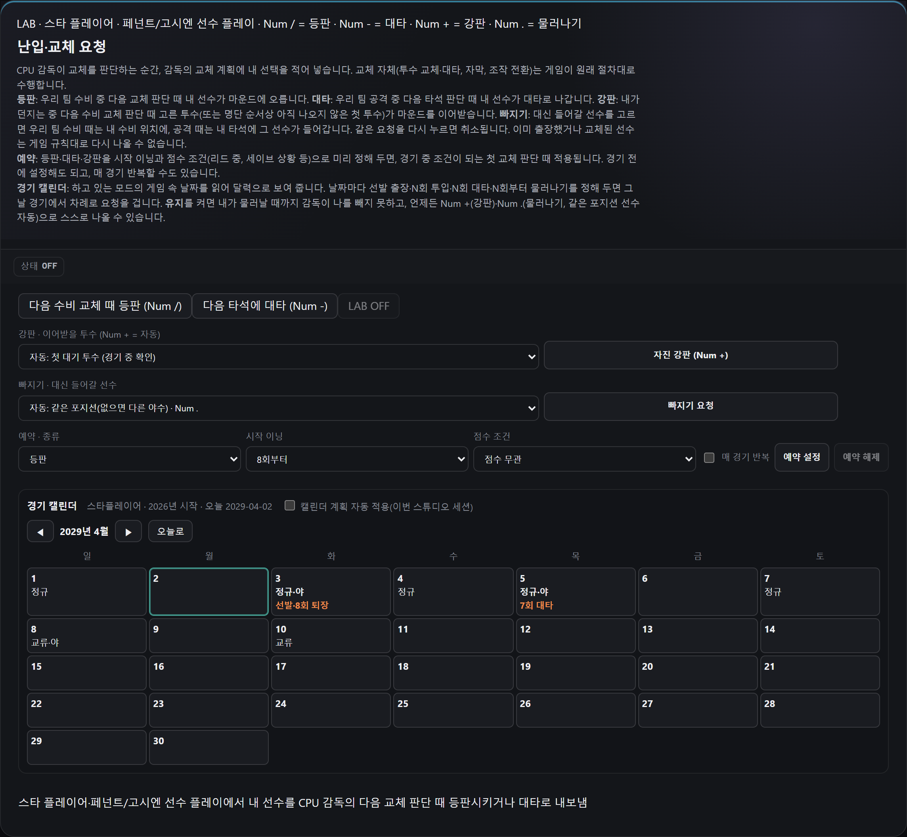

## 12 회색 메뉴와 전술 경기

일시정지 메뉴 감독 기능은 하나의 ON으로 지원 메뉴와 선수 겸 감독 처리를 함께 켭니다. 일반 오프라인 모드에서 플레이 방식 때문에 회색인 교체·설정·가이드 등 지원 항목을 열고, 작전·교체 방식은 게임 옵션의 직접·가이드·자동을 따릅니다. 자동으로 두면 CPU가 계속 판단할 수 있습니다.

모든 회색 항목을 무조건 사용 가능하게 만드는 것은 아닙니다. 대주자에는 주자가 필요하고, 리플레이에는 기록이 있어야 하며, 이미 사용한 선수를 다시 넣을 수 없습니다. 특수 모드·제한 메뉴·고시엔 고유 메뉴에는 별도 규칙이 있습니다. 불가능한 상황을 선택 가능한 것처럼 안내하지 않습니다.

고시엔 전술 경기 페넌트·스타 LAB은 경기 전에 ON합니다. 페넌트에서는 스타일 선택의 멀티 플레이 자리가 전술 경기로 바뀌며 감독 플레이는 유지됩니다. ON 중에는 그 자리의 로컬 멀티 플레이를 선택하지 않습니다. 스타는 출전일 스타일 선택에서 전술 경기로 들어갑니다.

전술 경기에는 게임의 전술 카드·CPU 카드·효과와 관련 HUD·속도·짧은 연출 연결을 사용합니다. 고유 카드는 제공하지 않습니다. 0.7.219부터는 선택 옵션으로 고유 카드와 전령을 쓸 수 있습니다(58장). 명단이 26명을 넘거나 재개 경기 등의 조건에서는 원래 감독 플레이로 진행합니다. 스타 전술 경기에는 스타 미션·평가가 없고 스타 선수도 CPU 조작입니다. 백업한 세이브로 먼저 확인하세요.

자동 경기로 끝까지는 별도 LAB입니다. 지원 일반 경기의 일시정지 메뉴에서 남은 경기를 양 팀 자동 진행으로 넘기는 기능이며 전역 다이제스트 설정을 바꾸지 않습니다. 난입 요청·메뉴 감독·전술 경기와 서로 다른 목적입니다. 전술 카드와 모든 메뉴가 모든 모드의 모든 상황에서 검증된 완전 이식이라고 안내하지 않습니다.

## 13 DIRECT 선수 편집과 데이터 모드

DIRECT 선수 편집에서 선수 구조를 고르고 목록을 불러옵니다. 스타·페넌트에서는 조회할 구단을 선택한 다음 이름·ID로 검색합니다. 선수 줄을 누르고 상세 이름·구단·투타를 확인한 뒤 값을 수정하고 적용하세요. 구단이나 모드를 바꾸면 이전 편집 선택은 해제됩니다.

기본 능력·수비 적성·특수 능력·구종·외모 등은 탭으로 나뉩니다. 능력 카드는 게임식 등급·타일로 읽는 확인 화면입니다. 투타 방향 안내를 보고 구종 방향을 판단하세요. 청특 지우기는 지원되는 나쁜 특능 하나 또는 전체를 정리하며 좋은 특능을 통째로 초기화하지 않습니다.

선수 데이터 팀별·OB·커스텀에서는 NPB·국가대표·WBC·OB 원본을 조회하고 가져오기 원본으로 쓸 수 있습니다. 원본 데이터 뱅크는 읽기 전용이고 저장된 커스텀·다운로드 선수는 지원 범위 안에서 편집합니다. 편집 가능한 저장 선수와 원본을 혼동하지 마세요.

명단에는 보이는데 상세를 못 읽으면 목록을 새로 읽고 다시 선택합니다. 0.7.159·160에서 신원 재확인과 일부 구종의 추가 비트 때문에 발생하던 실패를 보완했습니다. 추가 비트가 미확인인 구종 칸의 직접 쓰기는 별도 제한을 따릅니다.

0.7.219의 특수 능력 90 표시·능력 카드 표시와 등급형 안전 MAX·청특 지우기 변경은 70장에 있습니다.

## 14 사진으로 외모 맞추기

DIRECT의 사진·외모 LAB에서 대상 선수의 현재 외모를 읽고 정면 목표 사진을 엽니다. 눈·코·입·턱이 잘 보이는 사진을 쓰세요. 영역 확대와 검출 점 수정을 사용해 눈동자와 윤곽의 점을 확인합니다. 필요하면 옆모습 사진에 안내된 6점을 지정합니다.

자동 맞춤 미리보기를 만들고 제안값을 검토합니다. 현재 게임 얼굴의 정면 스크린샷을 넣으면 예측만으로 맞추는 대신 실제 표시된 얼굴을 기준으로 작은 보정을 할 수 있습니다. 게임 얼굴과 사진은 가능한 한 같은 각도·거리·표정으로 비교하세요.

게임의 최상위 외모 에디트 화면까지 완전히 닫은 다음 허용된 적용을 사용합니다. 임시 에디트 화면과 저장 대상에 서로 다른 값을 쓰지 않도록 하는 절차입니다. 적용 뒤 다시 같은 카메라에서 비교하고 필요하면 제공되는 되돌리기나 추가 미세 보정을 사용합니다.

이 기능은 사진을 새 3D 메시·피부 텍스처로 바꾸는 얼굴 교체가 아닙니다. 게임의 확인된 숫자 파라미터 안에서 형태를 맞춥니다. 눈썹·눈꺼풀 종류, 조명, 피부, 표정 차이는 남을 수 있으며 입술 색 등 미해석 필드는 임의로 쓰지 않습니다. 유사도 점수는 기하 측정값이지 실제 인물 재현율이 아닙니다.

## 15 선수 보관과 가져오기

공통 패널의 선수 원본 보관소는 10슬롯에 지원 선수 정보를 보관합니다. 슬롯 이름과 원본을 확인하고 외모·음성콜, 능력·특능·구종·폼 등 필요한 범주만 대상에 주입하세요. 고시엔 환산 프리셋의 수치 비율이 특능 종류 코드까지 같은 비율로 바꾼다는 뜻은 아닙니다.

0.7.194부터 슬롯을 Studio 재시작 후 복원하고 외부 프로필 파일로 입출력하는 흐름을 보완했습니다. 내보낸 파일은 게임 세이브 전체가 아닙니다. 가져오기 뒤 대상과 복사 범주를 다시 확인하세요. 직전 주입 되돌리기는 현재 기능의 원복 자료가 있는 범위에 한합니다.

선수 가져오기·드래프트 후보 교체에서는 원본 선수 선택과 목적지 선수를 각각 확인합니다. 검색 입력 직후 선택이 풀리던 문제와 오리지널 구종 발음 때문에 원본이 거부되던 문제를 수정했습니다. 다른 인물의 ID·계약·세이브 전체를 무조건 복제하는 기능은 아닙니다. 0.7.219부터 오타니 쇼헤이(게임 원본)의 스위퍼를 가진 기록도 원본으로 쓸 수 있습니다(67장).

## 16 스타플레이어 생활과 동료 훈련

스타플레이어에서 본인·소속 구단의 컨디션·부상·피로·애정도·아이템 사용 제한 및 성장·생활·교류 도구를 찾습니다. 재고를 채우는 것과 사용 횟수 제한을 유지하는 것은 별개입니다. 필요한 항목과 대상을 확인한 뒤 ON 또는 적용을 누릅니다.

동료 훈련은 게임의 선수교류에서 실제 연습이 가능한 때 사용합니다. 훈련 대상 구단을 고르고 선수 스캔 후 상대 동료를 선택합니다. 상승 배율, 상대 선택, 추가 보상은 다른 기능이므로 각각 적용 상태를 확인합니다. 입력칸에 채우기는 실제 적용과 다릅니다.

추가 보상은 기본 능력·수비 적성·보유 구종·포수 리드·특능·초록 성향·탄도 등 134항목을 개별 지정합니다. +N은 증가량이고 최종 상한은 별도입니다. 보유하지 않은 구종을 일반 증가 항목만으로 만드는 것은 아니며, 반대 성향 선택은 기존 성향을 대체할 수 있습니다. 좋은 효과인지 이름을 확인하세요.

0.7.187에서는 반대 성향과 나쁜 특능의 실제 저장값을 보완했습니다. 이미 보유한 보상을 중복 개수처럼 쌓거나 연습 이벤트 자체를 아무 때나 생성하는 기능은 아닙니다. 관계·학습 티켓 등은 해당 화면의 대상과 조건을 따릅니다.

## 17 페넌트 구단과 드래프트

페넌트는 한눈에 보기에서 작업 화면으로 이동합니다. 구단 통합 편집은 명단 갱신 뒤 대상 선수·범위를 골라 연봉·계약·FA·능력·아이템 효과를 적용합니다. 다른 구단을 열람하는 것과 자동 유지할 내 구단을 지정하는 것은 별개입니다. 0.7.219부터 이 구단 통합 편집(통합 패널)의 일은 왼쪽 사이드바의 **통합 상황실**(64장)에서 하고, 원래 패널은 LAB → 옮긴 원본에 그대로 있습니다.

자동 유지는 고정한 내 구단의 컨디션·부상·피로·애정도·사용 제한 등을 처리합니다. 구단 변경이 잠겨 있으면 관련 유지부터 OFF합니다. 0.7.201에서는 같은 선수·같은 칸으로 확인된 포스트시즌 사본을 함께 처리하도록 보완했습니다. 일본시리즈 경기 중 정규 표가 비는 경우에는 경기 사이에 값을 맞춥니다.

드래프트 후보 새로고침으로 현재 후보를 읽고 원본 검색으로 교체할 선수를 고릅니다. 게임에서 드래프트 발굴·조사 후보 목록을 열어 두라는 안내를 따르면 됩니다. 교체 시에도 현재 화면을 다시 확인합니다. 표시된 실제 능력은 게임의 조사 예상치와 다를 수 있습니다. 0.7.220부터 후보 목록은 게임의 현재 목록만 보여 주고, 고른 후보는 ☆로 내 후보에 따로 저장할 수 있습니다(76장).

중복 지명 당첨 기능은 지원하는 일반 드래프트 1순위 추첨 전에 켭니다. 지명할 선수는 게임에서 직접 선택하며 이미 끝난 추첨을 바꾸지 않습니다. FA 취득 조정은 지원 취득 상태·현재 시즌 자격의 보정이며 이적 협상을 자동 완료하는 기능이 아닙니다.

## 18 페넌트와 스타의 선수 성장

선수 성장에서 모드와 운영 구단을 확인합니다. 페넌트는 고른 선수, 구단 전원, 모든 구단 모든 선수 중 대상을 고르고, 구단·1군/2군·투수/야수 등의 필터로 좁힐 수 있습니다. 선택만으로 값은 바뀌지 않습니다. 스타의 같은 화면은 동료 성장용이며 직접 조작하는 스타 본인은 제외합니다.

매일 +N은 일정 성장 처리에 증가분을 넣습니다. 성장기 유지는 판정 나이와 성장 시기 판정을 조절하고, 판정 나이 옵션은 더 젊게 계산하거나 능력 동결을 선택합니다. 생년을 직접 고치는 기능이 아닙니다. 동결은 감쇠뿐 아니라 해당 성장 처리도 막을 수 있으므로 성장 보너스와 구분하세요.

선수별 세부에서 선수를 배치하고 능력·구종·좋은 특능·나쁜 특능·초록 특성·타입을 고릅니다. 항목별 하루 상승폭, 특능 단계·목표 등급을 정하고 이 선수 성장 ON 및 전체 적용·시작을 사용합니다. 엔진 설치와 실행은 별도 상태입니다. 현재 능력 읽기 뒤 구종별 항목과 지원 구종 추가를 사용할 수 있습니다.

새 화면에는 선수 30명·항목 20개 고정 UI 제한이 없습니다. 필요한 슬롯과 항목이 늘어납니다. 같은 항목을 중복해서 넣으면 무조건 배수가 되는 방식은 아니며 화면 안내를 따릅니다. 원본 내장 패널은 LAB의 옮긴 원본에 남아 있고 그 패널 자체의 옛 제한은 별개입니다.

특능 지금 1단계는 즉시 지급 동작입니다. 전체 중지는 추가 성장을 멈출 뿐 이미 오른 능력을 돌려놓지 않습니다. 0.7.191은 일정 진행 충돌을 수정했고, 0.7.204는 한 번에 처리할 수 없는 남은 성장일을 다음 처리에 남깁니다. 하루·이벤트·프레임은 서로 다릅니다.

## 19 성장 목록 저장과 세이브 연결

기본은 페넌트·스타의 운영 구단별, 고시엔의 학교별 목록 자동 저장입니다. 재시작 후 설정은 불러오되 성장 엔진을 자동으로 시작하지 않습니다. 과거 단일 목록은 첫 해당 구단·학교에서 이어받고 원본 파일을 보존합니다.

목록 저장의 세이브 파일 따라가기는 선택 기능입니다. 게임 저장의 정보를 읽어 성장 목록을 연결하며 게임 세이브 파일 자체를 덮어쓰는 기능은 아닙니다. 같은 날짜의 저장이 여러 개라면 게임에서 불러온 세이브를 직접 고릅니다. 애매한 후보를 자동으로 같은 저장이라고 단정하지 않습니다.

이적·은퇴 시는 선수를 따라감, 이적은 물어보기·은퇴는 해제, 모두 자동 해제 중 고릅니다. 이적 확인에서 계속 키우기 또는 해제를 선택할 수 있습니다. 고시엔은 설정 유지 또는 졸업·퇴부는 해제입니다. 해제 기록이 있으면 되돌릴 수 있습니다.

파일로 내보내기와 파일에서 불러오기는 목록의 이동·백업용입니다. 0.7.204에서는 큰 목록의 입출력을 지원하고, 읽기 실패를 빈 목록으로 판단해 현재 설정이나 기존 파일·백업을 덮어쓰던 문제를 막았습니다. 읽기 실패가 나면 원본 파일을 지우지 말고 메시지와 파일을 보존하세요.

## 20 고시엔 확장 관리

고시엔의 확장 관리에 중복된 조작을 모았습니다. 학교·훈련·아이템과 자동 유지의 이전 위치에서는 상태와 이동 버튼으로 연결합니다. 기능이 사라진 것이 아니며 원본 확장 패널은 LAB의 옮긴 원본에 남습니다.

| 영역 | 사용하는 방법 |
| --- | --- |
| 학교와 자원 | 현재값을 읽고 바꿀 항목만 수정한 뒤 한 번 적용. 지속 고정과 직전 한 단계 복원은 별도 |
| 12칸 훈련표 | 칸별 훈련을 선택하거나 일괄 값을 채운 뒤 적용·고정 |
| 훈련장비 | 26종의 수량을 선택해 적용 또는 유지 |
| 감독 특능 후보 | 특수훈련에서 제시할 후보를 조정. 학생에게 즉시 지급하는 것과 다름 |
| 스카우트 제의 성공 | 지원 제의 판정 때 사용. 지역 후보를 직접 만드는 것과 다름 |
| 동경 선수 등장 | 등장 판정과 회당 설정을 조정 |
| 특수훈련 성공률 | 원하는 성공률과 적용 상태를 확인 |
| 경험치 배율 | 전체 부원의 훈련 경험치 ×2~×100. OFF가 기본 |

그라운드 레벨도 한 번 적용과 지속 유지를 구분합니다. 경험치 배율 DIRECT와 원본 패널의 같은 배율 페이지를 중복으로 켜지 마세요. 개별 선수 성장 배율과 전체 배율을 함께 사용하면 수치가 커질 수 있어 먼저 하나씩 확인하는 편이 좋습니다. 0.7.219부터 확장 관리에 **09 상대 학교** 페이지가 있습니다(66장).

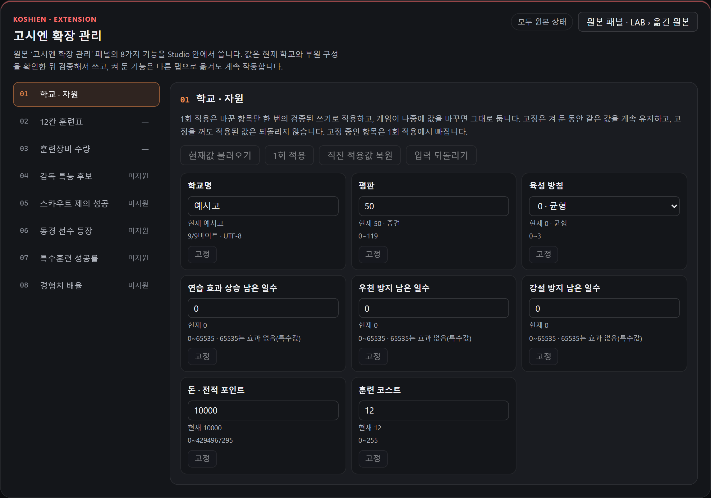

## 21 고시엔 부원 성장과 입학

고시엔 선수 성장에서 학교와 부원 목록을 읽습니다. 부원 전체 행 또는 부원별로 훈련 경험치 배율을 고르고, 전 능력 또는 선택한 능력만 대상으로 정합니다. 목록은 학교별로 보관하며 전체 적용·시작 뒤 실제 훈련 이벤트에서 적용됩니다. 이미 쌓인 능력을 한 번에 배율로 곱하는 기능은 아닙니다.

고시엔 부원의 구종 계보를 비교하려면 DIRECT 선수 편집에서 **고시엔 · 부원**을 읽고 한 부원을 선택한 뒤 **구종 계승 확인**을 엽니다. 현재 학교·경기 사본의 12구종과 오리지널 구종 정의를 단계별로 기록하고, 기록 새로고침이나 CSV 내보내기를 사용할 수 있습니다. 0.7.206까지는 이 세 버튼의 명령 전달 오류가 있었고 0.7.207에서 고쳤습니다. 기록은 읽기 전용이며 졸업·수출 때 자동으로 이전된다는 보장은 아닙니다.

컨디션·아이템·사용 제한은 자동 유지의 대표 조작을 사용합니다. 현재 학교와 동일한 것으로 확인된 복제 명단도 처리하지만 모든 지역·예선·준결승·결승을 실제로 전부 검증했다는 뜻은 아닙니다. 대회 전환 뒤 대기하면 모드·명단을 다시 확인합니다.

스카우트·입학 도구는 지역 후보 교체, 등장·성공 판정, 입학 전 예약, 실제 일반 입학생 선택 교체를 구분합니다. 원본 선수와 목적지 지역·학년·학생을 확인한 뒤 적용하세요. 천재형, 이름 가져오기, 기존 선수·다운로드 선수 사용, 구종 중복 방지·오리지널 구종 예약도 각자의 적용 시점이 다릅니다.

이미 입학한 학생과 입학 예정자를 혼동하지 마세요. 감독의 특능 후보 목록을 바꾸는 것과 부원의 특능을 직접 지급하는 것도 다릅니다. 복원 버튼은 해당 기능이 기억하는 현재 대상 범위에서 사용합니다.

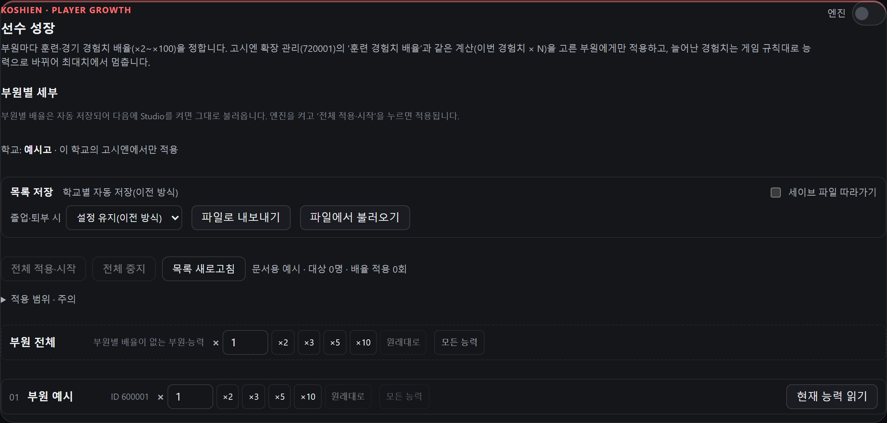

## 22 스피리츠와 엑시비션

스피리츠의 포인트·육성 화면은 실제 생성 선수 데이터가 로드된 뒤 새로고침해서 사용합니다. 셔플·더블업·특훈 횟수, 투구·스태미나·정신·구종·타격·수비·스피리츠 포인트 등 필요한 값을 입력하고 해당 페이지 적용을 누릅니다. 결합된 특능 원값이나 비트마스크를 무조건 최대로 넣는 방식은 피하세요.

생성 선수 가져오기와 DIRECT 편집은 현재 생성 대상의 신원을 확인합니다. 게임의 다른 모드 포인트까지 동시에 바꾸는 것이 아닙니다. 인스턴트 구종 화면의 스피리츠 UI 선택은 표시 방식이며 실제 스피리츠 경력으로 모드를 바꾸지 않습니다.

엑시비션 화면은 현재 경기 상태와 내 팀 컨디션·부상·피로 유지를 제공합니다. 스타 경력이 열린 상태는 엑시비션으로 잘못 처리하지 않습니다. 투타 겸업의 투수 행도 조작 선수로 연결하는 처리가 포함됐습니다. 일반 팀 조작의 공통 효과는 대상 카드에서 내 팀 전체 또는 여러 명 선택을 확인하세요.

## 23 공통 패널과 카메라

공통 패널에는 카운트, 홈런·더그아웃 세리머니, NPB 뉴스 보조, 선수 보관, 구종 유지 등 기존 도구가 있습니다. 자동 랜덤 세리머니는 별도로 OFF해야 하며 뉴스 보조는 프로그램 전체 언어를 영구 변경하는 기능이 아닙니다.

카메라·옵션의 58항목은 투타·수비·주루 카메라, 표시·조작 방식, CPU 난이도 등 게임 옵션을 조정합니다. 패널 열기만으로 적용하지 않으며 원하는 선택 후 게임이 옵션을 구성하는 장면에서 반영됩니다. 게임 설정 유지는 그 항목의 강제를 멈춥니다. 이미 열린 장면은 재진입이 필요할 수 있습니다.

전체 네이티브 기능 목록은 고급 호환 경로입니다. 옮긴 원본과 현재 웹 화면이 같은 효과를 쓰는 경우 중복 실행하지 마세요. 사용자 대상·부모 기능·자식 값·적용 버튼을 차례로 확인합니다. 상세 보상·아이템·옵션의 개별 목록은 GitHub README의 기능별 안내와 표를 함께 보세요.

## 24 설정 보관과 종료

지원 카드의 현재 입력 설정 저장은 입력값을 보관합니다. 설정만 불러오기와 자동 ON 요청은 다릅니다. 0.7.209부터 검토된 스타플레이어 확장 관리 내장 패널 #740001만 자동 ON 요청 줄을 패널을 열 때마다 되살리고, 해당 레코드의 자동 ON은 시작할 때 패널을 엽니다. 다른 패널의 종전 동작은 그대로입니다. 설정 파일을 가져왔다고 현재 경기의 선수 신원과 주소까지 유효해지지는 않습니다. 공통 대상의 선택 명단과 인스턴트 투수 설정 등은 현재 세션용입니다.

종료 전 필요한 게임 저장을 별도로 관리하고 모든 기능 OFF 또는 해당 기능의 OFF를 사용한 뒤 Studio 메뉴에서 정상 종료합니다. 창 숨기기나 패널 닫기와 구분하세요. 게임이 켜진 상태에서 Studio를 강제 종료하면 활성 코드의 복원이 끝나지 않을 수 있습니다.

업데이트는 Studio 정상 종료 후 새 EXE로 바꾸면 됩니다. 게임 설치 파일이나 LocalAppData 설정 폴더 전체를 삭제하지 않습니다. 앱 이전 버전으로 돌아가도 이미 수정된 게임 저장은 되돌아가지 않습니다.

## 25 문제를 확인하고 제보하기

실행이 안 되면 .NET Desktop Runtime과 WebView2 설치 상태, 표시된 오류를 확인합니다. 흰 화면·실행 직후 종료는 startup 로그가 도움이 됩니다. 0.7.209부터는 게임 실행 파일 확인이 길어져도 Studio 화면을 먼저 열고 그동안 읽기 전용으로 기다립니다. 시작·연결이 세 번 연속 실패하면 원인 분석 보고서를 바탕화면에 저장할지 한 번 묻고, 호환성 화면의 진단 로그 저장으로 직접 만들 수도 있습니다. 이미 실행 중이면 다른 창이나 트레이 아이콘을 먼저 확인하고 강제 중복 실행하지 마세요.

ON인데 효과가 없으면 모드·선수/팀 조작 방식, 대상과 포함 스위치, 실제 투구·타격 역할, 현재 투수 연결, 상태의 대기·거부 이유를 봅니다. 모든 기능을 한꺼번에 바꿔 보기보다 해당 기능 하나의 메시지를 확인하는 편이 원인을 찾기 쉽습니다.

버전, 모드, 경기 방식, 켠 기능과 설정값, 기대한 결과, 실제 결과, 발생 직전 동작과 오류 문구를 제보에 포함해 주세요. 사진과 로그에 계정·경로·개인 저장 자료가 있으면 공개 전에 가립니다. 자동 검사 통과는 모든 실경기와 모든 PC의 정상 동작 보장이 아닙니다.

0.7.219부터 화면 하나를 그리다 오류가 나면 검은 빈 창 대신 그 화면 안에 오류 상자가 나옵니다(71장). 제보할 때 그 문구와 진단 로그를 함께 보내 주세요.

## 26 다운로드와 참고

공식 배포와 오류 제보: https://github.com/PrimeTimerer/ProspiStudio

전체 변경 기록: CHANGES_0_7_159_TO_220.ko.md

배포 파일은 Prospi26Studio.Single.exe이며 0.7.220 공개 패키지는 21,787,162바이트입니다. SHA-256은 9E63905B88A98A640B10B70A21C8DBC3F82B31CA8FE7351E8BEA1F4D14BB5A57입니다.

## 27 번호키·[*]를 내 팀 전체나 양 팀에 쓰기

기존 Num 1~9 및 Num * 조작은 그대로입니다. 새로 `Ctrl+Num 1~9` 또는 `Ctrl+Num *`를 누르면 그 번호키 기능을 홈·원정과 선택 명단에 관계없이 양 팀 범위로 켭니다. 상대 팀에도 적용되므로 경기 결과를 바꾸기 전에 범위를 꼭 확인하세요. 같은 키를 다시 눌러 해당 기능을 끕니다.

공통 기능의 번호키 범위에서 **번호키·[*] 내 팀 전체**를 켜면 Ctrl을 누르지 않은 평소 번호키도 내 팀에서 지금 행동하는 선수들에게 적용합니다. 이 옵션은 기본 OFF이므로 설정하지 않으면 0.7.208의 번호키 동작을 유지합니다. 이 옵션은 F6·F7·F8 및 수비·송구·주루 속도를 자동으로 양 팀 범위로 바꾸지 않습니다.

## 28 드래프트의 실제 게임 목록 보기

0.7.220부터 페넌트 드래프트 후보 화면은 게임이 현재 공개한 후보 목록(**게임 목록 N명**)만 투수·야수·포수·내야수·외야수 페이지 기준으로 보여 줍니다. 0.7.218~0.7.219의 **발굴된 후보**·**미발굴 등**·**저장된 전체** 보기는 없어졌고, 미발굴 후보는 목록 아래의 접힌 **미발굴 후보 발굴** 구역(54장)에, 따로 저장한 후보는 **내 후보**(76장)에 있습니다. 게임 코드나 특별 후보 설정을 확인하지 못하면 목록을 추측해서 확정하지 않고 확인 불가 이유를 표시하며, 그때는 후보를 보여 주지 않습니다. 후보 선택·교체·지명 기능과는 별개의 읽기 보기입니다.

검색에서는 이름 단어의 순서를 바꿔도 찾을 수 있습니다. 게임 목록에 없는 후보(미발굴)가 있는 것은 보통 오류가 아니라 공개 여부의 차이입니다. 실제 게임 화면의 인원수와 다르면 현재 시즌·후보 페이지·특별 후보 설정을 함께 제보해 주세요.

## 29 전술 경기 화면과 연출 선택

페넌트·스타플레이어에서 고시엔식 전술 경기를 여는 기존 LAB은 그대로입니다. 해당 전술 경기에 한해서 수비 배치 지도를 아래로 내리고 고시엔식 상황 메시지 줄을 표시합니다. 각각 OFF로 돌릴 수 있습니다. 삼진 뒤 다음 타자의 등장 연출은 기본 **버튼으로 건너뛰기**이며 버튼을 누르지 않으면 원래처럼 재생됩니다. **고시엔처럼 짧게** 또는 **원래대로(예전)**도 선택할 수 있습니다. 실제 고시엔 원본 경기나 일반 감독·다이제스트 경기의 규칙을 이 옵션이 모두 바꾸는 것은 아닙니다.

전술 경기를 켜는 것, 일시정지 메뉴 감독, 난입·교체, 자동 경기로 끝까지는 독립된 기능입니다. 필요한 기능을 함께 켤 수 있지만 회색 메뉴가 게임 규칙상 허용되지 않는 상황까지 무조건 활성화되는 것은 아닙니다. 실제 경기에서 HUD나 타자 등장 동작을 확인하지 못한 경우 버전·모드·직전 플레이를 제보해 주세요.

## 30 특능·오리변 가져오기

DIRECT 선수 편집에서 대상 선수를 읽고 **특능·오리변 가져오기** 탭을 엽니다. 페넌트의 어느 구단이든, 스타의 조작 선수·동료, 고시엔 부원, 스피리츠·커스텀의 쓰기 가능한 선수에게 사용합니다. 스타 본인을 리그 명단 사본에서 고르면 거부하므로 **스타 · 조작 선수** 명단에서 고릅니다. 고시엔은 학교 메뉴에서 확인되는 현재 부원이어야 합니다.

원본 이름·ID를 검색하고 범위(게임 선수 / 커스텀·다운로드)와 보유 필터를 고릅니다. 현역·OB·해외·WBC·국가대표 등 검색된 원본 하나를 선택하면 이 선수에게 없는 특능과 오리지널 구종이 표시됩니다. 가져올 항목을 체크하고 **미리보기 → 적용**을 누릅니다. 같은 방향의 서로 다른 오리변 두 개를 함께 선택하면 빈 1구종·2구종 칸에 순서대로 들어갑니다(0.7.211 수정). 두 칸이 차 있으면 바꿀 구종을 명시적으로 고릅니다. 같은 정의를 중복 설치하지 않습니다.

이름·ID·생일·소속 및 고르지 않은 능력은 그대로입니다. 대상의 기존 특능보다 낮은 단계는 선택할 수 없고, 원본 오리변 값이 검증 범위를 벗어나면 그 오리변만 건너뜁니다. 적용 후 **직전 가져오기 되돌리기**는 같은 게임 세션·같은 선수의 해당 값이 이후 바뀌지 않았을 때만 원래 바이트로 돌립니다. 게임 저장을 이미 했다면 저장 자체를 되감는 버튼은 아닙니다. 먼저 별도 세이브에서 한 항목을 시험하고 게임 표시·저장 후 재접속을 확인하세요.

세이브 편집에서도 같은 화면으로 세이브 안의 선수에게 가져올 수 있습니다(46장). 게임 원본 오타니 쇼헤이의 스위퍼도 0.7.219부터 가져올 수 있습니다(67장).

## 31 호환성·진단과 오류 메시지

검토된 게임 2.2.0에서는 기존 호환 경로가 기본입니다. **관대 호환 모드**는 실행파일이 순정(또는 34장의 인정된 다른 패치)으로 확인되지 않을 때만 효과가 있습니다. 0.7.212부터 버튼은 항상 보이고 켜기·끄기가 다음 실행에도 기억됩니다(35장). 기능마다 코드 자리와 원본 바이트를 확인한 뒤 켜려고 하지만, 선수 편집기와 내장 패널은 여전히 2.2.0 주소·구조를 사용합니다. 업데이트된 게임에서는 목록이 비거나 값이 이상할 수 있고 멈춤·종료도 가능합니다. 별도 세이브 백업 없이 사용하지 마세요. 새로 설치하면 OFF이며, 켜 두어도 검토된 게임에서는 예전 경로 그대로입니다.

성장기 유지 등에서 **AOB가 일치하지 않아** 거부될 때는 해당 코드 자리를 쓰는 Studio 기능·내장 패널 또는 외부 변경을 가능한 범위에서 이름과 함께 안내합니다. 다른 소유자가 그 자리를 원복한 후에는 새로 연결하지 않아도 다시 찾습니다. 안내가 모호하면 설치를 반복하지 말고 진단 로그와 정확한 오류 문구를 보존하세요. 실제 게임 2.2.0 업데이트 후의 관대 모드 안정성, 모든 선수·시즌의 전술·드래프트·가져오기 효과는 아직 실경기 검증 대기입니다.

## 32 모션 LAB으로 폼과 동작 보기

왼쪽 **모든 모드 공통 → 모션 LAB**(기능 찾기에서도 검색됨)을 엽니다. 이 화면을 열 때만 게임 설치 폴더의 동작 자료(RES00 파일)를 **읽기 전용**으로 읽습니다. 게임 파일과 게임 메모리에는 아무것도 쓰지 않으며, 다른 화면과 기존 기능은 그대로입니다.

설치 위치는 실행 중인 게임, Steam 라이브러리 순서로 찾습니다. 찾지 못하면 **게임 위치 지정**에 게임 폴더를 입력하세요. 위쪽의 RES00 확인 결과가 검토된 2.2.0 빌드와 일치하는지 표시합니다.

왼쪽 목록은 **투구(와인드업) 665개 · 세트 610개 · 타격 736개**의 폼입니다. 선수 이름·번호·폼 번호로 검색하고, **빈 슬롯**(아무 선수도 쓰지 않는 칸)·**숨김**·**공용** 필터로 좁힙니다. 폼을 누르면 오른쪽에서 구간(M000 준비·와인드업, M001 릴리스·팔로스루 등)을 골라 재생·정지, 키 이동, 프레임 이동, 재생 속도를 바꿔 봅니다. 보기 안을 누른 뒤 스페이스는 재생/정지, ←/→는 1프레임, Shift+←/→는 키 단위 이동입니다. 정면·측면·위·좌우 뒤집기·시점 초기화 버튼으로 막대 인형을 돌려 봅니다.

막대 인형의 뼈대 연결은 아직 추정이라 **임시 뼈대** 표시가 붙고, 릴리스 프레임 표시도 추정입니다. 게임 화면의 모습과 똑같다는 보장은 아닙니다.

**편집 미리보기**는 0.7.214부터 폴리곤 인체 편집기로 바뀌었고, 편집한 동작을 게임에 쓰는 방법은 37장에 있습니다. 이 장의 목록·재생·필터는 그대로입니다. 0.7.220부터 목록에 **내 폼 파일** 탭이 생겼고(75장), **◀ 폼 목록 접기**로 목록을 접어 편집 화면을 넓힐 수 있습니다(37장).

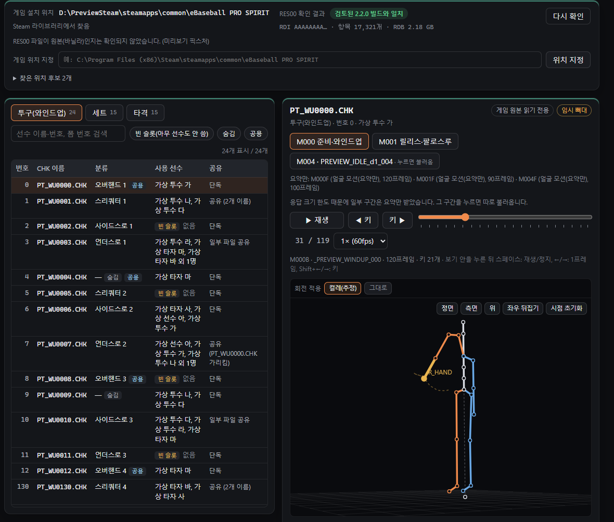

## 33 세이브 편집 모드

왼쪽 위 **실시간 | 세이브 편집** 스위치로 전환합니다. 기본은 **실시간**이며 실시간의 메뉴·기능·단축키는 전과 같습니다. **세이브 편집**으로 바꾸면 왼쪽이 **스타플레이어 · 페넌트 · 고시엔 · 에디트 선수** 섹션과 **기타 세이브**, **백업·기록**으로 바뀌고, 각 섹션 아래에 슬롯이 게임 안 날짜·제목과 함께 표시됩니다. 다른 위치의 파일은 **경로로 파일 열기**를 씁니다.

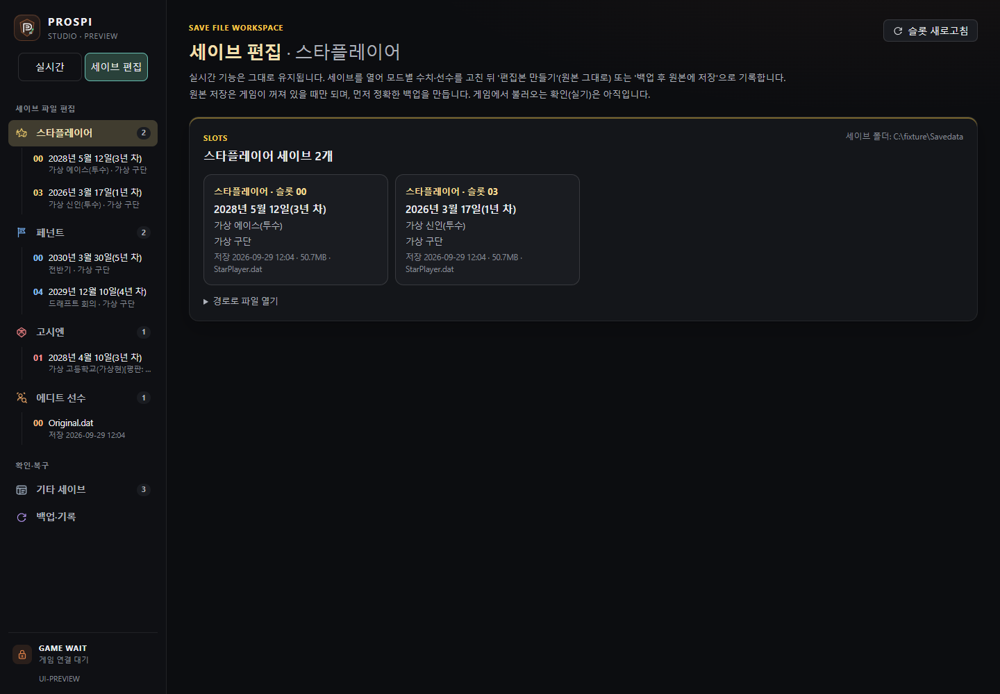

슬롯을 열면 파일의 암호화·압축·체크섬을 검증한 뒤 **검증 완료**와 저장 시각·크기를 보여 주고, 모드별 페이지 탭을 엽니다. 페이지는 파일 구조를 확인한 항목만 나옵니다.

| 모드 | 편집할 수 있는 페이지 |
| --- | --- |
| 스타플레이어 | 생활·인간성(소지금·컨디션·피로·인간성 5종), 성장 경험치(능력·수비 위치·구종), 취미 9종 레벨, 생활 소유물 37종, 아이템(특능 경험치 책·장비 배트·스파이크·글러브 수량, 255=미보유), 인물 교우 12명, 선수 |
| 페넌트 | 구단 자금, 선수 |
| 고시엔 | 학교(학교 자금·평판·육성 방침), 훈련 장비 26종, 비용·일수(훈련 코스트·연습 효과 상승·우천 방지·강설 방지 남은 일수), 그라운드(레벨 기본값), 감독 특능, 부원 |
| 에디트 선수 | 에디트 선수 |

아직 위치를 확인하지 못한 항목은 열린 파일의 **위치 확인 전 · 아직 편집할 수 없는 항목** 상자에 표시됩니다. 스타 캐릭터 레벨·연습 레벨, 여러 모드가 함께 쓰는 System.dat 아이템(스타 VP 소비재·페넌트 아이템), 페넌트 드래프트 후보, 고시엔 학교 랭크·이름 등은 이번 버전에서 편집할 수 없습니다.

선수 페이지에서는 명단에서 선수를 고르고 능력치, 수비 적성, 투수 수비·구속·스태미나, 포수 리드, 주 수비 위치, 투타, 코스 9칸, 특수 능력, 구종 12칸(DIRECT와 같은 이름·등급), 고시엔 학년을 바꿉니다. 이름과 ID는 바꾸지 않습니다. 스타 본인은 명단 맨 위의 **스타 본인**에서 편집하며, 같은 선수의 여러 사본을 함께 기록합니다. 페넌트 세이브가 개막일·드래프트 회의처럼 시즌 사이 명단 사본을 가진 시점이면 선수 편집을 잠그고 자금만 편집할 수 있습니다. 거부될 때는 이유가 한국어로 표시됩니다.

0.7.216부터 선수 페이지에서 DIRECT 선수 편집과 같은 작업(오리지널 구종 장착, 일괄 작업, 성향·투구폼, 특능·오리변 가져오기, 수집, FA 판정)도 할 수 있습니다. 46장을 보세요.

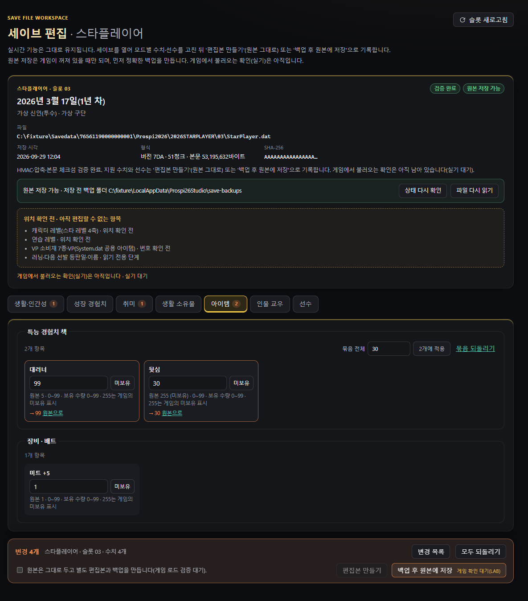

바꾼 값은 아래 변경 목록에 모입니다. 저장 방법은 두 가지입니다.

- **편집본 만들기**: 원본은 그대로 두고 별도 폴더에 편집본과 원본 백업·기록을 만듭니다.
- **백업 후 원본에 저장**(LAB, 게임 확인 대기): 게임이 꺼져 있을 때만 됩니다. 이어하기(Resume) 세이브가 있거나 파일이 연 뒤에 바뀌었으면 거부합니다. 먼저 정확한 원본을 `%LOCALAPPDATA%\Prospi26Studio\save-backups`에 남기고 다시 읽어 확인한 뒤 교체하며, 교체 후에도 다시 읽어 확인합니다.

저장 전 확인 창에 모든 수치·선수 변경과 기록 위치, 백업 폴더가 나옵니다. 원본에 저장하면 다음 Steam 동기화 때 이 세이브가 올라갑니다. 충돌 창이 뜨면 이 PC(로컬) 쪽을 고르세요. **백업·기록**에서 백업을 골라 **백업에서 되돌리기**를 누르면 그때의 파일로 돌아갑니다(되돌리기 전 현재 파일도 백업).

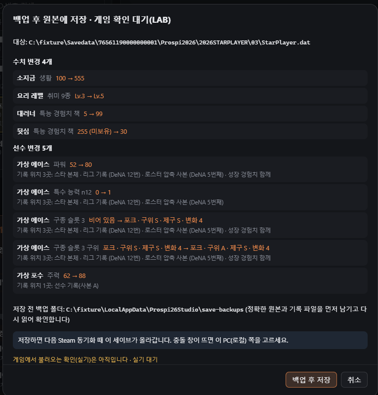

**게임이 편집된 세이브를 불러오는 확인(실기)은 아직입니다.** 처음에는 세이브를 따로 복사해 두고 쓰지 않는 슬롯이나 편집본으로 먼저 시험하세요. Studio가 저장한 파일은 선수 성장의 세이브 따라가기가 게임 저장으로 오인하지 않습니다.

## 34 다른 패치가 적용된 게임 실행 파일

한글패치처럼 **이름·학교 같은 데이터만 바꾼 2.2.0 실행 파일**은 전체 파일 해시가 달라도 게임 코드·주소 구조가 순정과 같은지 확인한 뒤 **다른 패치가 적용된 2.2.0 실행 파일(게임 코드는 순정과 같음)**으로 인정하고 모든 기능을 그대로 씁니다(0.7.212). 한글패치 V1.4를 다른 옵션·순서로 적용한 파일과, 예전에 거부되던 학교 이름만 바꾼 파일도 포함됩니다. 호환성 표시줄에는 그 이름과 **모든 기능을 그대로 씁니다**가 나옵니다.

게임 코드나 구조를 바꾼 패치, 업데이트된 게임은 순정으로 확인되지 않습니다. 이때 안내는 기술 정보 대신 쉬운 문장으로 나옵니다. 2.2.0이면 "다른 패치를 사용해 게임 실행 파일이 순정으로 확인되지 않습니다", 다른 버전이면 "게임이 업데이트되어 아직 확인되지 않은 버전입니다"입니다. 호환성 표시줄은 **순정이 아닌 게임 실행 파일**, DIRECT 표시는 **순정 아님**입니다(0.7.213). 버전·크기·해시 같은 기술 정보는 시작 로그와 진단 보고서에 남습니다. 이런 파일에서도 기능을 시도하려면 35장의 관대 호환 모드를 켭니다.

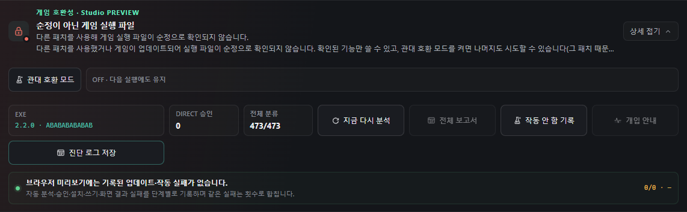

## 35 관대 호환 모드 켜기·끄기 기억

0.7.212부터 **관대 호환 모드** 버튼은 게임 연결 전이나 검토된 게임에서도 호환성 화면에 항상 보이고, 켜기·끄기는 **다음 실행에도 기억**됩니다. 새로 설치하면 OFF입니다. 끄려면 버튼을 다시 누르세요.

켜 두어도 검토된 게임(34장의 인정된 다른 패치 포함)은 예전 경로 그대로 동작합니다. 순정으로 확인되지 않는 게임은 실행할 때마다 새로 확인한 뒤 적용되며, 화면에 대기·확인 중·사용 중이 표시됩니다. 이 모드를 켠다고 경기 기능이 켜지지는 않습니다. 위험과 사용 범위는 31장과 같습니다.

0.7.219에서 달라진 점(관대 호환 모드에서만): 일부 LAB의 선택 부분만 순정과 다를 때 호환성 화면이 그 LAB 전체를 잠김으로 표시하던 것을 0.7.215 기준으로 되돌렸습니다(설치는 원래 막지 않았습니다). **자동 경기로 끝까지**는 메뉴 행 표시 보정을 확인하지 못하면 켜기를 거부하던 것을, 0.7.214 방식(행은 보이지 않지만 선택할 수 있고, 적용 범위는 일반 모드만으로 고정)으로 켜고 그 이유를 카드에 보여 줍니다.

## 36 내 쪽 타구만 직접 수비와 F8 수비 감지

**내 쪽 타구만 직접 수비**(공통 기능 → 경기 조작의 LAB 카드, 기본 OFF)는 선수 플레이에서 타구가 내 선수에게 가지 않는 플레이만 CPU가 내 선수를 대신 움직이게 합니다. 내 선수에게 오는 타구는 지금 수비 조작 설정(수동 등) 그대로 직접 수비합니다. 그 플레이 동안만 게임 설정 '수비 조작'을 게임의 '전부 CPU' 값으로 두었다가 다음 수비 준비 때 원래 설정으로 되돌립니다.

- 대상 모드: 스타플레이어가 기본이고, 선택하면 페넌트·고시엔 선수 플레이에도 씁니다.
- 판정 기준(0.7.215): 기본은 **내 포지션**으로 오는 타구(게임이 정한 첫 수비수가 내 선수)입니다. 0.7.214의 판정은 **넓게**(커서 선수, 선택하면 백업 수비수 포함)로 고를 수 있습니다.
- 이미 전부 CPU이거나 내 팀 공격·리플레이·팀 조작 경기에서는 아무것도 바꾸지 않습니다. 끄면 원래 코드와 바꿔 둔 수비 조작 설정을 되돌립니다.
- **빠른 진행**(53장)과 함께 켜면 내 포지션으로 오는 타구만 1배속이고, 다른 타구는 CPU 수비로 빠르게 지나갑니다.

**F8 자동 전환**은 0.7.215부터 1루수~우익수로 **수비만 할 때**도 따로 감지해 F6 선택의 수비 가속·송구 속도를 켭니다. F8 패널의 **야수 수비도 감지**(기본 ON)로 끌 수 있습니다.

## 37 모션 편집을 게임에 쓰기와 새 폼 파일

0.7.214부터 모션 LAB은 **폴리곤 인체 편집기**입니다. 기본은 전체 동작이고 구간 탭은 미세 조정용입니다. 본·프레임·보간 범위를 고르고 회전(엉덩이는 위치도)을 입력하거나 손·발·머리를 끌어(IK) 자세를 바꿉니다. 원본 겹쳐 보기, 되돌리기·다시하기(Ctrl+Z/Y), 편집 목록, 애니메이션 저장·열기(.p26motion)를 씁니다.

- **편집본 CHK로 내보내기:** 편집한 구간을 다시 만든 CHK 파일을 원하는 곳에 저장합니다. 게임 폴더는 바꾸지 않습니다.
- **원본 CHK에 적용 / 빈 슬롯에 새 폼으로 저장:** 게임이 꺼져 있을 때만 됩니다. 적용 전 목록 파일(RES00.RDI)을 백업하고 기록을 남기며, 게임은 다음 실행부터 새 동작을 읽습니다. **원본 CHK 복구**로 가장 최근 변경부터 되돌립니다. 온라인 플레이 전에는 복구하세요.
- **새 폼 파일(0.7.215):** 지금 투구폼(편집본 또는 복사)을 게임 실행 파일 옆에 새 파일로 만듭니다. 게임 원본 자료는 바꾸지 않고 게임이 켜져 있어도 됩니다. **게임에 등록**하면 Studio가 켜져 있는 동안 폼 번호 하나가 그 파일을 읽어, 그 번호를 쓰는 선수는 모든 모드에서 새 폼을 씁니다.
- **DIRECT 선수 편집 → 투구폼 번호:** 선수의 와인드업·세트 폼 번호를 바꿉니다. 새 폼 파일을 등록한 번호를 주면 그 선수가 새 폼으로 던집니다.
- **모든 기능 OFF**는 폼 등록도 원래대로 되돌리고 멈춥니다.

게임 안에서 편집 동작·새 폼이 보이는 모습의 실기 확인은 아직입니다. 먼저 쓰지 않는 번호·세이브로 시험하세요.

**0.7.220 화면 정리:** 저장·적용 버튼을 편집 도구 열에서 편집기 아래의 카드로 옮겼습니다. 버튼 이름, 확인 창, 게임이 꺼져 있어야 하는 조건과 백업은 그대로입니다.

- 게임 폼을 열면 **애니메이션 파일**(애니메이션 저장·열기), **게임 파일에 적용**(편집본 CHK로 내보내기, 원본 CHK에 적용, 빈 슬롯에 새 폼으로 저장, 원본 CHK 복구, 게임 파일 변경 기록), **새 폼 파일로 만들기**(지금 폼을 새 폼 파일로 만들고, 만든 뒤 그 파일 열기) 카드가 나옵니다.
- 0.7.215의 새 폼 파일 목록과 파일별 버튼(게임에 등록·등록 끄기, 파일 다시 쓰기, 지우기)은 폼 목록의 **내 폼 파일** 탭과, 그 파일을 열었을 때의 **게임에서 쓰기**·**파일 관리** 카드로 옮겼습니다(같은 동작과 조건).
- **◀ 폼 목록 접기**를 누르면 편집 화면이 넓어지고 카드가 나란히 놓입니다. 폼 목록 칸은 조금 좁아졌습니다. 얼굴 모션 같은 요약 구간은 '얼굴 모션 등 요약만 N개'로 접혀 있습니다.
- 아무것도 없는 상태에서 새 투구폼을 만드는 방법은 75장에 있습니다.

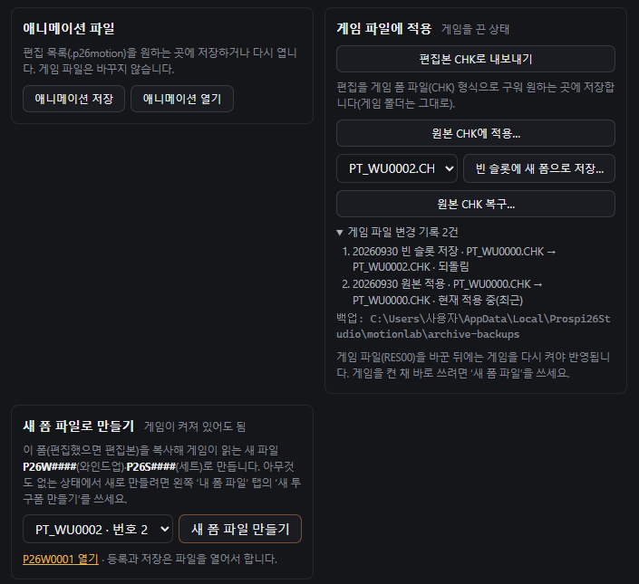

## 38 스타·고시엔 한눈에 보기와 옮긴 패널

스타플레이어와 고시엔도 페넌트처럼 **한눈에 보기** 탭이 먼저 열립니다. 할 일별로 모든 기능을 카드로 보여 주고 카드의 버튼은 그 기능의 화면으로 이동만 합니다(켜거나 끄지 않음). 카드 제목에 마우스를 올리면 설명이 나옵니다.

예전 내장 패널의 기능은 Studio 화면의 카드로 옮겼습니다: 고시엔 부원 일괄 설정·완전 강화 프리셋·직접 효과·훈련 버프 12칸·체력/학력 유지, 스타 **내 선수 생활**(소지금·인간성·취미·생활 소유물·사용 횟수), 스피리츠 횟수와 육성 포인트, 경기 조작의 **간편 카운트 제어**, DIRECT **성향·스타일**. 원래 패널은 **LAB → 옮긴 원본**에서 그대로 작동합니다.

## 39 세이브 편집의 선수 신상·고향·기록·이름·상태

세이브 편집(33장)의 선수 페이지에 탭이 늘었습니다.

- **신상:** 생일, 입단 연도, 키, 몸무게, 고향(게임의 지역 목록과 확인된 나라)
- **기록:** 연도별 기록과 통산
- **이름:** 성·이름·등록명
- **상태:** 컨디션, 부상, 피로, 충성도(고시엔은 신뢰·건강·학력·사용 횟수·스카우트 관련 값)

저장 방법과 주의(복사한 세이브로 먼저 시험)는 33장과 같습니다.

## 40 즐겨찾기 창과 뒤로 가기

각 모드 화면의 **즐겨찾기 창 열기**는 그 모드 전용의 작은 창(오른쪽 끝, **항상 위** 선택)을 엽니다. **기능 고르기**에서 자동 유지·DIRECT 경기 기능·모드 패널·다른 기능을 골라 목록을 만들면, 목록의 스위치·값 편집·프리셋이 메인 창과 같은 명령으로 작동합니다. 자체 화면이 있는 기능은 **메인 창에서 조작**으로 엽니다. 즐겨찾기 창을 닫아도 아무것도 꺼지지 않습니다.

**뒤로**(화면의 버튼, Alt+←, 마우스 뒤로 버튼)는 직전에 보던 화면으로 돌아갑니다.

## 41 일정 탭과 자유행동일 여러 번 행동

스타플레이어·페넌트·고시엔에 **일정** 탭이 생겼습니다(한눈에 보기 다음). 지금 게임의 경력 달력에 내 팀 경기(홈/원정·상대·경기 구분)를 날짜마다 보여 주고, 날짜를 누르면 그날 전체 경기와 저장된 계획이 나옵니다. 고시엔은 0.7.216부터 대회와 연습 경기 날짜도 보여 줍니다.

**자유행동일 여러 번 행동**(스타플레이어 → 성장·생활·아이템의 LAB 카드, 기본 OFF)은 시즌 중 자유행동일에 사생활 행동(선수 교류·인물 교류·외출)을 정한 횟수(기본 2번 = 오전·오후)까지 하게 합니다. 마지막 행동이나 휴양을 고르면 하루가 원래대로 끝나고, 날짜 진행·리그 경기·성장 처리는 하루 한 번 그대로입니다. 일정 탭에서 날짜별 계획(하루 N번과 메모)을 저장하면 그날은 그 횟수를 씁니다. 경기 있는 날·경기 없는 날에도 쓰는 선택은 52장에 있습니다. 0.7.219의 하루 1번과 휴일 아이템은 69장, 일정 탭의 센트럴 리그 DH 카드는 72장, 게임 DH 설정을 바꾼 시즌의 경기 표시는 73장에 있습니다.

## 42 단축키 배치: 풀사이즈와 텐키리스

공통 기능 → 경기 조작의 **단축키 배치**에서 고릅니다. 기본은 **풀사이즈**(예전 텐키 단축키 그대로)입니다.

- **텐키리스 (Alt + 숫자):** 텐키 단축키를 Alt + 숫자 줄로 옮깁니다(Ctrl+Num은 Ctrl+Alt).
- **텐키리스 (Ctrl + 숫자):** Ctrl + 숫자 줄로 옮깁니다(Ctrl+Num은 Ctrl+Shift). 간편 카운트 제어를 켜면 Ctrl+1~4·Ctrl+0은 카운트 제어가 씁니다.

F2~F4·F6~F9와 숫자 키 단독은 그대로이고, 화면의 단축키 안내도 고른 배치로 표시합니다.

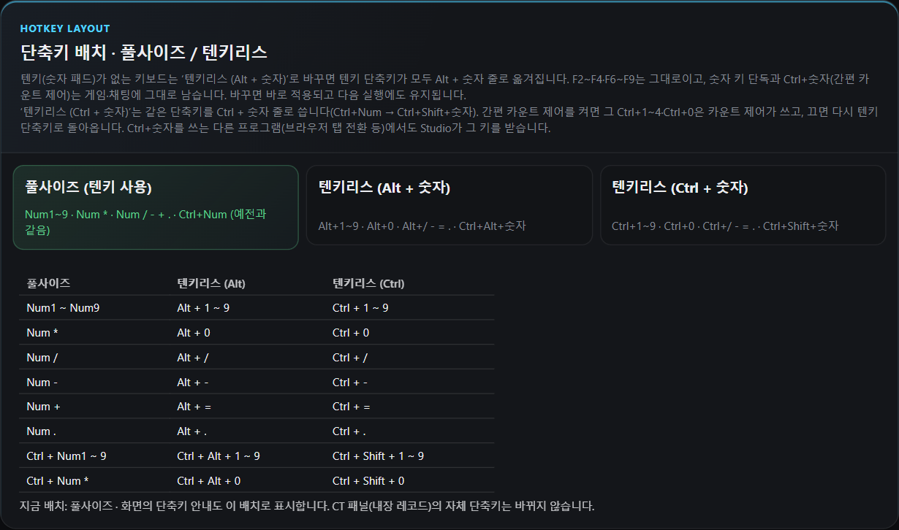

## 43 코드 공간 부족 안내

게임을 오래 켜 두면 게임 자체가 메모리를 써서, 기능 코드를 둘 자리(게임 코드 ±2GB 범위)가 부족해질 수 있습니다. 이때 "코드 동굴을 할당하지 못했습니다"가 나옵니다. 치트엔진으로 값을 편집해서 생기는 문제는 아닙니다.

- 0.7.214부터 Studio가 게임에 연결할 때 그 자리를 미리 잡아 두고 DIRECT 기능이 씁니다.
- 0.7.215부터 내장 CT 레코드(번호키 구속 프리셋 등)도 자기 검색이 실패하면 그 자리를 씁니다.
- 그래도 실패하면 경기 조작 화면과 레코드 메시지에 원인(자리 부족 또는 Windows 가상 메모리 부족)과 해결법을 표시합니다. 자리 부족이면 게임을 다시 켠 뒤 Studio를 연결하세요.

## 44 자동 경기로 끝까지와 경기 메뉴 감독 기능의 적용 범위

**자동 경기로 끝까지**(고속 경기, LAB)는 일시정지 메뉴 오른쪽 열 맨 아래(경기 중단 아래)에 고시엔과 같은 항목을 더합니다. 0.7.214에서는 이 행이 보이지 않았고 0.7.215에서 고쳤습니다. 고르면 지금 경기를 양 팀 모두 자동 진행으로 끝까지 진행하며, 선수 플레이에서도 내 선수의 플레이를 자동으로 진행합니다. 확인 창과 취소가 없고, 게임의 다이제스트 기본 설정은 바꾸지 않습니다.

- **적용 범위:** 기본 **모든 오프라인 모드**(팀·선수·감독·관전·다이제스트 어떤 플레이 형태든, 투구·타격·주루·수비 어느 때든). **일반 모드만 (0.7.214)**을 고르면 그랑프리·라이브 시나리오·연습 같은 특수 모드에는 넣지 않습니다. 켜져 있을 때 바꾸면 바로 바뀝니다.
- 온라인·네트워크 경기는 어느 범위에서도 원래 메뉴입니다. 고시엔은 게임 자체 항목을 씁니다. 특수 모드에서의 동작은 아직 실기 확인 전입니다.
- 0.7.219: 관대 호환 모드에서 메뉴 행 표시 보정을 확인하지 못한 실행 파일은 0.7.214 방식으로 켭니다(35장).

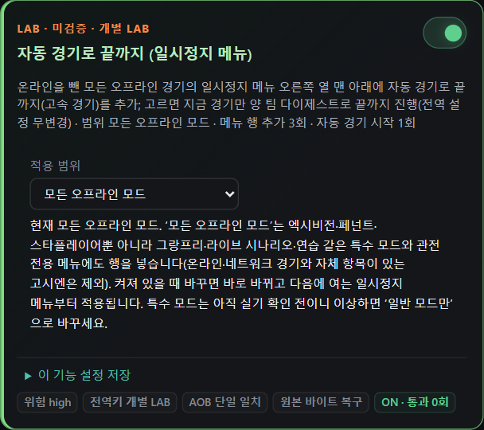

**스타·페넌트 경기 메뉴 감독 기능**(LAB)에도 **적용 범위**가 생겼습니다. 기본은 예전처럼 **일반 모드만**이고, **모든 오프라인 모드**를 고르면 특수 모드의 경기 메뉴에도 같은 규칙(회색 메뉴 열기, 선수 플레이 감독 기능)을 적용합니다. 켜져 있을 때 바꾸면 다시 설치해 다음에 여는 일시정지 메뉴부터 적용됩니다.

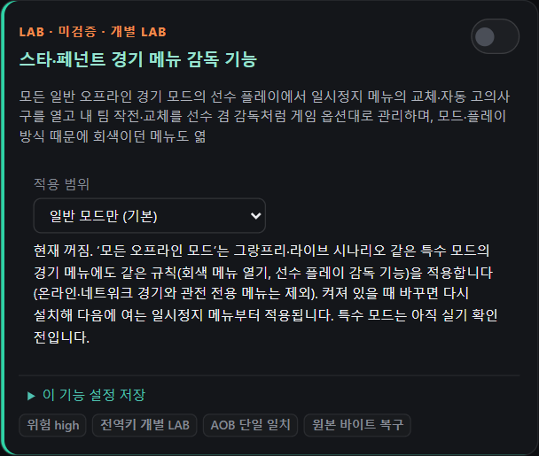

일시정지 메뉴 기능은 투구·타격·주루·수비를 구별하지 않습니다. 공격과 수비에 따라 게임이 보여 주는 칸(불펜 교체 또는 대타·대주자)만 다릅니다.

## 45 선발 아닌 날 불펜 대기

스타플레이어에서 내 선수가 선발 투수형이면 선발 등판일이 아닌 경기일에는 원래 경기 결과만 볼 수 있어 등판 요청을 쓸 수 없습니다. **선발 아닌 날 불펜 대기**(공통 기능 → 경기 조작의 LAB 카드, 기본 OFF)를 켜 두면 그런 날 메뉴에서 **시합**을 고르는 순간 오늘 역할을 불펜 대기(중계)로 바꿉니다. 게임이 직접 벤치 명단을 다시 짜고, 내 선수가 벤치(불펜)에 있는 실제 경기로 진행합니다.

- 등판은 감독(CPU) 판단이나 **난입·교체 LAB**의 등판 요청(10장)으로 이뤄집니다.
- 다음 선발 등판일과 선발 로테이션 자리는 그대로입니다.
- 1군 선발 투수형이고 오늘 팀의 정규 경기가 있으며 원래 '출전 없음'인 날에만 바꿉니다. 선발 등판일·이도류 야수 출전일·2군·올스타·감독 겸임·구원/야수형 스타는 원래대로입니다.
- 그날 원래대로 결과만 보려면 시합을 고르기 전에 끄세요. 플레이 방식 화면에서 스킵하면 자동 진행 경기에서 내 선수가 구원으로 나올 수 있습니다.
- 끄면 원래 코드로 돌아가고, 경기를 시작하기 전이면 오늘 역할도 원래대로 되돌립니다. 며칠 자동 진행이 역할을 잘못 적용하지 않도록 따로 막습니다.
- 카드에 시합 선택 횟수, 불펜 대기 전환 횟수와 마지막 시합 선택의 결과(예: 오늘이 선발 등판일이라 그대로)가 표시됩니다. 스타 한눈에 보기의 경기 묶음에도 카드가 있습니다.

실전 확인 전 LAB입니다. 구원 등판의 미션·평가, 짧은 등판이 선발 간격 설정에 주는 영향은 아직 확인하지 않았습니다.

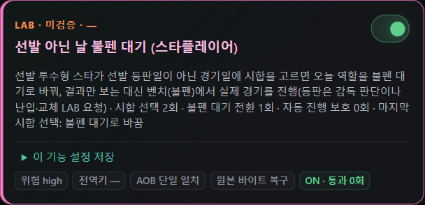

## 46 세이브 편집: DIRECT와 같은 선수 편집과 구종 긴빠이

세이브 편집(33장)의 선수 페이지에서 DIRECT 선수 편집과 같은 작업을 같은 규칙으로 할 수 있습니다. 바꾼 내용은 모두 **저장 전 변경** 목록에 모이고, **편집본 만들기** 또는 **백업 후 원본에 저장**(LAB) 때 사본 규칙대로 기록됩니다. 스타 본인은 세 사본(본체·리그 기록·로스터 압축 사본), 페넌트·스타 리그 선수는 선수 기록(사본 A), 고시엔 부원은 부원 기록과 팀 블록 사본, 에디트 선수는 사본 A에 씁니다.

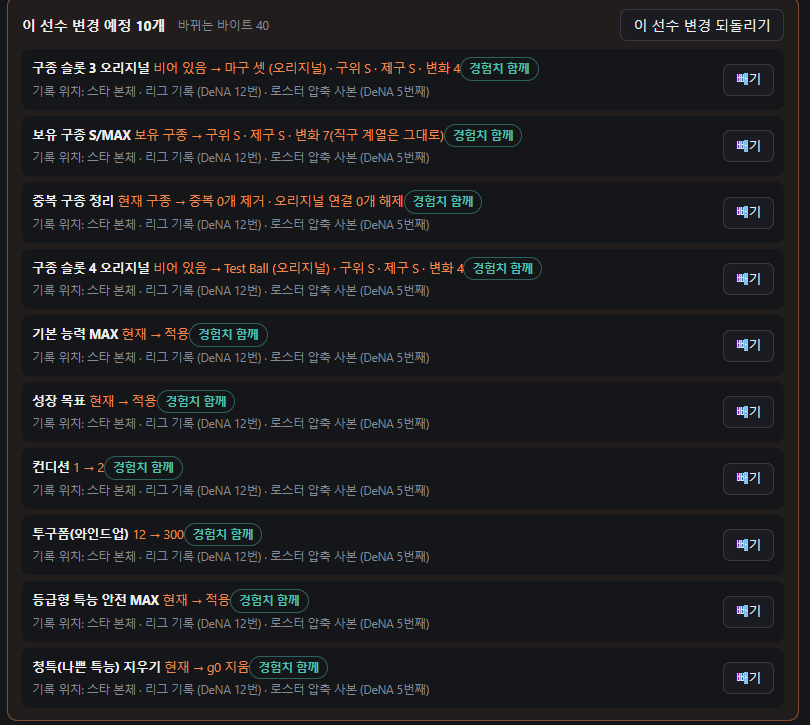

- **구종 탭:** 슬롯마다 **오리지널 장착**(라이브러리에서 고르기 또는 커스텀 오리지널 만들기)과 **보유 구종 S/MAX**, **중복 구종 정리**가 있습니다. 같은 방향 칸에만 들어가고, 이미 다른 칸에 같은 오리지널이 있으면 DIRECT처럼 거부합니다.
- **이 세이브에서 수집:** 열린 세이브의 선수들이 가진 오리지널 구종을 DIRECT와 같은 사용자 라이브러리에 모읍니다. 이미 있는 것은 건너뛰고, 세이브 파일은 바꾸지 않습니다. 모은 구종은 DIRECT와 세이브 편집 양쪽 라이브러리에 함께 보입니다.
- **기본·수비 탭:** **기본 능력 MAX**, 스타 본인의 **성장·표시 MAX**와 **성장 목표**, 성향·스타일 15항목, **투구폼 번호**(와인드업 0~664·세트 0~609)를 바꿉니다. 맨 아래에 DIRECT와 같은 **FA 취득·계약 판정** 표가 읽기 전용으로 나옵니다.
- **특수 능력 탭:** **등급형 MAX**, **특능 비우기**, **청특 지우기**(전부 또는 하나)를 씁니다.
- **상태 탭:** 고시엔 도구·책 사용 횟수를 DIRECT와 같은 0~1·0~5로 고를 수 있습니다(예전에는 0만).
- 성장 경험치는 DIRECT처럼 능력·구종을 바꿀 때 스타 본인에게만 함께 기록합니다. 특능·오리변 가져오기는 경험치를 쓰지 않습니다.

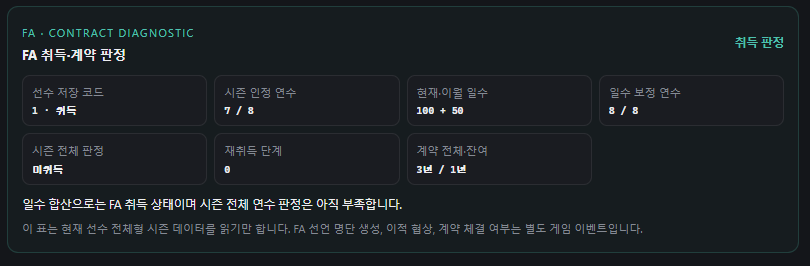

**가져오기** 탭은 DIRECT의 특능·오리변 가져오기(30장)와 같은 화면입니다. **범위**에서 원본을 고릅니다.

| 범위 | 원본 |
| --- | --- |
| 이 세이브(기본) | 열린 세이브의 다른 선수. 대상 선수 자신과 그 사본은 나오지 않습니다. |
| 게임 선수(현역·OB·WBC·대표) | 게임 실행 파일에 들어 있는 선수 목록. 게임이 꺼져 있어도 됩니다. DIRECT와 같은 코드 확인을 통과한 실행 파일에서만 읽습니다. |
| 커스텀·다운로드(Original.dat) | 세이브 폴더의 Original.dat에 있는 에디트 선수. Original.dat 자체를 열었을 때는 '이 세이브' 범위에 있습니다. |
| 전체 | 이 세이브의 선수 다음에 게임 선수와 커스텀·다운로드 선수 |

원본을 고르고 가져올 항목을 체크한 뒤 **미리보기 → 적용**을 누르면 저장 전 변경에 들어갑니다. **이 원본 가져오기 빼기**로 다시 뺄 수 있습니다. 원본을 고른 뒤 게임 실행 파일이나 Original.dat이 바뀌면(게임 업데이트 등) 다른 선수를 가져오지 않도록 거부하니 다시 검색해서 고르세요. 실행 파일을 찾지 못하면 '전체'에서는 이 세이브의 선수만 나오고 이유가 함께 표시됩니다. 게임 실행 파일 위치는 모션 LAB과 같은 방법(실행 중인 게임, Steam 라이브러리, 지정한 게임 폴더)으로 찾습니다.

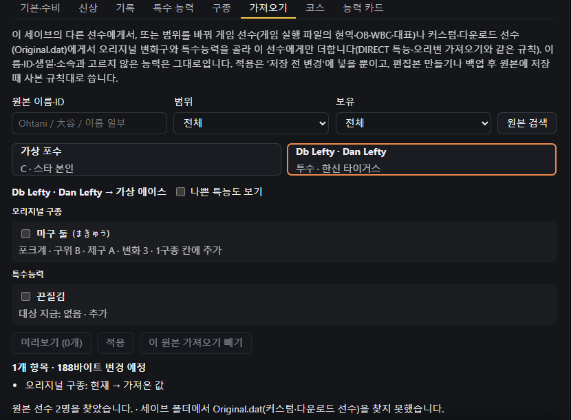

선수 한 명의 능력·특능·구종·외모 등을 통째로 가져오는 **선수 가져오기**는 0.7.218부터 같은 탭에 있습니다(55장).

게임이 편집된 세이브를 불러오는 확인(실기)은 아직입니다. 세이브를 복사해 두고 쓰지 않는 슬롯이나 편집본으로 먼저 시험하세요.

## 47 모드별 기능 OFF

**모든 기능 OFF** 말고도 한 모드에서 켠 기능만 끌 수 있습니다. 왼쪽 사이드바의 스타플레이어·페넌트·고시엔 옆 전원 버튼(그 모드에 켜진 기능이 있을 때만 보임)이나, 각 모드 **한눈에 보기** 오른쪽 위의 **<모드> 기능 OFF (N)**을 누릅니다.

- 끄는 것: 그 모드 화면에 있는 DIRECT LAB, 자동 유지·고정, 내장 기능(LAB → 옮긴 원본 포함). 고시엔은 입학 예약·천재형 자동 적용도 멈춥니다.
- 두 모드가 함께 쓰는 기능(고시엔 전술 경기, 자동 경기로 끝까지, 성장 엔진, 공용 아이템 수량 등)은 어느 쪽에서 눌러도 꺼집니다. 버튼 설명에 끄는 기능이 모두 나옵니다.
- 0.7.219부터 통합 상황실의 자동 유지(페넌트·스타), 고시엔 상대 학교의 두 기능(고시엔), 센트럴 리그 DH 제도·이도류 LAB(그 모드 부분)도 그 모드의 OFF에 들어갑니다.
- 끄지 않는 것: 공통 기능(F6·F7·F8, 번호키, 공통 경기 기능), 스피리츠·엑시비션.
- 결과는 한 줄로 표시되고, 실패한 항목만 따로 알려 줍니다. 나머지는 그대로 꺼집니다. 이 버튼은 아무것도 켜지 않습니다.

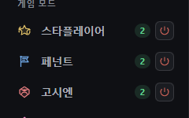

## 48 F6·F7·F8을 켠 채 적용 대상 바꾸기

0.7.216부터 공통 기능의 **적용 대상** 카드를 저장할 때 F8을 끄지 않아도 됩니다. 켜져 있는 F8은 켜진 채 새 대상으로 다시 적용되고, F6·F7 묶음, 개별 구성요소, 번호키도 새 대상으로 바뀝니다(예전에는 먼저 끄라는 안내와 함께 거부). 구종 규칙 밖에서 켠 구질 직접 설정만 예전처럼 거부합니다. F6·F7·F8 묶음은 공통 기능의 첫 구역으로 옮겼습니다.

## 49 전술 경기: 3루 주자 도루와 속도 표시 위치

- **전술 경기 3루 주자 도루**(공통 기능 → 경기 조작의 LAB 카드, 기본 OFF): 고시엔·페넌트·스타 전술 경기에서 주자가 3루, 2·3루, 만루일 때도 내 공격 카드에 도루가 나옵니다. 쓰면 모든 주자가 뛰고 3루 주자는 홈스틸을 합니다. 1·3루 같은 다른 상황과 CPU의 카드는 그대로입니다. 다음 전술 시점부터 적용되고, 끄면 원래 코드로 돌아갑니다.
- 성공 표시와 카드 등급은 3루 주자를 계산하지 않을 수 있고, 홈스틸이 기록에 남는 방식과 헛스윙 때 주자가 아웃되는지는 실기 확인 전입니다.
- **속도 표시 위치:** 페넌트·스타 전술 경기의 배속 표시(L2 ▶▶ R2)가 중계 메시지 줄을 가리지 않도록 고시엔과 같은 위치에 둡니다. 전술 경기 HUD 설정의 **속도 표시 위치**에서 **예전 위치**(0.7.215)를 고를 수 있습니다. 다음 HUD를 만들 때(경기 시작, 공수 교대) 적용됩니다.
- **스타 전술 경기 종료 튕김 수정:** 스타 전술 경기를 마친 뒤 결과 화면에서 게임이 튕기던 문제를 고쳤습니다(0.7.216). 다른 장면은 그대로입니다.
- 스타 출전일에 **전술 경기**를 누르면 튕기는 문제의 대응(최근 단계·로그·안정 모드)은 57장에 있습니다. 원인과 0.7.220의 수정은 74장에 있습니다.

## 50 스트라이크 존 핫존·콜드존 표시

**스트라이크 존 핫존·콜드존 표시**(공통 기능 → 경기 조작의 LAB 카드, 기본 OFF)를 켜면 게임이 원래 그리는 타자의 강한 코스(빨강)·약한 코스(파랑) 칸이 투구 순간에 사라지지 않고 계속 보입니다. 별도 그림을 덧그리지 않고 게임의 칸을 숨기지 않게만 합니다.

- 게임 설정의 스트라이크 존 표시가 **모두 표시** 또는 **선호·비선호만**일 때 보입니다. 표시 안 함 계열 설정이나 타격 조작 자동에서는 보이지 않습니다.
- 성향 데이터가 없는 타자는 칸이 없습니다. 타자가 바뀌면 다음 존 표시 때 색이 바뀝니다. 고시엔은 원래처럼 상대 코스를 공 하나씩 알아 갑니다.
- 기존 **스트라이크 존**(F6·F7·F8의 사각형)과 따로 켜고 끕니다.

## 51 외출 장소 전부 열기(??? 해금)

스타플레이어의 **외출 장소 전부 열기**(LAB, 기본 OFF)를 켜면 외출 화면을 다시 열 때부터 아직 가 보지 않아 **???**로 보이던 장소의 이름이 모두 보이고, 게임의 원래 조건이 맞으면 고를 수 있습니다.

- 조건은 게임 그대로입니다: 지역(홈·원정), 오늘 일정(경기 없음·낮 경기·밤 경기), 상점이 아닌 곳은 소지금 5 이상, 골프장은 비시즌. 조건이 맞지 않는 곳은 이름이 보여도 흐리게 남고 게임의 안내가 나옵니다.
- 세이브에는 아무것도 쓰지 않습니다. 끄면 아직 발견하지 않은 장소는 다시 ???로 보입니다.
- 처음 가는 장소는 게임의 이벤트가 그대로 나옵니다. 취미로 열리는 장소(영화관, 만화 카페, 게임 카페, 노래방, 골프, 낚시터, 요리 교실)는 소개 이벤트를 본 것으로 진행될 수 있으니 이상하면 끄세요.

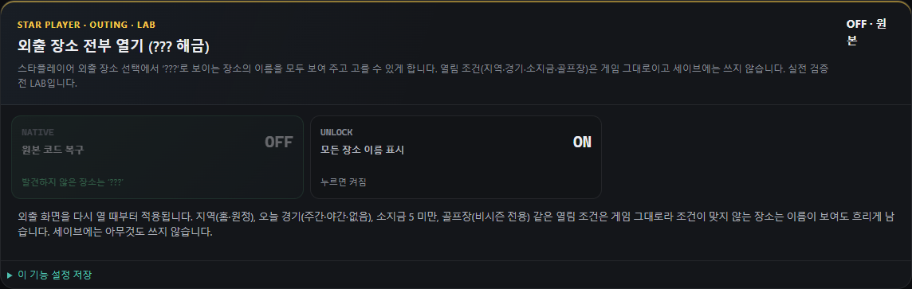

## 52 자유행동일을 경기 있는 날·경기 없는 날에도

**자유행동일 여러 번 행동**(41장) 카드의 **자유행동일 말고도 적용할 날**에서 두 가지를 고를 수 있습니다. 둘 다 기본 OFF이며 끄면 0.7.215와 같습니다.

- **경기 있는 날(시합 전):** 정규 경기가 있는 날 시합 전에 사생활 행동(외출·인물 교류·선수 교류)을 '하루 횟수 − 1'번까지 실제로 하고, 하루는 시합으로만 끝납니다.
- **경기 없는 날(휴일):** 자유행동일이 아닌 경기 없는 날에도 '하루 횟수'번까지 행동하고, 마지막 행동이나 다음으로 하루가 끝납니다.
- 고른 뒤 **적용하는 날 설정 적용**을 누릅니다. 켜져 있을 때 바꾸면 바로 반영되고 오늘 센 횟수는 이어집니다.
- 자유행동일 규칙, 휴양·다음·시합, 아이템(하루를 쓰는 아이템은 자유행동일만), 약속, 오프시즌·캠프, 올스타 같은 특별한 날은 그대로입니다. 바꾸는 것은 메인 메뉴에서 하세요.

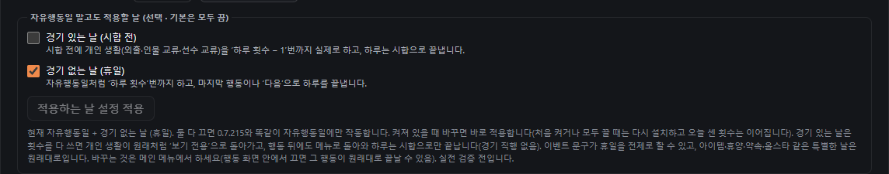

실전 확인 전 LAB입니다. 이벤트 문구가 휴일을 전제로 할 수 있습니다.

## 53 빠른 진행(내 차례만 1배속)

**빠른 진행 (내 차례만 1배속)**(공통 기능 → 경기 조작의 LAB 카드, 기본 OFF)을 켜면 선수 플레이 경기에서 **내 차례가 아닌 동안** 경기를 빠르게 진행하고, 내 차례가 오면 그 순간 1배속으로 돌아옵니다. 게임이 L2·R2 배속에 쓰는 고속 진행(한 화면에 경기 계산을 여러 번)을 그대로 씁니다.

- **배속:** 2~10배. 기본은 4배로 게임의 R2 최대와 같습니다. 5배 이상은 게임에 원래 없던 속도라 **실험**으로 표시됩니다. 화면·소리 처리가 어색하면 카드에서 바로 낮추세요. 켜 둔 채 바꿔도 바로 적용됩니다.
- **적용 모드:** 스타플레이어가 기본이고, 선택하면 페넌트·고시엔 선수 플레이에도 씁니다.
- **1배속으로 두는 때:** 내가 직접 수비하는 타구(항상), 내 타석과 내가 주자일 때(선택, 기본 ON), 내가 투수·포수일 때의 투구(선택, 기본 ON). 일시정지 메뉴 중에는 바꾸지 않는 선택도 기본 ON입니다.
- **빠르게 지나가는 때:** 다른 타자의 타석, 내가 야수일 때의 투구와 공수 교대, 내가 수비하지 않는 타구.
- 타구는 게임 설정 **수비 조작**이 전부 CPU가 아니면 내가 수비하는 타구로 봅니다. 그래서 **내 쪽 타구만 직접 수비**(36장)를 함께 켜야 내 포지션으로 오는 타구만 1배속이고 다른 타구는 CPU 수비로 빠르게 지나갑니다. 수비 조작을 직접 전부 CPU로 두었다면 모든 타구가 빠르게 지나갑니다.
- 내가 주자일 때 타구 중에는 게임 설정 **주자 조작**이 자동이면 빠르게, 직접이면 1배속입니다. 투구 사이(도루·리드)는 1배속입니다.
- 리플레이·팀 조작 경기·다른 모드·전술 경기에서는 바꾸지 않습니다. 켜 둔 동안에는 선택한 모드에서 게임의 R2/L2 배속 대신 이 카드의 배속이 적용됩니다.
- 끄면 원래 코드로 돌아가고, 바꿔 둔 경기 속도도 게임이 그 사이 바꾸지 않았다면 1배속으로 돌려 둡니다.
- 카드 아래에 경기 판정 횟수, 빠르게 진행한 횟수, 내 차례(타석·주루·투구·수비)로 1배속을 둔 횟수, 최근 판정과 내 역할이 나옵니다. 경기 중인데 최근 판정이 계속 **경기 장면 아님**이면 제보해 주세요.

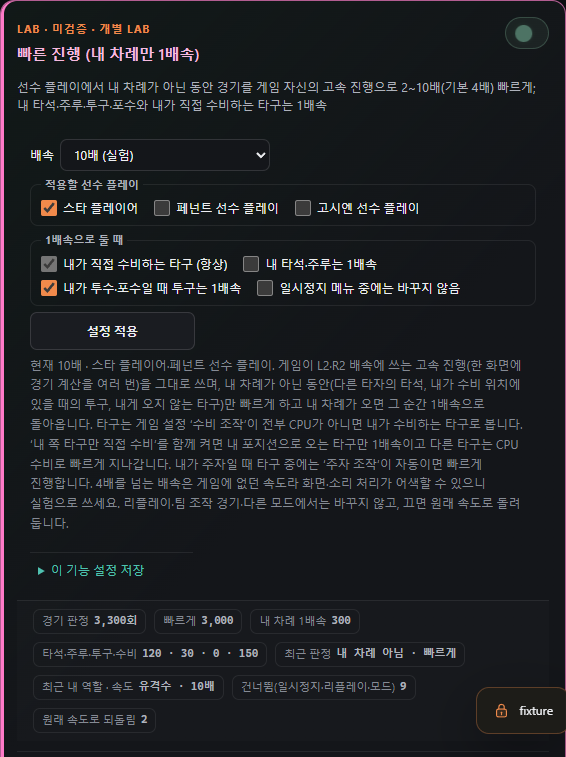

실전 확인 전 LAB입니다. 처음에는 4배로 시험하고, 일시정지 메뉴·리플레이·내 타석 전후를 확인해 보세요.

0.7.219: 게임 자동 진행·고속경기 배속은 62장, 관전 모드의 관전 배속으로 이 카드를 켜고 배속을 바꾸는 방법은 61장에 있습니다.

## 54 드래프트: 미발굴 후보 발굴

0.7.218에서 드래프트 후보 화면에 미발굴 후보를 발굴하는 버튼이 생겼습니다. 0.7.220부터 후보 목록은 게임의 현재 목록만 보여 주고(76장), 미발굴 후보와 발굴 버튼은 목록 아래의 접힌 구역 **미발굴 후보 발굴 (N명)**에 있습니다. 0.7.218~0.7.219의 **발굴된 후보**·**미발굴 등**·**저장된 전체** 보기 버튼은 없어졌습니다(발굴된 후보는 이제 **게임 목록 N명**).

- **미발굴 N명 모두 발굴:** 미발굴 후보 전부를 게임의 스카우트가 발굴할 때와 같은 값(발굴일 = 오늘)으로 바꿉니다. 확인 창이 한 번 나옵니다. 게임에서 드래프트 발굴·조사 후보 목록을 연 상태에서 누르세요.
- **이 후보 발굴:** 미발굴 후보 하나를 고른 뒤 그 후보만 발굴합니다. 0.7.220부터는 미발굴 후보 발굴 구역에서 후보를 고르고 그 후보의 능력 상세에서 누릅니다.
- 게임 목록에는 페이지를 바꾸거나 다시 열면 보입니다. 특별(OB) 후보처럼 확인할 수 없는 후보는 발굴하지 않습니다. 버튼을 누르기 전에는 아무것도 바꾸지 않습니다.
- 0.7.220부터 발굴하는 동안에는 두 버튼이 잠기고, 결과와 오류는 카드 안에 나옵니다(76장).

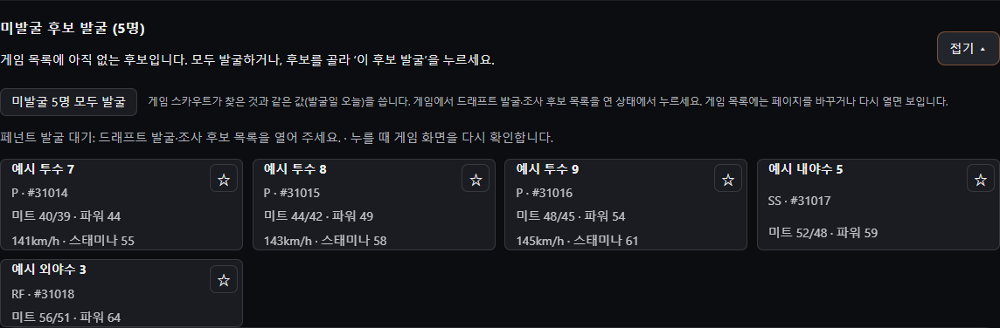

발굴한 후보의 조사 보고서 내용은 게임의 다음 조사 진행에 따릅니다. 실전 확인 전이므로 세이브를 복사해 두고 쓰세요.

## 55 세이브 편집: 선수 가져오기

세이브 편집(33장)의 선수 페이지 **가져오기** 탭에 **선수 가져오기**가 생겼습니다. DIRECT 선수 편집의 선수 가져오기(15장)와 같은 규칙으로, 다른 선수의 능력·특수 능력·구종·외모 등을 골라 이 선수 슬롯에 가져옵니다.

- **원본:** 이 세이브의 다른 선수, 게임 선수(게임 실행 파일의 현역·OB·WBC·대표), 커스텀·다운로드(Original.dat). 원본 범위를 고르고 검색한 뒤 원본을 고릅니다.
- **가져올 항목:** 기본 능력, 특수 능력, 녹색 능력, 구종, 오리지널 구종, 외모, 투타·폼, 음성곡. 능력은 DIRECT처럼 **65% 환산** 또는 그대로, 이름은 원본 이름·영문 이름·그대로 중에서 고릅니다.
- **대상:** 페넌트는 내가 운영하는 구단의 선수, 고시엔은 부원(팀 블록 사본도 같은 값), 에디트 선수(Original.dat). 스타 세이브는 DIRECT에도 없는 기능이라 0.7.218에서는 이유를 보여 주고 쓰지 않았습니다. 0.7.219부터 스타 본인에게는 씁니다(68장).
- 선수 ID·생일·소속·계약·시즌 저장값은 그대로이고 성장 경험치는 쓰지 않습니다. **변경 미리보기**로 바뀌는 영역을 확인하고 **변경 예정에 넣기**를 누르면 저장 전 변경에 들어갑니다. **이 원본 가져오기 빼기**로 다시 뺄 수 있습니다.

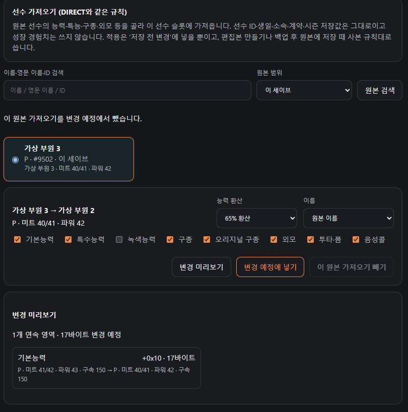

게임이 편집된 세이브를 불러오는 확인은 아직입니다. 편집본이나 쓰지 않는 슬롯으로 먼저 시험하세요.

## 56 통합 상황실(읽기 전용 1단계)

왼쪽 사이드바 **게임 모드**의 맨 아래에 **통합 상황실**이 생겼습니다. 통합 패널(페넌트·스타 선수·구단 편집)을 Studio 화면으로 옮기는 첫 단계이며, 지금은 **읽기만** 합니다.

- **모드:** 페넌트 세이브(16개 구단 위치, 사용자·추가 구단 위치 포함) 또는 스타플레이어 리그(12구단, 내 선수 구단 표시).
- **범위:** 통합 패널과 같은 9가지(전체, 1군, 2군, 투수, 야수, 1군 투수 등).
- **상황 읽기:** 범위 인원·범위 밖·빈 칸·구단 자금·포스트시즌 사본 수와 함께 선수별 번호·포지션·1·2군·연봉·계약(남은/전체)·FA·애정도·컨디션·부상·피로를 표로 보여 줍니다. 스타 본인은 **본인**으로 표시됩니다.
- 계약·자금 변경, 직접 효과, 자동 유지는 다음 단계에서 이 화면에 추가됩니다. 그동안 원래 통합 패널은 그대로 쓸 수 있습니다.
- 0.7.219에서 ② 자동 유지, ③ 직접 효과, ④ 계약·자금, 외부 설정과 고시엔·엑시비전 보기가 추가됐습니다(64~65장).

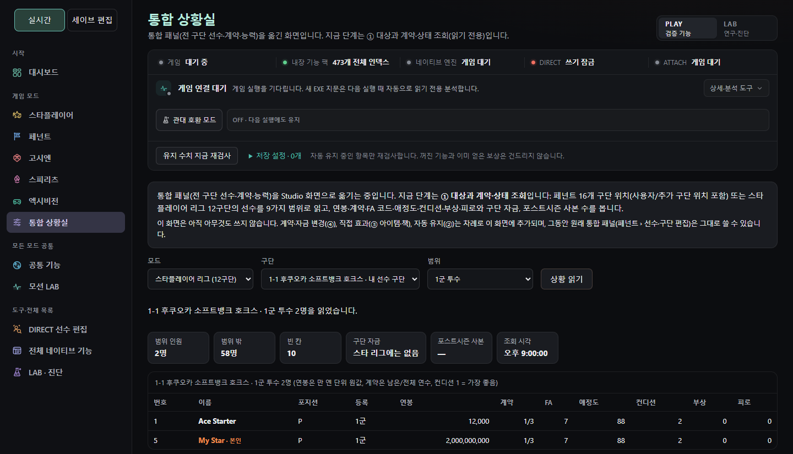

## 57 스타 전술 경기 튕김 대응과 안정 모드

0.7.220: 제보자분이 보내 주신 크래시 덤프로 원인(Studio가 스타 경기 준비 코드에 끼워 넣은 자리)을 찾아 고쳤습니다(74장). 아래는 0.7.219에서 더한 진단과 옵션이며 그대로 있습니다.

스타플레이어 출전일에 **전술 경기**를 누르면 게임이 튕긴다는 제보가 있었습니다(페넌트는 정상). 개발 환경에서는 재현되지 않아 정확한 원인은 튕긴 PC의 크래시 덤프가 있어야 확정됩니다. 0.7.219는 **고시엔 전술 경기 (페넌트·스타)** LAB(공통 기능 → 경기 조작)에 다음을 더했습니다.

- **스타 출전일 판정 수정(옵션과 관계없이 적용):** 전술 경기 요청을 받아들일지 게임의 '오늘 역할' 검사로 정합니다. 0.7.218은 지난 준비 때의 값을 읽을 수 있어 스타가 나오는 날이 액션 플레이로 바뀌거나 스타가 나오지 않는 날이 통과될 수 있었습니다.
- **거부된 요청 정리:** 받아들이지 않은 요청은 바로 지웁니다. 0.7.218에서는 남아 있다가 다음 페넌트 감독 플레이를 전술 경기로 바꿀 수 있었습니다.
- **최근 단계와 로그:** 카드 아래 '최근 단계 · …'에 마지막으로 지난 단계(스타 준비의 수락·거부와 이유, 경기 생성 판단, 두 팀 명단 인원)가 나옵니다. 같은 내용이 날짜별 로그(`%LOCALAPPDATA%\Prospi26Studio\logs` 폴더의 koshien-tactics-20261002.log 같은 파일)에 남습니다. 하루 최근 500줄, 14일치를 보관하며 선수 이름이나 주소 없이 단계와 숫자만 기록합니다. 튕긴 뒤에는 로그의 마지막 줄이 마지막으로 지난 단계입니다.
- **스타 전술 경기 안정 모드(옵션, 기본 OFF):** 스타 전술 경기에서 내 스타를 게임의 '선택 선수'로 정하지 않습니다(페넌트 전술 경기와 같은 방식). 그래서 그 경기의 스타 평가 기록은 남지 않습니다. 명단이 26명을 넘는 날은 전술 경기 대신 액션 플레이로 진행합니다. 튕김 대책 후보입니다.
- **명단 26명 초과 안내:** 안정 모드 없이 명단이 26명을 넘어 게임의 원래 감독 플레이로 진행한 스타 경기가 있으면 카드에 주의 문구가 나옵니다.
- 옵션은 LAB이 꺼져 있을 때 고르고 켤 때 적용됩니다. 켜진 동안에는 바뀌지 않으니 끄고 고친 뒤 경기 밖에서 다시 켜세요. 필요한 게임 코드를 확인하지 못하면 그 옵션만 빼고(카드에 '… 꺼짐(이 게임 실행 파일에서 확인되지 않음)') 나머지는 켜집니다. 출전일 판정 코드를 확인하지 못하면 0.7.218 방식 그대로 두고 카드에 '스타 준비 오늘 역할 검사 꺼짐'이 나옵니다.

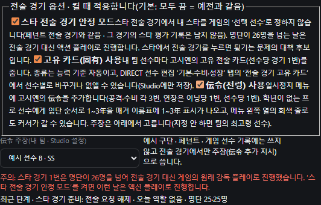

튕김이 계속되면 먼저 안정 모드를 켜고 시험해 보세요. 제보할 때는 크래시 폴더 `%LOCALAPPDATA%\prospi\Saved\Crashes`의 최근 폴더(UE4Minidump.dmp와 CrashContext), Studio 버전과 카드의 '최근 단계' 문구, 스타 유형(선발·중계 투수, 야수, 투타겸업)과 그날 역할, 1군·2군, DH 경기 여부, 튕긴 시점(클릭 직후, 로딩 중, 첫 플레이 중)을 함께 알려 주세요. 실전 확인 전입니다. 0.7.220부터는 이 원인이 고쳐졌습니다(74장). 그래도 튕기면 위 정보를 함께 보내 주세요.

## 58 전술 경기 고유 카드와 전령·주장

**고시엔 전술 경기 (페넌트·스타)** LAB의 **전술 경기 옵션**에 고시엔에만 있던 두 가지를 더했습니다. 둘 다 기본 OFF이며 끄면 0.7.218과 같습니다(12장).

- **고유 카드 사용:** 페넌트·스타 전술 경기에서 내 팀 선수마다 고시엔의 고유 전술 카드를 줍니다. 한 경기에 선수당 한 번 쓰고, 상대(CPU) 팀은 받지 않습니다.
- **카드 종류:** 럭키, 괴물, 축제 사나이, 궁극, 마물, 정확무비, 노란 함성, 흔들기 8종입니다(축제 사나이와 마물은 타격 카드만 있음). 기본은 능력 기준 자동입니다. 타자는 교타·파워·주력 중 가장 높은 능력으로(90 이상이면 궁극, 모두 50 미만이면 마물), 투수는 구속·구위·제구·스태미나로 정합니다. 자동 규칙은 카드 이름과 설명을 보고 Studio가 정한 것입니다.
- **선수별 지정:** DIRECT 선수 편집 → **기본·수비·성장** 탭의 **전술 경기 고유 카드 · Studio 데이터**에서 자동(능력 기준), 8종 중 하나, 없음(카드 안 줌)을 고릅니다. 페넌트 선수, 스타 내 선수와 스타 리그 선수에게 있습니다. Studio 설정 파일에만 저장하고 게임 선수 기록·세이브에는 쓰지 않습니다. 켜져 있는 LAB에는 다음 경기부터 반영됩니다.
- **전령 사용:** 페넌트·스타 전술 경기의 일시정지 메뉴 왼쪽 열에 고시엔의 전령 지시를 더합니다(게임이 허락하는 때만 선택 가능). 횟수는 게임 규칙 그대로입니다(공격·수비 각 3번, 연장은 이닝마다 1번, 선수당 1번).
- 전령 옵션을 켜면 학년이 없는 프로 선수에게 입단이 빠른 순서로 3·2·1학년을 매겨 이름표에 1~3年 표시가 나오고, 메뉴 왼쪽 열의 회색 줄로도 커서가 갈 수 있습니다.
- **주장:** 전령 옵션을 체크하면 주장 목록(내 팀 · Studio 설정)이 나옵니다. DIRECT 선수 편집에서 '페넌트 · 12구단'(내 구단) 또는 '스타 · 12구단' 명단을 불러오면 내 팀 선수 중에서 고를 수 있고, 지정하지 않으면 팀의 최고령 선수가 주장입니다. 주장은 게임의 추가 전령 지시를 받습니다. 게임 선수 기록에는 쓰지 않습니다.
- 일시정지 메뉴의 **자동 경기로 끝까지**와 함께 켜도 두 줄 모두 쓸 수 있습니다.

카드가 맞는 선수에게 나오는지, 한 번 쓴 뒤 다시 나오지 않는지, 전령 지시와 연출, 학년 표시, 주장의 추가 지시는 실전 확인 전입니다. 고시엔 모드 자체의 경기는 그대로입니다.

## 59 전술 경기 횟수 무제한

**전술 경기 횟수 무제한**(공통 기능 → 경기 조작의 LAB 카드, 기본 OFF)은 전술 경기의 한 경기 제한을 없앱니다.

- **무제한으로 할 것(처음에는 모두 체크):** 전령 횟수(남은 횟수가 줄지 않음, 연장 포함), 같은 선수 전령(선수당 한 번 제한을 없앰), 고유 카드 재사용(한 번 쓴 고유 카드가 다음 전술 타임에 다시 나옴).
- **적용할 전술 경기(처음에는 모두 체크):** 고시엔 전술 경기(고시엔 모드의 원래 전술 경기), 페넌트·스타 전술 경기(고시엔 전술 경기 LAB으로 시작한 경기).
- 페넌트·스타 전술 경기에서는 고시엔 전술 경기 LAB의 전령·고유 카드 옵션(58장)을 켰을 때만 해당합니다. 고유 카드 재사용은 그 경기에서 카드가 한 번이라도 나왔던 선수만이며, 카드가 없는 선수에게 새로 생기지 않습니다.
- 게임이 세는 전령 사용 횟수·선수별 표시·고유 카드 사용 표시는 원래대로 기록되므로 고시엔 경기 뒤 기록은 바뀌지 않습니다. 다른 경기·모드와 상대(CPU)의 카드는 그대로입니다.
- **설정 적용**은 LAB이 켜져 있으면 바로, 꺼져 있으면 다음에 켤 때 적용됩니다. 경기 중에 끄면 다음 전술 타임부터 원래대로입니다.

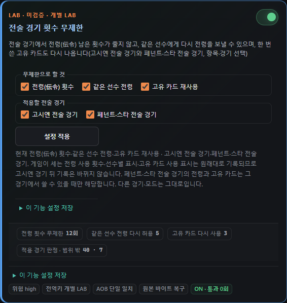

실전 확인 전 LAB입니다.

## 60 내 선수만 전술 카드

**내 선수만 전술 카드**(공통 기능 → 경기 조작의 LAB 카드, 기본 OFF)는 직접 플레이처럼 내 선수 차례에만 전술 카드를 고르고, 내 팀의 다른 차례는 효과 없는 **맡기기** 카드를 카드 화면 없이 자동으로 고릅니다.

- **카드를 고르는 차례:** 내 선수 차례만 카드 고르기(나머지는 맡기기 자동, 기본) 또는 반대로 내 선수 차례만 맡기기 자동(나머지는 카드 고르기).
- **내 선수 차례:** 내 팀 공격 때 그 선수의 타석, 수비 때 그 선수의 투구입니다. 주자는 포함하지 않습니다.
- **내 선수:** 스타 전술 경기는 내 스타 선수입니다. 고시엔·페넌트 전술 경기는 공통 기능의 적용 대상 카드에서 '내 팀 선수 여러 명 선택'으로 고른 선수입니다(4장, 경기 중 명단을 불러와 선택). 고른 선수가 없으면 고시엔·페넌트 전술 경기에서는 아무것도 바꾸지 않고 카드에 그렇게 표시합니다.
- 손패에 맡기기 카드가 없거나 선수를 확인하지 못하면 원래대로 카드 화면이 열립니다. 상대(CPU)의 카드는 그대로입니다. 고시엔 첫 경기의 카드 도움말은 처음 열리는 카드 화면에 나옵니다.
- 켜진 동안 설정을 바꾸면 다음 전술 타임부터 적용되고, 끄면 다음 전술 타임부터 원래대로입니다.

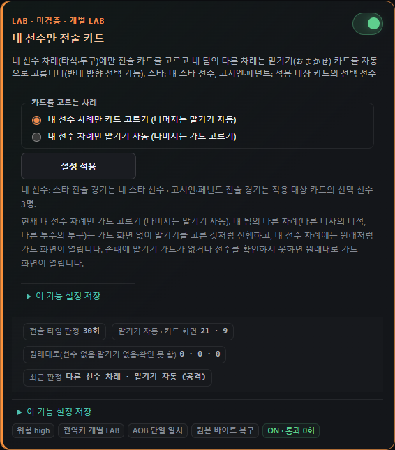

실전 확인 전 LAB입니다.

## 61 관전 모드(내 차례 아닌 플레이 보기)

선수 플레이에서 내 선수가 관여하지 않는 투구는 게임이 뒤에서 결과만 계산합니다(다이제스트). **관전 모드 (내 차례 아닌 플레이 보기)**(공통 기능 → 경기 조작의 LAB 카드, 기본 OFF)를 켜면 그 투구를 실제 경기 장면으로 보여 주고 CPU가 모든 선수를 움직입니다. 투수 스타라면 우리 팀 공격을, 타자 스타라면 앞 타자들의 타석과 우리 팀 투수의 투구를 볼 수 있습니다.

- **관전할 플레이:** 공격 관전(내 팀 공격 중 벤치나 대기 타석일 때 다른 타자의 타석, 기본 ON), 수비 관전(내 팀 수비 중 벤치일 때 수비 장면, 수비 위치일 때 모든 투구, 기본 ON), 내가 주자일 때도 관전(그 투구는 CPU가 주루, 기본 OFF).
- **적용할 선수 플레이:** 스타 플레이어, 페넌트 선수 플레이, 고시엔 선수 플레이, 엑시비전 등 다른 오프라인 모드(모두 기본 ON). 고른 뒤 **설정 적용**을 누르면 켜져 있어도 바로 바뀝니다.
- **관전 배속:** 관전 장면의 속도는 빠른 진행 LAB(53장)이 냅니다. 2~10배를 고르면 꺼져 있던 빠른 진행을 이 카드의 적용 모드(스타·페넌트·고시엔)로 그 배속에 켜고, 이미 켜져 있으면 빠른 진행의 배속만 바꿉니다(빠른 진행 카드에도 반영). 1배속을 고르면 빠른 진행을 끕니다. 빠른 진행은 엑시비전 등 다른 모드에서는 작동하지 않아 그 모드의 관전 장면은 원래 속도입니다.
- 수비 위치에 있을 때 공이 오면 지금 게임 설정 '수비 조작'대로 수비합니다.
- 바꾸지 않는 것: 내 타석과 타자 주자 상황, 공수 교대 때의 짧은 다이제스트, 찬스 모드와 양 팀 자동, 팀·감독·전술 경기, 온라인 경기.
- 일시정지 메뉴 '진행 설정'(선수 플레이)에는 관여하지 않는 투구를 보여 주는 항목이 없습니다. 켜져 있는 동안은 공격 관전이 대기 타석 표시 설정보다, 수비 관전이 수비·투수 장면을 일부만 보이거나 보이지 않게 한 설정보다 우선하고, 끄면 게임 설정 그대로입니다.
- 관전 장면은 실제 물리로 진행되어 결과가 다이제스트와 다를 수 있고 경기 시간이 길어집니다. 카메라는 게임의 대기 타석 연출을 씁니다. DH 스타가 벤치에 있을 때의 수비는 CPU가 합니다.
- **다음 내 차례까지 건너뛰기**(63장)를 누르면 내 차례가 올 때까지는 건너뛰기가 우선합니다.

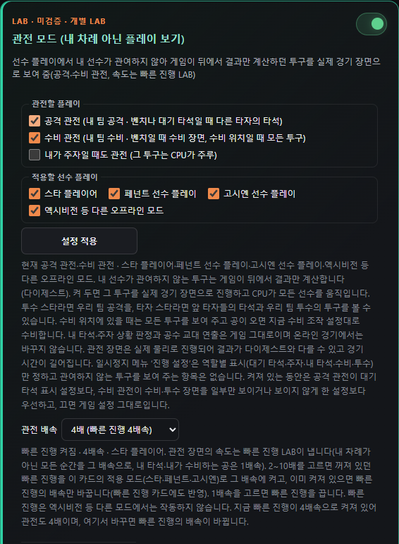

실전 확인 전 LAB입니다. 처음에는 빠른 진행 2~4배와 함께 시험해 보세요.

## 62 빠른 진행: 게임 자동 진행·고속경기 배속

**빠른 진행 (내 차례만 1배속)** 카드(53장)에 **게임 자동 진행·고속경기 배속**이 생겼습니다. 게임이 스스로 결과를 빠르게 계산하는 동안(내 선수가 관여하지 않는 투구의 다이제스트와 일시정지 메뉴의 고속경기)에만 쓰는 배속입니다.

- **원래대로(기본):** 0.7.218과 똑같습니다. 카드의 내 차례 판정을 그대로 따릅니다.
- **1배속:** 그동안 게임 자체 속도로 둡니다.
- **2~10배:** 그동안 그 배속으로 진행합니다. 고속경기는 내 차례도 자동으로 진행하므로 그 배속이 내 차례에도 적용됩니다.
- 고른 뒤 **자동 진행 배속 적용**을 누릅니다. 꺼져 있으면 저장만 하고 켤 때 씁니다. 켜져 있을 때 '원래대로'와 다른 값 사이를 바꾸면 빠른 진행을 한 번 다시 설치해 바로 적용하고, 값끼리 바꾸면 바로 바뀝니다.
- 이 설정은 따로 저장되며, 배속·적용 모드·1배속 옵션 등 기존 설정은 그대로입니다.

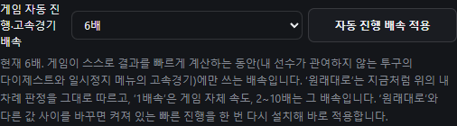

실전 확인 전입니다. 다이제스트와 고속경기에서 1·4·10배를 시험해 보세요.

## 63 다음 내 차례까지 건너뛰기

**다음 내 차례까지 건너뛰기**(공통 기능 → 경기 조작의 LAB 카드, 기본 OFF)는 선수 플레이 경기 중에 한 번 누르면 내 차례가 올 때까지 다른 플레이를 게임 자신의 다이제스트로 건너뜁니다. 내 차례와 관계없는 플레이를 건너뛰고 싶다는 요청 중 이 게임에서 할 수 있는 부분입니다.

- **지금 건너뛰기:** 경기 중에 누릅니다. LAB이 꺼져 있으면 먼저 켭니다. 카드에 '건너뛰는 중 · 다음 내 차례에서 멈춥니다'가 나오고, **건너뛰기 취소**로 멈춥니다.
- **건너뛰는 것:** 다른 타자의 타석, 내가 대기 타석·주자·야수일 때의 플레이. 건너뛴 타석은 게임의 빠른 시뮬레이션이 결과를 정하고 기록도 평소처럼 쌓입니다.
- **멈추는 때:** 내 타석(항상)과 내 투구(기본). **내 투구도 건너뛰기**를 켜면 내 투구도 건너뛰고 내 타석에서 멈춥니다.
- 한 번 누르면 그 경기에서 한 번만 적용됩니다. 경기가 끝나거나 바뀌면(경기 사이 메뉴 포함) 대기가 풀립니다. 이미 날아가는 타구는 건너뛸 수 없습니다.
- **적용할 선수 플레이:** 스타 플레이어, 페넌트 선수 플레이, 고시엔 선수 플레이, 그 밖의 오프라인 모드(엑시비전·WBC 등) 모두 기본 ON. 팀·감독·관전 경기와 온라인 경기에서는 바꾸지 않고, 지금 쓸 수 없으면 이유(경기 중이 아님, 온라인, 적용 모드 아님, 선수 조작 경기가 아님 등)를 보여 주고 아무것도 쓰지 않습니다.
- **단축키:** 기본은 없습니다. 카드에서 F5, F10, F11, Pause, Scroll Lock, Insert, Home, End, Page Up, Page Down 중 하나를 고르면 누를 때 건너뛰기, 다시 누를 때 취소입니다. 고른 키는 Studio가 켜져 있는 동안 다른 프로그램(게임 포함)보다 먼저 받습니다. 다른 프로그램이 이미 쓰는 키면 카드에 안내가 나옵니다.
- 게임 일시정지 메뉴의 '진행 설정'(선수 플레이)에서 대기 타석·주자·수비·투구별 다이제스트를 늘 정해 둘 수도 있습니다. 이 LAB은 그 설정을 바꾸지 않습니다.

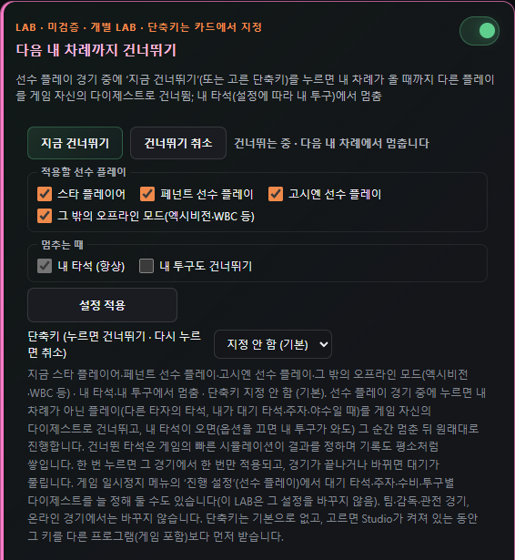

실전 확인 전 LAB입니다. 건너뛰는 동안 스타 미션·평가와 컷인이 어떻게 처리되는지는 게임에 따르며 아직 확인하지 않았습니다.

## 64 통합 상황실: 자동 유지·직접 효과·계약·자금·외부 설정

0.7.218의 읽기 전용 **통합 상황실**(56장)에 원래 통합 패널의 나머지 기능을 옮겼습니다. 페넌트 세이브와 스타플레이어 리그에서 씁니다. 표의 **선택** 칸에 체크한 선수가 있으면 그 선수에게, 없으면 지금 범위의 모든 선수에게 적용합니다. 같은 선수의 포스트시즌·보조 로스터 사본도 같은 선수일 때만 함께 씁니다.

- **② 자동 유지:** 컨디션 최고조, 부상·피로 0, 계약기간 5년, 아이템 29종 99(페넌트만), 팀 애정도 100, 핵심 능력 MAX, 보유 구종 전체 S, 구단 자금 입력값(페넌트만), FA 취득·시즌 연수 보완. 체크하면 켜지고 다시 누르면 꺼집니다. 기본은 모두 OFF입니다.
- 페넌트는 **자동 유지 구단** 한 곳(사용자·추가 구단 위치 포함)을 처음 켤 때 고정하고, 모두 끄면 다시 고를 수 있습니다. 스타는 조작 선수의 소속팀을 선수 신원으로 매번 확인하고, 컨디션·부상·피로 유지에는 원래 패널과 같은 뜻의 '(조작 제외)'가 붙습니다.
- 자동 유지는 구단 명단이 세 번 연속 같게 보인 뒤에 쓰고, 명단이 바뀌거나 항목을 켜고 끄면 다시 세 번 확인합니다(안정화). 끄면 바뀐 값은 그대로 남습니다.
- 원래 통합 패널(또는 스타 전용 연결)이 켜져 있으면 같은 칸을 두 곳에서 유지하지 않도록 상황실 자동 유지를 켤 수 없습니다(끄기는 됩니다). **자동 유지 모두 끄기**, 모드별 기능 OFF, 모든 기능 OFF로도 꺼집니다. 켜진 개수는 사이드바의 통합 상황실 옆에 표시되고 켜진 기능 목록과 기능 찾기에도 나옵니다.
- **③ 직접 효과:** 원래 패널의 241종(능력·수비·구종 129, 특능 책 83, 초록 책 29)을 한 번 씁니다. 단계형 효과는 증가량(작음 +1~+4, 큼 +4~+7)을 고릅니다. 구단 자금 증가(+10000)는 페넌트에서 표의 구단에만 씁니다.
- **④ 계약·자금:** 연봉 원값(만 엔 단위, 0~2,000,000,000), 계약기간(1~5년, 1년 = 단년), FA 코드(1 취득 또는 3~14), 구단 자금 원값과 +10000(페넌트만). FA 1(취득)은 대상과 사본을 모두 확인한 뒤 한 번에 쓰고, 하나라도 맞지 않으면 아무것도 쓰지 않습니다. 적용 뒤에는 구단을 다시 읽어 표에 새 값을 보여 줍니다.
- **외부 설정 · 10슬롯:** 원래 패널과 같은 .p26profile 파일로 모드·구단·범위, 체크한 선수, ③에서 고른 효과, ④의 값, ② 자동 유지 항목을 저장하고 불러옵니다. 불러오면 상황실 자동 유지를 모두 끈 뒤 그 구단을 다시 읽고 저장한 선수를 찾아 체크하며 저장된 자동 유지를 그 구단으로 다시 켭니다. 저장한 선수를 하나도 찾지 못하면 안전을 위해 범위 적용을 막습니다. 원래 패널은 선택 선수 16명까지만 불러옵니다.
- 10슬롯 원본 → 선택 1명 주입은 원래 통합 패널에만 있습니다(공통 패널의 선수 원본 보관소 10슬롯을 켠 뒤 사용). 이 구역의 **LAB › 옮긴 원본에서 원래 패널 열기**로 엽니다.

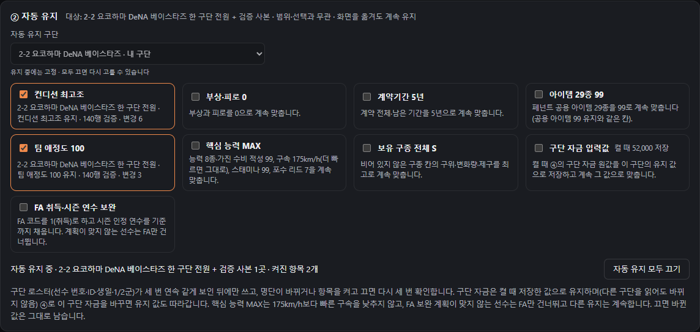

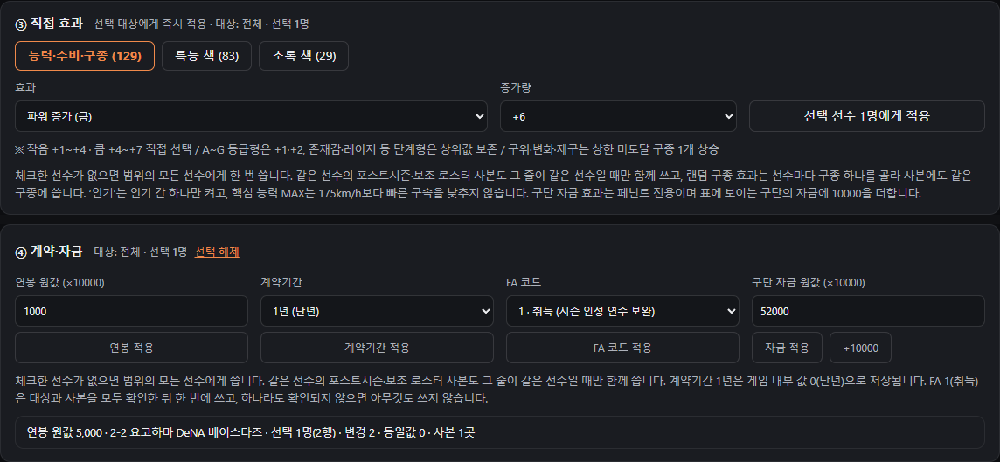

원래 패널과 다른 점: 핵심 능력 MAX는 175km/h보다 빠른 구속을 낮추지 않고, FA 보완 계획이 맞지 않는 선수는 FA만 건너뛰고 다른 유지는 계속합니다. 구단 자금 유지는 켤 때의 값을 저장하고 ④로 그 구단의 자금을 바꾸면 그 값을 따라갑니다. '인기'는 인기 칸 하나만 켜고, 랜덤 구종 효과는 선수마다 구종 하나를 골라 사본에도 같은 구종에 씁니다.

**원래 통합 패널의 위치:** 페넌트·스타 **선수·구단 편집** 탭에 있던 원래 통합 패널(과 스타 전용 연결)은 **LAB → 옮긴 원본**으로 옮겼고 예전과 똑같이 켜고 쓸 수 있습니다. 탭에는 '통합 상황실 열기'와 'LAB › 옮긴 원본 열기' 안내가 남고, 켜져 있던 원본은 끌 때까지 그 탭에서도 끌 수 있습니다. 페넌트 한눈에 보기의 계약·연봉·직접 효과·자동 유지 패널 카드, 스타 한눈에 보기의 리그 패널 카드, 페넌트 자동 유지 안내는 통합 상황실을 엽니다. 즐겨찾기 창의 기능 고르기에서는 '다른 모드·전체 기능'에 있습니다.

DIRECT 페넌트 명단과 페넌트 자동 유지는 0.7.219부터 연봉 원값이 최대값(2,000,000,000)인 선수도 포함합니다. 실제 게임의 계약·능력 화면과의 비교, 포스트시즌 사본, 외부 설정 파일 주고받기는 실전 확인 전입니다. 세이브를 복사해 두고 쓰세요.

## 65 통합 상황실: 고시엔·엑시비전 보기와 스피리츠 안내

통합 상황실의 **모드**에 세 가지가 더 있습니다.

- **고시엔 (내 학교 부원):** 범위(전체, 1학년, 2학년, 3학년, 투수, 야수)를 고르고 **상황 읽기**를 누르면 지금 학교 부원의 학년·포지션·컨디션(0 = 가장 좋음)·체력(0~500)·학력(0~100)·신뢰도와 주목도(0~200)·도구/책 사용 횟수를 표로 보여 줍니다. 읽기만 하며, 바꾸는 것은 같은 페이지 아래의 고시엔 카드(완전 강화 프리셋·유지, 직접 효과)로 합니다(고시엔 화면과 같은 명령).
- **엑시비전 경기 (현재 경기 두 팀):** 범위(두 팀 전체, 내 팀, 상대 팀)로 지금 경기의 선수와 조작 선수·투타겸업 표시를 보여 주고, 내 팀은 컨디션(1 = 가장 좋음)·부상·피로도 보여 줍니다(아직 읽지 않은 값은 —). 읽기 전용이며 내 팀 유지는 엑시비전 화면의 기능을 그대로 씁니다. 커리어 세이브(페넌트·스타·고시엔)가 열려 있으면 그렇게 알려 줍니다.
- **스피리츠 (스피리츠 화면 안내):** 스피리츠에는 구단 선수 명단이 없어(카드로 모은 선수) 표를 읽지 않고, **스피리츠 › 포인트·육성 열기**와 **선수 편집 (스피리츠) 열기** 버튼으로 안내합니다.
- ② 자동 유지와 외부 설정은 원래 패널처럼 페넌트 세이브와 스타플레이어 리그에서만 나옵니다.

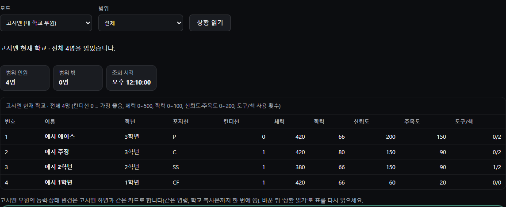

게임 화면과의 값 비교는 실전 확인 전입니다.

## 66 고시엔 상대 학교

**고시엔 → 확장 관리**에 **09 상대 학교** 페이지가 생겼습니다(앞의 8페이지는 그대로). 상대 학교(69교)를 약하게 만드는 세 가지 방법이며 모두 기본 OFF이고 서로 따로 켭니다. 어떤 방법도 내 학교 부원은 바꾸지 않습니다. N은 남기는 비율(10~99%)이고 100%는 게임 원본입니다.

- **경기 중 상대 능력 N%:** 게임이 고시엔 경기(연습 시합·대회, 팀·선수·전술 플레이)를 준비하면서 상대 선수의 경기용 기록을 만들 때만 낮춥니다. 상대 학교 명단과 세이브는 바뀌지 않아 경기가 끝나면 원래 능력입니다. 켠 뒤 준비하는 경기부터 적용되고, 켠 채로 N과 선택을 바꿀 수 있습니다.
- 낮추는 것: 기본 능력 8종, 수비 적성(선택, 기본 ON), 스태미나, 포수 리드, 구종별 구위·제구·변화(0이 아니면 최소 1), 구속(선택, 기본 ON: 100km/h를 넘는 만큼만 N%). 그대로인 것: 특능, 이름, 포지션, 투타, 외모, 오리지널 구종의 궤적. 경기 전 전력 표시는 명단 값이라 그대로 보입니다.
- **상대 학교 성장 N%:** 상대 학교 선수는 경험치 없이 게임의 성장 표 두 개(매달 1일, 4월 1일)로 큽니다. 그 표를 N%로 줄여 켠 뒤의 성장을 늦춥니다. 이미 오른 능력과 매년 새로 들어오는 1학년의 처음 능력은 그대로이고, 끄면 원래 표로 돌아갑니다.
- **영구 조정:** 고른 상대 학교 선수의 명단 값을 한 번 N%로 낮춥니다(경기 중 기능과 같은 계산). 게임을 저장하면 세이브에 남습니다. 고시엔 모드 화면에서 **상대 학교 읽기**를 누르고 N, 선택, 적용 범위(전체 69교, 지역 20교(같은 현), 전국 49교, 등급 N 이상, 선택 학교, 오늘 상대)를 고른 뒤 적용합니다. 경기 중에는 쓰지 않습니다.
- 이미 조정한 선수는 다시 적용해도 건너뜁니다(두 번 줄지 않음). 매년 4월에 들어오는 1학년은 줄지 않으니 4월 뒤에 다시 적용하세요. 확인하지 못한 학교는 이유와 함께 잠기고 쓰지 않습니다.
- **되돌리기 · 원래 값으로:** 조정한 값이 그대로 남은 칸만 원래 값으로 돌리고, 그 뒤 게임에서 바뀐(성장한) 칸은 지금 값으로 둡니다. 조정한 날짜보다 이른 세이브에서는 되돌리지 않습니다. **기록 지우기**는 되돌리기 기록만 지웁니다(지운 뒤 다시 적용하면 이미 줄인 선수도 또 줄어듭니다).
- 방법을 함께 쓰면 곱해집니다(예: 영구 조정 80%에 경기 중 80%면 약 64%). 페이지의 예상 효과 표 기준으로 50%면 등급 5 강호도 가장 약한 학교 수준이 되니 70~80%부터 써 보세요.
- 켜진 상태는 페이지 칩, 고시엔 한눈에 보기의 상대 학교 카드, 켜진 기능 목록에 보이고, 고시엔 기능 OFF로 두 기능이 함께 꺼집니다.

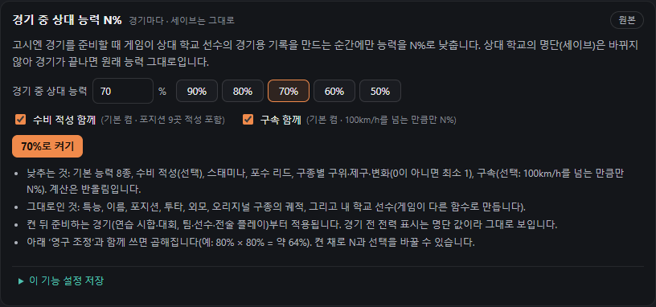

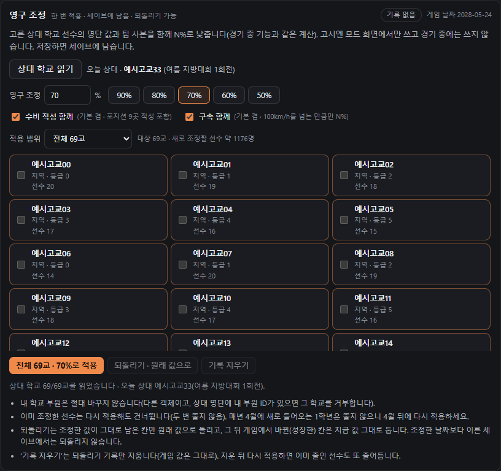

실전 확인 전입니다. 영구 조정은 세이브를 복사해 둔 뒤 쓰세요.

## 67 오타니 쇼헤이의 스위퍼 가져오기

게임에는 스위퍼라는 기본 구종이 없고, 오타니 쇼헤이의 스위퍼는 게임에 들어 있는 오리지널 구종(슬라이더 기반)입니다. 예전에는 그 값이 Studio의 확인 범위 밖이라 가져올 수 없었습니다(가져오기 목록에서 회색으로 '검증 범위 밖').

- 0.7.219부터 게임 원본의 이 기록과 똑같은 값만 확인된 구종으로 인정합니다. **특능·오리변 가져오기**(DIRECT와 세이브 편집)로 가져오고, **오리지널 라이브러리**에서 장착할 수 있습니다(라이브러리에 '(大谷 翔平)'가 붙은 항목이 하나 늘어남).
- 오타니 기록은 선수 가져오기·드래프트 후보 교체·스카우트의 원본으로도 쓸 수 있고, 스위퍼를 받은 선수도 '확인 안 된 구종'으로 표시되지 않아 중복 구종 정리·선수 가져오기를 그대로 쓸 수 있습니다.
- 원본 검색은 '大谷', 'Ohtani' 또는 선수 ID '61271'로 합니다('오타니'로는 찾지 못합니다).
- 한국어 게임 화면에서는 기본 구종 이름(슬라이더)으로 보입니다. 예리함은 한 단계 낮고 가로 변화가 큰 구종입니다.
- 이 기록과 값이 하나라도 다른 구종은 예전처럼 가져오지 않습니다.

쓰지 않는 선수로 먼저 시험하고(가져오기, 던져 보기, 저장 후 다시 불러오기) 필요하면 직전 가져오기 되돌리기를 쓰세요. 실전 확인 전입니다.

## 68 세이브 편집: 스타 본인 선수 가져오기

세이브 편집의 선수 가져오기(55장)는 0.7.219부터 스타 세이브의 **스타 본인**에게도 됩니다.

- 원본 범위(이 세이브, 게임 선수, 커스텀·다운로드)와 가져올 항목, 65% 환산, 이름 선택은 55장과 같습니다. 같은 역할군(투수·야수)의 원본만 나옵니다.
- 바뀐 값은 스타 본인의 세 사본(본체·리그 기록·로스터 사본)에 함께 쓰고, 바뀐 능력치의 성장 경험치도 새 값에 맞춥니다(게임의 성장 판정 때 되돌아가지 않게). 바뀌지 않은 값의 경험치는 그대로입니다.
- 선수 ID·생일·소속·계약·시즌 저장값은 그대로입니다. 스타 리그의 다른 선수에게는 하지 않고 이유를 보여 줍니다.
- 적용은 '저장 전 변경'에 넣을 뿐이고, 편집본 만들기나 백업 후 원본에 저장 때 씁니다.

게임이 이 세이브를 불러오고 성장일이 지난 뒤에도 값이 남는지, 외모·폼이 바뀌는지는 실전 확인 전입니다. 편집본이나 복사한 세이브로 먼저 시험하세요.

## 69 자유행동일 하루 1번과 휴일 아이템

스타플레이어 → 성장·생활·아이템의 **자유행동일 여러 번 행동** 카드(41·52장)에 두 가지 선택이 생겼습니다. 둘 다 기본 OFF이며 끄면 0.7.218과 같습니다. 자유행동일이 아닌 휴일에도 개인 생활을 하고 싶을 때 씁니다.

- **하루 1번:** '자유행동일 말고도 적용할 날'에서 **경기 없는 날 (휴일)**을 체크하면 '하루 1번' 버튼이 나오고, **적용하는 날 설정 적용**을 누른 뒤 고를 수 있습니다. 자유행동일은 게임 그대로 한 번 행동하면 하루가 끝나고, 휴일(경기 없는 날)에는 개인 생활(외출·인물 교류·선수 교류) 1번을 실제로 한 뒤 하루가 끝납니다. 경기 있는 날의 시합 전 행동은 없습니다.
- 하루 1번으로 켜져 있는 동안에는 경기 없는 날을 끌 수 없습니다. 먼저 하루 2번 이상으로 바꾸거나 LAB을 끄세요.
- **휴일 아이템:** 세 번째 체크 상자입니다. 휴일에도 아이템 탭에서 하루를 쓰는 아이템을 자유행동일처럼 쓸 수 있고(행동 횟수와 상관없음), 쓰면 그날이 원래대로 끝납니다. 켜거나 끄면 LAB을 다시 설치합니다.
- 게임 코드를 확인하지 못하면 휴일 아이템은 빼고 나머지만 적용하며 이유를 카드에 보여 주고, 하루 1번은 켜지 않습니다.
- 자동 ON으로 하루 1번을 쓸 때는 '적용하는 날' 설정을 먼저 저장하세요(시작할 때 저장한 순서대로 넣습니다).
- 휴일은 자유행동일과 완전히 같지는 않습니다. 자유행동일 표시와 시작 이벤트, 자유행동일에 주는 체력 회복이 없고, 첫 탭에는 휴양 대신 다음이 나오며, 이벤트 문구가 자유행동일을 전제로 할 수 있습니다. 오프시즌·캠프 날과 약속이 있는 날은 원래대로입니다.

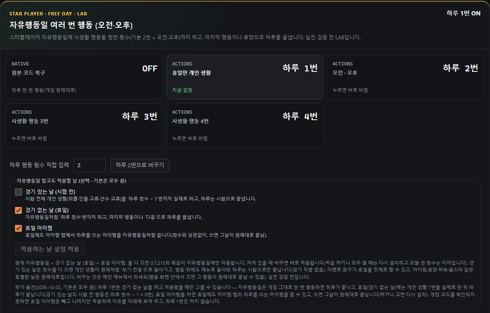

실전 확인 전 LAB입니다. 설정을 바꾸는 것은 메인 메뉴에서 하세요.

## 70 DIRECT 특수 능력 표시와 등급형 안전 MAX·청특 지우기

DIRECT 선수 편집에서 스타 선수를 불러오면 능력·구종은 같은데 특능만 다르게 보인다는 제보를 고쳤습니다. 스타 선수는 실선수 1,491명 표본에 없는 특능 조합을 가질 수 있는데, **특수 능력 90** 탭의 칸은 표본 조합만 목록에 있어 첫 항목(D 또는 없음)으로 잘못 보였습니다. 능력·구종은 숫자라 원래 정상이었습니다.

- **특수 능력 90:** 저장된 값이 목록에 없으면 '현재값 · (실제 특능) (표본 밖 조합 · 그대로)'로 보여 줍니다. 이 항목은 표시용이라 고를 수 없고, 다른 항목을 고르면 예전처럼 그 칸 전체가 고른 값으로 바뀝니다(숨은 조합은 사라짐). 열기만 해서는 아무것도 쓰지 않습니다.
- **능력 카드:** 게임 화면의 표시 규칙을 따릅니다. 풀히터·거친볼·사구·힘 배분은 중립 색, 내부값 4는 글자 없이 빨간색(예리함·뻗기는 저하), 이름이 따로 없는 값은 게임처럼 가까운 단계의 이름, 큰 무대·낮·밤 경기·타구 반응·번트 대시는 주 포지션의 탭에 표시합니다.
- **특능·오리변 가져오기:** 이름이 따로 없는 값을 게임의 이름으로 보여 줍니다(예: VS 패스트볼 (값 2)).
- **등급형 안전 MAX:** 지금보다 낮은 등급은 쓰지 않습니다. 예전에는 표본에서 가장 좋은 값을 써서 스타 선수의 'A + 부가 능력'이 'C + 부가 능력'으로 내려갈 수 있었습니다.
- **청특 지우기:** 바꾸는 칸만 검사합니다. 예전에는 건드리지 않는 다른 칸에 표본 밖 조합이 있으면 전체를 거부했습니다. 바꾸는 칸 자체가 표본 밖이면 여전히 거부합니다.
- 등급형 안전 MAX와 청특 지우기는 DIRECT와 세이브 편집에 똑같이 적용됩니다. 그 밖에 쓰는 값의 규칙은 그대로입니다.

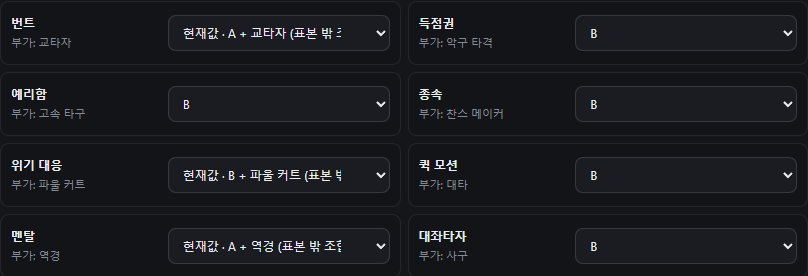

게임의 선수 능력 확인 화면과의 비교는 실전 확인 전입니다.

## 71 화면 오류 안내(검은 화면 대신 오류 상자)

0.7.218에서 드래프트 후보 목록을 새로 고치면 Studio가 검은 화면이 되며 멈췄다는 제보가 있었습니다. 재현되지는 않았지만, 화면을 그리다 오류가 나면 Studio 전체가 빈 검은 창이 되는 구조였습니다.

- 0.7.219부터 모든 화면과 탭은 오류가 나도 그 화면 안에만 오류 상자를 보여 줍니다. '…을(를) 그리다 오류가 났습니다', 오류 문구, **다시 그리기** 버튼이 나오고 사이드바와 다른 화면, 게임과 켜 둔 기능은 그대로입니다.
- 화면 밖에서 오류가 나면 빈 창 대신 **화면 다시 불러오기** 버튼이 있는 페이지가 나옵니다.
- 오류와 그 위치가 진단 로그(`%LOCALAPPDATA%\Prospi26Studio\logs`의 startup 로그)에 남습니다. 드래프트 읽기마다 시작과 끝(걸린 시간·후보 수), 실패한 명령도 기록합니다. 드래프트 읽기 기록에는 숫자만 남습니다.
- 오류가 없으면 화면은 예전과 같습니다.

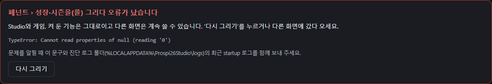

같은 문제가 다시 생기면 오류 상자의 문구(스크린샷)와 최근 startup 로그를 함께 보내 주세요. 드래프트 새로고침 때의 원인은 이 오류 상자 덕분에 찾아 0.7.220에서 고쳤습니다(76장).

## 72 센트럴 리그 DH 제도(퍼시픽 방식)와 이도류 옵션

**센트럴 리그 DH 제도 (퍼시픽 방식)** LAB(기본 OFF)을 켜면 페넌트·스타플레이어에서 센트럴 리그 구장의 홈경기도 퍼시픽 리그처럼 지명타자(DH)를 씁니다. 카드는 공통 기능 → 경기 조작, 페넌트 → 일정, 스타플레이어 → 일정에 있고 설정과 스위치는 같습니다(일정 탭에서는 그 모드의 스위치를 강조). 두 모드의 한눈에 보기에도 일정으로 가는 카드가 있습니다.

- **모드별 스위치:** 페넌트와 스타플레이어를 따로 켭니다. **모두 끄기**는 원래 코드로 되돌립니다. 모드별 기능 OFF는 그 모드의 스위치와 그 모드에 해당하는 이도류 옵션만 끕니다(페넌트: CPU 팀 옵션, 스타: 세 옵션).
- **적용 경기(켤 때 기본은 모두 선택, 하나 이상):** 정규 시즌, 클라이맥스 시리즈(퍼스트·파이널 스테이지), 일본시리즈(센트럴 구장 경기도 DH), 교류전(센트럴 구장 홈경기, 게임의 교류전 DH 설정을 모두 끈 경우는 원래대로). 켜져 있을 때 바꾸면 바로 적용됩니다.
- 게임이 경기마다 DH를 정하는 판정에서 센트럴 구장 경기를 퍼시픽 구장의 규칙으로 보냅니다. 그래서 오더·라인업, CPU 팀 오더, 자동 진행(시뮬레이션) 경기, 경기 중 DH가 함께 따라갑니다. 스타플레이어의 일본시리즈·교류전에서 경기 중 DH를 한 번 더 정하는 판정도 함께 바꿔 라인업과 맞춥니다(이 부분을 확인하지 못한 실행 파일에서는 스타의 일본시리즈·교류전을 원래대로 두고 카드에 안내합니다).
- 다음에 준비하는 경기(오더·라인업)부터 적용됩니다. Studio가 게임 메뉴 화면의 모드(페넌트 진행 화면·스타 화면)를 알아보고 그 모드의 스위치대로 적용하므로, 경기 중에 켜거나 바꾸면 경기가 끝나고 메뉴에서 적용됩니다. 시즌 중이면 경기 전날에 켜는 것이 좋습니다. 끄면 바로 원래 코드로 돌아가 다음 경기 준비부터 원래대로입니다.
- 퍼시픽 구장 경기, 고르지 않은 경기, 2군은 게임 그대로이고 세이브에는 아무것도 쓰지 않습니다.

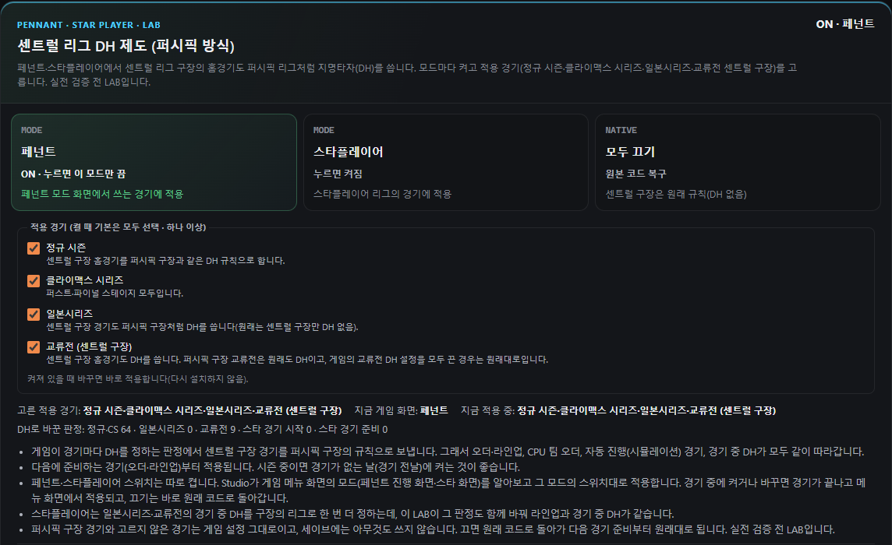

**이도류 옵션**은 각각 따로 켜는 LAB이며 기본은 모두 OFF입니다.

- **선발 등판일에 지명타자로도 출전(내 스타):** 이도류 스타가 선발 등판하는 날 DH가 있는 경기면 타순에도 지명타자로 들어가 선발 투수와 타격을 함께 합니다. 원래는 등판일에 타순에서 빠집니다. DH가 없는 경기는 원래대로 투수 타석만 섭니다.
- **등판 다음 날에도 타격(내 스타):** 이도류 스타의 야수 출전일을 고를 때 선발 등판 다음 날도 고를 수 있게 합니다(등판 전날은 원래도 가능). 게임이 다음 출전일을 다시 정할 때부터 적용되고 피로·부상 위험이 커질 수 있습니다.
- **CPU 팀 이도류 레귤러: 등판 전날·다음 날에도 타격(페넌트·스타의 CPU 팀):** CPU 팀이 매일 오더를 짤 때 쓰는 휴식 명단에서 어제 던진 선발과 내일 선발을 빼지 않습니다. 이도류로 보는 투수(야수 적성이 있는 투수)만 타순에 들 수 있고 순수 투수는 그대로입니다. 이틀·사흘 전에 던진 투수의 휴식, 국가대표·특수 팀, 내 팀은 그대로입니다.

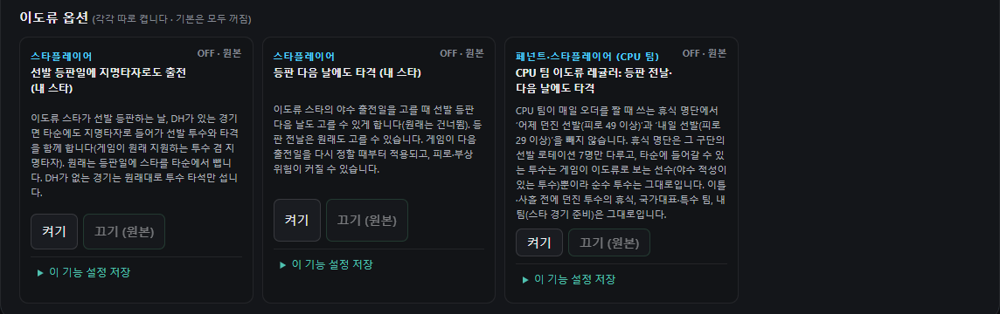

실전 확인 전 LAB입니다. 켠 뒤 센트럴 구장 홈경기의 오더 화면에서 DH 칸과 다른 구단 자동 진행 경기의 기록을 확인해 보세요.

## 73 일정 탭: 게임 DH 설정을 바꾼 시즌의 경기 표시

페넌트·스타플레이어의 **일정** 탭(41장)과 난입·교체 LAB의 캘린더(11장)는 0.7.218에서 게임의 DH 설정을 바꾼 시즌의 경기 날짜를 경기 없는 날로 보여 줄 수 있었습니다. 게임의 DH 설정이 일정 자료의 같은 칸을 함께 바꾸기 때문입니다. 0.7.219부터는 그런 날도 경기로 표시합니다. 기본 DH 설정의 시즌은 결과가 예전과 같습니다.

## 74 스타 전술 경기 튕김: 원인과 수정

**고시엔 전술 경기 (페넌트·스타)** LAB을 켠 채 스타플레이어 경기를 시작하면 게임이 튕기던 문제(57장)의 원인을 찾아 0.7.220에서 고쳤습니다. 원인은 게임이 아니라 Studio에 있었습니다. 크래시 폴더를 보내 주신 제보자분께 감사드립니다. 그 덤프 덕분에 튕긴 위치를 정확히 확인할 수 있었습니다.

- **원인:** 스타 경기를 준비할 때 게임은 두 팀의 선수 기록을 한 팀씩 차례로 복사합니다. 0.7.183부터 이 LAB은 그 준비 코드에 Studio의 판단을 끼워 넣었는데, 끼워 넣은 자리가 두 번째 팀 복사가 다시 시작되는 지점과 겹쳤습니다. 그래서 두 번째 팀을 복사할 때 엉뚱한 팀 정보를 읽어 게임이 튕길 수 있었습니다. 제보된 오류 창의 메모리 읽기·쓰기 오류(EXCEPTION_ACCESS_VIOLATION)가 이것입니다.
- **영향 범위:** LAB이 켜져 있으면 전술 경기뿐 아니라 액션 플레이를 포함한 모든 스타 경기 준비가 이 자리를 지났습니다. 튕기는지는 첫 팀의 복사 인원과 Studio 코드가 놓인 메모리 위치에 따라 달라서, 어떤 PC에서는 매번 튕기고 다른 PC에서는 거의 튕기지 않았습니다. LAB이 꺼져 있었다면 해당하지 않습니다.
- **수정:** 끼워 넣는 자리를 복사 반복의 시작 지점 그 자체로 옮겼습니다. 전술 경기 판단은 첫 번째 팀 차례에서 한 번만 하고, 두 번째 팀은 게임 원래 순서대로 복사합니다. 옵션과 관계없이 적용됩니다.
- **바뀌지 않은 것:** 어느 날 전술 경기를 받아들일지의 판단(오늘 역할 검사)과 그 시점, 고유 카드·전령·안정 모드 같은 옵션, 카드의 최근 단계와 로그는 0.7.219와 같습니다. 안정 모드는 이 원인과 관계가 없었으며 선택 옵션(기본 OFF)으로 그대로 남아 있습니다.
- **같은 종류의 문제 검사:** Studio가 게임 코드에 끼워 넣는 모든 자리를 게임 실행 파일의 분기와 대조하는 검사를 새로 만들어 배포 전 검사에 넣었습니다. 0.7.219의 이 자리 말고는 발견되지 않았습니다.

LAB을 켠 채 스타 경기를 액션 플레이와 전술 경기로 각각 끝까지 진행하는 실전 확인은 아직입니다. 그래도 튕기면 57장의 방법(크래시 폴더, 카드의 최근 단계 문구)으로 다시 알려 주세요.

## 75 모션 LAB: 아무것도 없는 상태에서 새 투구폼 만들기

0.7.220부터 모션 LAB에서 빈 파일을 먼저 만들고, 그 안에서 투구폼 동작을 만든 뒤, 게임에서 쓸 수 있습니다. 순서는 **새 파일 만들기 → 동작 만들기 → 파일에 저장 → 게임에서 쓰기**입니다. 게임 폼을 고쳐 새 폼 파일로 만드는 예전 방법(37장)도 그대로 있습니다.

**1. 새 파일 만들기:** 왼쪽 폼 목록의 **내 폼 파일** 탭에서 **새 투구폼 만들기**를 누릅니다.

- **이름:** Studio에서만 쓰는 이름입니다(40자까지).
- **종류:** 와인드업 또는 세트.
- **시작:** **빈 동작**(기본)은 틀 폼의 첫 자세로 가만히 서 있는 동작입니다. 아무것도 움직이지 않으므로 키 프레임으로 동작을 만듭니다. **게임 폼 복사**는 틀 폼의 동작을 그대로 가져와 고칩니다.
- **틀 폼:** 같은 종류의 게임 폼 하나입니다(기본은 목록에서 고른 폼). 구간 길이, 공이 손을 떠나는 시점(릴리스), 게임의 투구 판정(팔 각도 분류·팔로스루)을 틀에서 가져오고 빈 동작의 첫 자세도 이 폼에서 가져옵니다. 모든 회전값이 0인 자세는 게임 뼈대에서 몸이 한 줄로 접힌 모양이라 쓰지 않습니다.
- **게임 번호:** **자동**은 아무 선수도 쓰지 않는 번호 중 게임의 폼 고르기 화면에 보이는 번호를 먼저 고릅니다(틀 폼과 다른 파일이 고른 번호는 빼고). 직접 고르거나 **나중에 정함**을 골라도 됩니다.
- **만들면 바로 게임에 등록(Studio가 켜져 있는 동안):** 번호가 있으면 처음부터 체크되어 있습니다.
- **만들기**를 누르면 새 파일(와인드업은 P26W####, 세트는 P26S####)이 Studio 보관 폴더와 게임 실행 파일 옆 폴더에 생기고 바로 편집기에 열립니다. 게임 원본 파일은 바꾸지 않으며 게임이 켜져 있어도 됩니다.

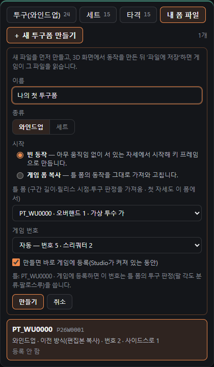

**2. 동작 만들기(키 프레임):** 파일은 제목이 'P26W0002 · 이름'인 문서로 열리고 **내 폼 파일** 표시가 붙습니다. 편집 방식은 **키 프레임**이 기본입니다(게임 폼은 예전처럼 **범위 블렌드**가 기본이며 둘 다 바꿀 수 있습니다).

- 프레임을 고른 뒤 본의 회전 숫자(FK)를 바꾸거나 3D 모델의 몸 부위를 끌면(IK) 그 프레임에 바꾼 본의 키가 생깁니다.
- 동작은 첫 프레임의 원래 자세에서 출발해 키와 키 사이를 부드럽게 잇고, 마지막 키 뒤에는 그 자세를 유지합니다. 준비·와인드업과 릴리스·팔로스루(M000→M001)는 한 흐름으로 이어지고 다른 구간은 따로 이어집니다.
- **자세 키 넣기**는 모든 본의 지금 자세를 이 프레임의 키로 고정합니다(다른 프레임의 키가 이 프레임을 바꾸지 않음). **키 지우기**는 이 프레임의 키를 지웁니다.
- **자세 복사**와 **자세 붙여넣기**로 한 프레임의 자세 전체를 다른 프레임에 넣습니다.
- **◀ 키 / 키 ▶**로 키 사이를 오가고, 타임라인에는 키가 주황색 마름모로 표시됩니다.
- **릴리스 추정 프레임으로**를 누르면 공이 손을 떠나는 프레임(틀 폼의 타이밍)으로 갑니다. 팔 동작을 여기에 맞추세요.
- 되돌리기·다시 하기(Ctrl+Z/Y), 원본 겹쳐 보기, 편집 목록, 카메라 버튼은 예전과 같습니다(37장).

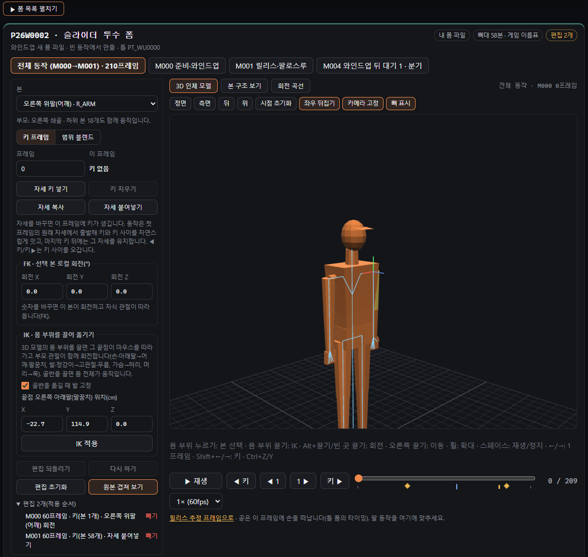

**3. 파일에 저장:** 편집기 아래 **파일** 카드의 **파일에 저장**을 누르면 편집이 그 폼 파일에 들어갑니다(보관 폴더 먼저, 그다음 게임 폴더). 편집 목록도 함께 저장되어 다음에 파일을 열면 이어서 고칠 수 있습니다.

- 저장하지 않은 편집이 있으면 카드에 '저장 안 한 편집이 있습니다' 안내가 나옵니다. 게임이 읽는 파일은 **파일에 저장**을 눌러야 바뀝니다.
- 같은 카드에서 **이름 바꾸기**를 하고 만든 방식·틀 폼·만든 시각·저장 시각을 봅니다. **애니메이션 저장·열기**(.p26motion)도 여기에 있습니다.
- 게임이 그 파일을 읽는 중이라 게임 폴더 쪽을 바로 쓰지 못하면 1초 동안 다시 시도하고, 그래도 안 되면 그렇게 알려 줍니다. 그때는 **파일 관리** 카드의 **파일 다시 쓰기**를 누르세요.

**4. 게임에서 쓰기:** **게임에서 쓰기** 카드에서 번호를 고르고 **게임에 등록**을 누릅니다(끄려면 **등록 끄기**).

- Studio가 게임과 함께 켜져 있는 동안 그 번호를 쓰는 모든 선수가 다음에 폼을 불러올 때 새 파일의 동작을 씁니다. 페넌트·스타·고시엔·엑시비전 등 모든 모드에 해당하고, 파일에 다시 저장하면 다음에 불러올 때 새로 저장한 동작을 읽습니다.
- **선수에게 주는 법:** 게임의 선수 편집(투구폼 고르기)에서 카드에 나온 폼 이름(예: 스리쿼터 2)을 고르거나, **DIRECT 선수 편집 → 투구폼 번호**에서 와인드업(세트 파일이면 세트) 폼 번호에 그 번호를 넣습니다. 숨김 번호는 게임 목록에 없으므로 DIRECT로만 줄 수 있습니다.
- **등록 끄기**, **모든 기능 OFF**, Studio 종료 때 그 번호는 게임 원래 폼으로 돌아갑니다. Studio 없이 게임만 켜도 원래 폼입니다.
- **파일 관리** 카드에는 게임 폴더 파일이 있는지와 폴더 위치가 나옵니다. 게임 폴더 파일이 없거나 맞지 않으면 **파일 다시 쓰기**가 나오고, **지우기**는 게임이 꺼져 있고 등록을 끈 파일만 됩니다.

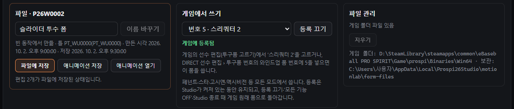

빈 동작은 그대로 두면 움직이지 않으니 키로 동작을 만든 뒤 저장해서 쓰세요. 게임 안에서 새 폼이 실제로 어떻게 보이는지(키로 만든 동작, 릴리스 시점, 등록 끄기 뒤의 원래 폼)는 실전 확인 전입니다. 먼저 쓰지 않는 번호와 별도 세이브로 시험하세요.

## 76 드래프트: 게임 현재 목록만 보기와 내 후보

0.7.220부터 **페넌트 → 성장·시즌 → 드래프트 후보 · 실제 능력치** 카드는 게임의 현재 드래프트 후보 목록만 보여 주고, 마음에 드는 후보를 따로 저장해 두는 **내 후보**가 생겼습니다. 0.7.218~0.7.219의 **미발굴 등**·**저장된 전체** 보기는 없어졌습니다. 저장된 전체는 Studio가 저장해 둔 목록이 아니라 그해 게임이 만든 후보 전체였으므로 화면에서만 빠졌고 게임의 후보는 그대로입니다.

- **게임 목록 N명:** **후보 목록 새로고침**으로 읽은 게임의 현재 목록을 투수·야수·포수·내야수·외야수 페이지로 봅니다. 검색, 포지션 거르기, 40명씩 보기, 후보 선택과 능력 상세, 후보 교체는 예전과 같습니다.
- **목록을 확인하지 못했을 때:** 예전처럼 후보 전체를 대신 보여 주지 않고 '지금 게임의 드래프트 후보 목록을 확인하지 못해 후보를 보여 주지 않습니다'와 그 이유를 보여 줍니다. 게임에서 드래프트 후보 목록을 연 뒤 다시 새로고침하세요.
- **특별(OB) 후보:** 게임 설정을 확인하지 못해 목록에 드는지 정할 수 없는 특별 후보에는 '특별(OB) 후보 · 게임 설정 확인 불가' 표시가 붙습니다(예전에는 이 표시가 빠져 있었음). 게임이 숨기는 특별 후보(게임 목록에도 없고 발굴도 할 수 없는 후보)는 보이지 않습니다.
- **☆/★ 내 후보 저장:** 후보 칸 오른쪽 위의 ☆나 능력 상세의 **★ 내 후보로 저장**을 누르면 그 후보를 지금 읽은 값으로 Studio 파일(`%LOCALAPPDATA%\Prospi26Studio\pennant-draft-picks.v1.json`)에 저장합니다. 저장한 후보는 ★로 바뀌고, 다시 누르면 지금 값으로 다시 저장합니다. 게임에는 아무것도 쓰지 않습니다.
- **내 후보 불러오기:** 위쪽 줄의 이 버튼을 누를 때만 파일을 읽어 **내 후보 N명** 구역을 엽니다. Studio를 켤 때나 새로고침·후보 선택 때는 읽지 않습니다. 후보마다 지금 상태가 '지금 게임 목록에 있음 · 누르면 선택', '미발굴 후보 · 누르면 선택(발굴 가능)', '지금 게임 목록에 없음 · 누르면 저장한 능력'(저장할 때의 능력을 보여 줌) 중 하나로 나옵니다. 이름과 ID가 모두 같아야 같은 후보로 봅니다(교체한 후보는 다른 후보).
- 내 후보 칸 오른쪽 위의 X는 확인 창을 거쳐 그 후보를 내 후보에서 지우고(저장한 데이터만), **닫기**는 구역을 닫습니다.

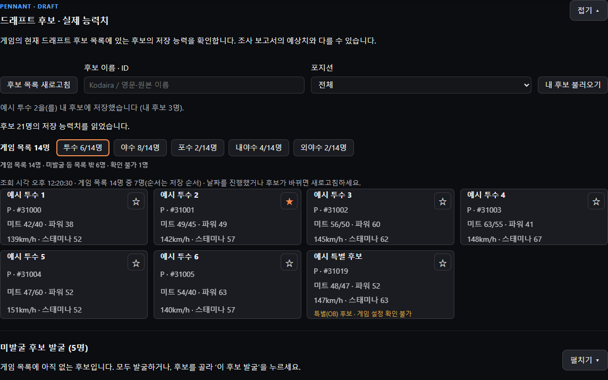

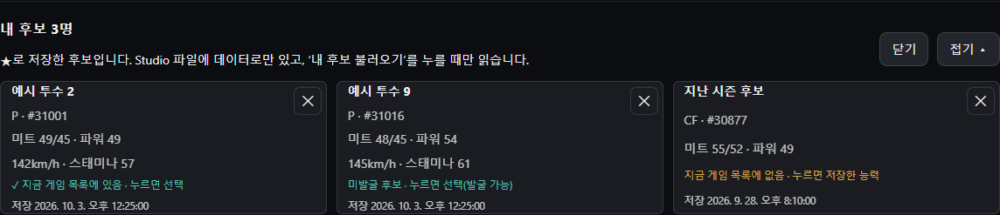

- **미발굴 후보 발굴 (N명):** 모두 발굴과 이 후보 발굴은 그대로 있고 목록 아래의 접힌 구역으로 옮겼습니다(처음에는 접혀 있음). 펼치면 발굴할 수 있는 후보만 나옵니다(54장).
- **발굴 안정성:** 발굴하는 동안에는 두 발굴 버튼이 잠겨 두 번 눌러도 한 번만 실행됩니다. 결과와 오류는 카드 안(모두 발굴은 그 구역, 이 후보 발굴은 그 후보의 상세)에 나옵니다. 쓰기가 꺼져 버튼을 쓸 수 없으면 '쓰기 꺼짐: …' 이유를, 게임 화면을 아직 확인하지 못했으면 '누를 때 게임 화면을 다시 확인합니다'를 버튼 옆에 보여 줍니다.
- **새로고침 검은 화면 수정:** 0.7.218~0.7.219에서 미발굴 후보가 있을 때 후보 목록을 새로 고치면 화면을 그리지 못하던 문제를 고쳤습니다(0.7.218은 Studio 전체가 검은 창, 0.7.219는 그 화면의 오류 상자). 71장의 오류 상자 덕분에 원인을 찾았습니다.

내 후보 파일을 지우거나 고쳐도 게임에는 영향이 없습니다. 파일을 읽지 못하면 파일은 그대로 두고, 새로 저장할 때 원래 파일을 옆에 따로 보관합니다. 실제 게임 목록과 같은 후보가 나오는지, 날짜가 지난 뒤에도 저장한 후보의 능력이 열리는지, 모두 발굴의 결과가 카드에 나오는지는 실전 확인 전입니다. 세이브를 복사해 두고 쓰세요.

## 77 전술 경기: 내 선수 차례만 1배속, 다른 선수는 빠르게

전술 경기(고시엔 전술 경기와, 고시엔 전술 경기 LAB으로 하는 페넌트·스타 전술 경기)에서 내 선수 차례는 보통 속도로 보고 다른 선수 차례는 빠르게 넘길 수 있습니다. 게임이 카드를 고른 뒤 고속 진행하는 동안의 속도만 바꿉니다.

- **내 선수:** 스타 전술 경기는 내 스타 선수, 고시엔·페넌트 전술 경기는 '적용 대상' 카드에서 고른 선택 선수입니다. 선택 선수가 없으면 바뀌지 않습니다.
- **내 선수 차례:** 우리 팀 공격 때 그 선수의 타석, 수비 때 그 선수의 투구입니다. 나머지 차례와 게임이 결과만 계산하는 동안은 고른 배속으로 진행합니다.
- **쓰는 법 1:** 공통 기능 > 경기 조작의 **빠른 진행 (내 차례만 1배속)** 카드에서 **전술 경기 배속**을 2~10배로 고르고 **전술 경기 배속 적용**을 누릅니다. 빠른 진행 LAB이 켜져 있어야 작동합니다.
- **쓰는 법 2:** **내 선수만 전술 카드** 카드의 **다른 선수 차례 배속**에서 고르면 같은 설정이 들어갑니다. 빠른 진행이 꺼져 있으면 켜며, 그때는 선수 플레이에서도 빠른 진행 카드의 설정대로 작동합니다.
- **그대로인 것:** 카드 화면과 연출, 고속 진행이 꺼진 동안은 바꾸지 않습니다. 고속 진행 중에는 이 설정이 R2·L2보다 우선합니다.
- **기본값 원래대로:** 0.7.219와 똑같이 전술 경기 속도를 바꾸지 않습니다. 빠른 진행을 끄거나 전술 경기가 끝나면 게임이 쓰던 속도로 돌아갑니다.
- 다른 선수 차례를 아예 건너뛰는 방식은 게임에서 확인할 부분이 남아 이번에는 넣지 않았습니다.

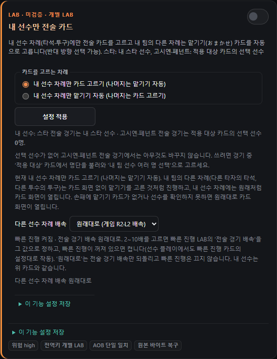

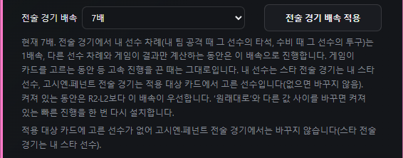

## 78 페넌트 훈련 효과 배율

페넌트에서 하루 연습(연습 메뉴·오마카세)과 코치 개별 지도로 쌓이는 경험치를 배율로 곱합니다. 페넌트 > 선수 성장 화면 아래의 **훈련 효과 배율** 카드에 있으며 기본은 꺼짐입니다.

- **적용 범위 3가지:** 팀 전체(운영 구단 선수 전원), 고른 선수 공통(고른 선수에게 같은 배율, 한 명만 골라도 됨), 선수마다 따로(선수별 배율).
- **배율 방식 2가지:** 모든 훈련에 하나의 배율, 또는 연습 메뉴별 배율(특수 연습과 코치 지도 포함).
- **우선순위:** 선수마다 따로 > 고른 선수 공통 > 팀 전체 중 하나만 적용하며 배율이 겹쳐 곱해지지 않습니다. 팀이 ×2여도 그 선수에게 따로 ×1을 주면 원래대로입니다.
- **범위:** ×0~×1000. ×0이면 그 훈련의 경험치가 쌓이지 않습니다.
- **곱하지 않는 것:** 경기 출장 경험치 등 연습이 아닌 경험치, 연습 화면의 예상 표시, 스타플레이어·고시엔.
- **게임 규칙은 그대로:** 하루에 오를 수 있는 양(능력 25단계, 포수 리드·구종 2단계)과, 최대치를 넘는 날은 그날 상승을 버리는 게임 규칙이 그대로 적용됩니다. 최대치에서 멈추게 하려면 선수 성장 엔진을 함께 켜세요.
- 설정은 구단별로 저장되고 다른 구단 세이브에서는 그 구단의 설정을 읽습니다.
- 스타플레이어의 훈련 배율은 이후 작업으로 남겨 두었습니다.

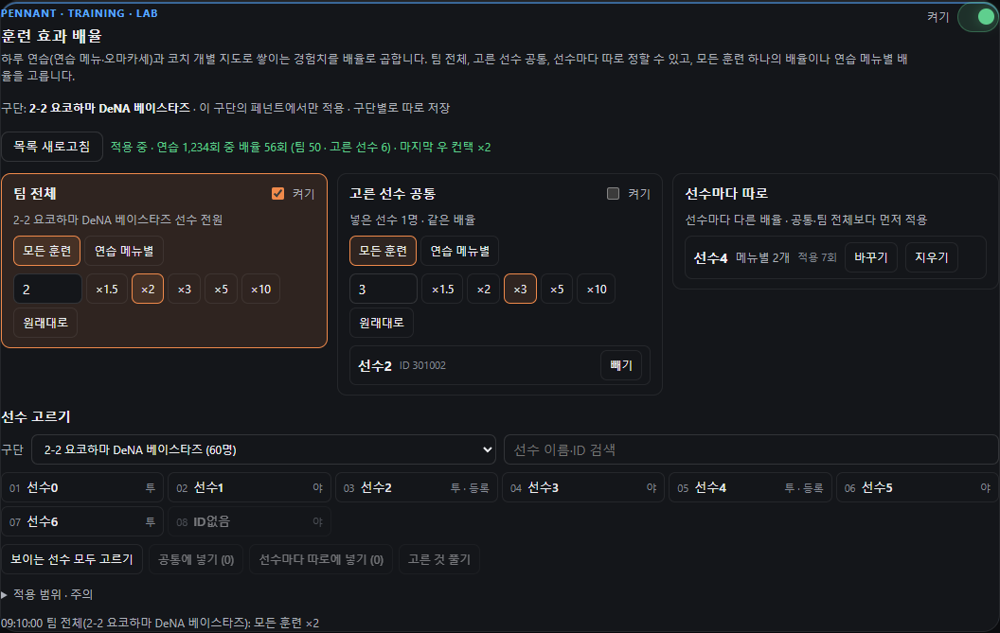
