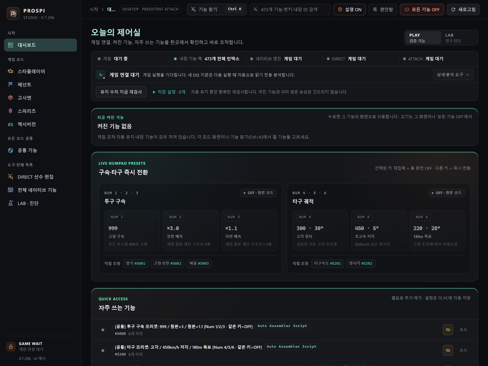
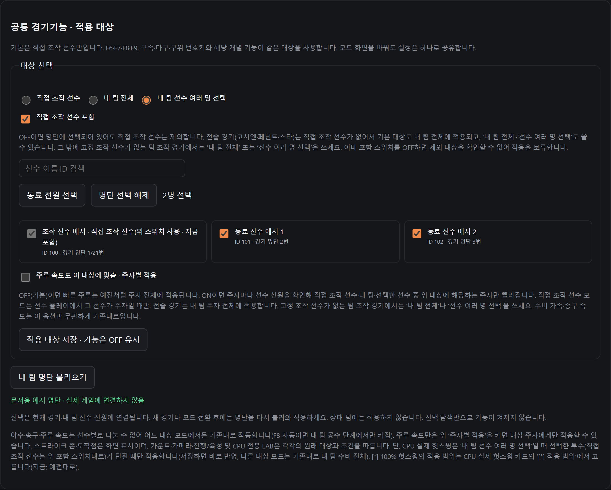
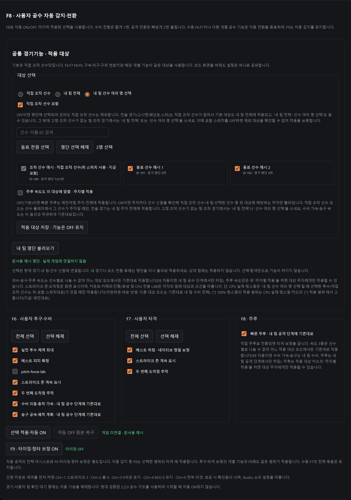
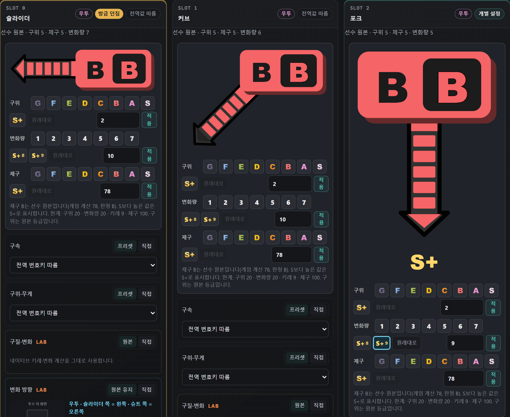
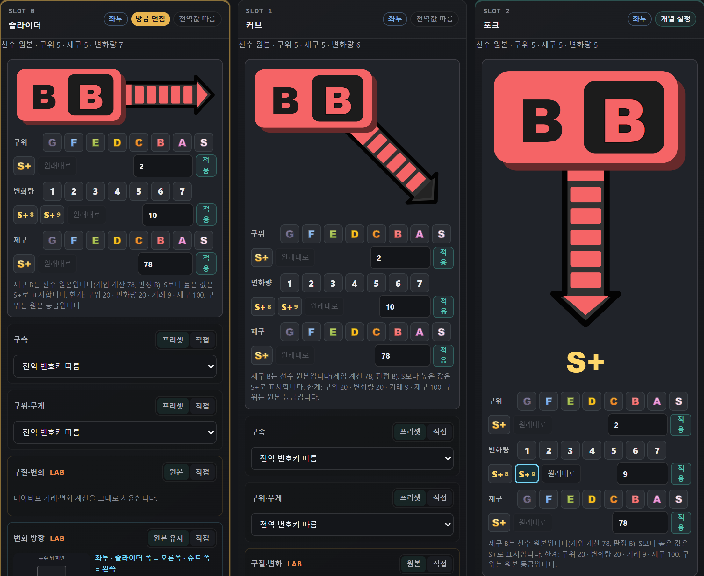
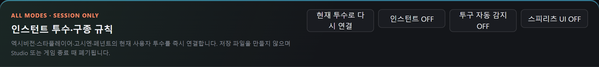
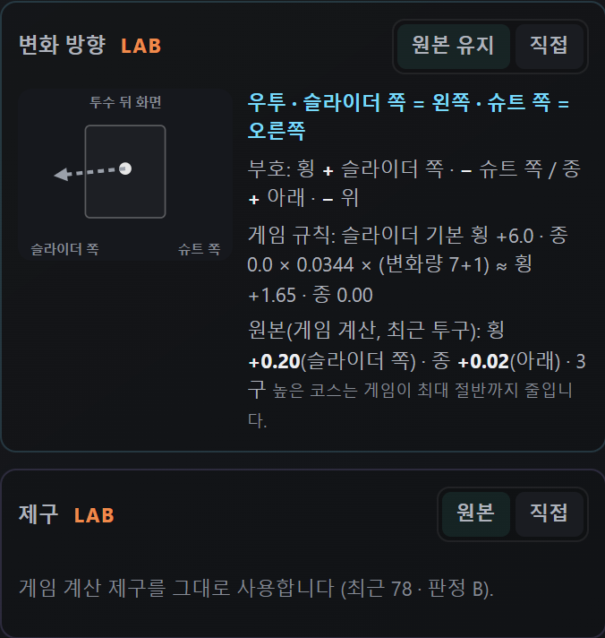
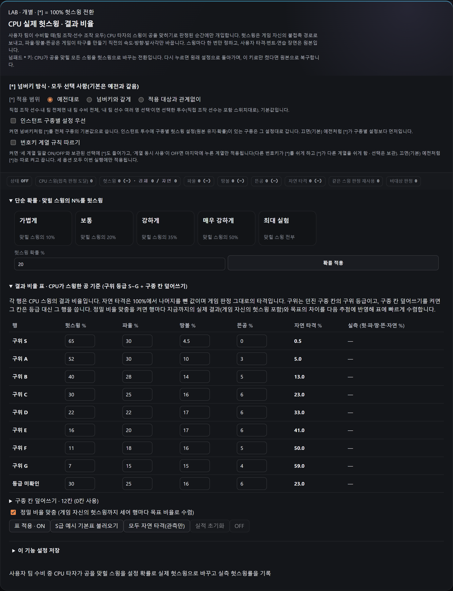
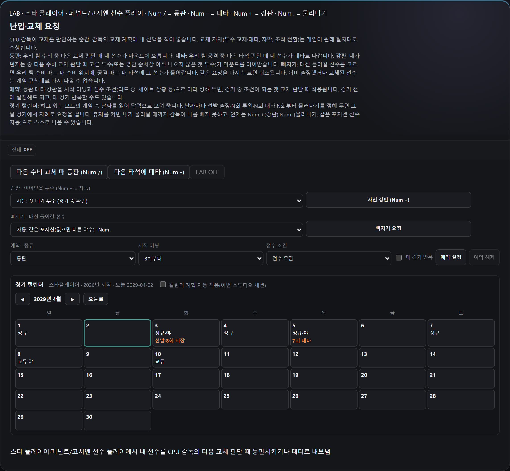
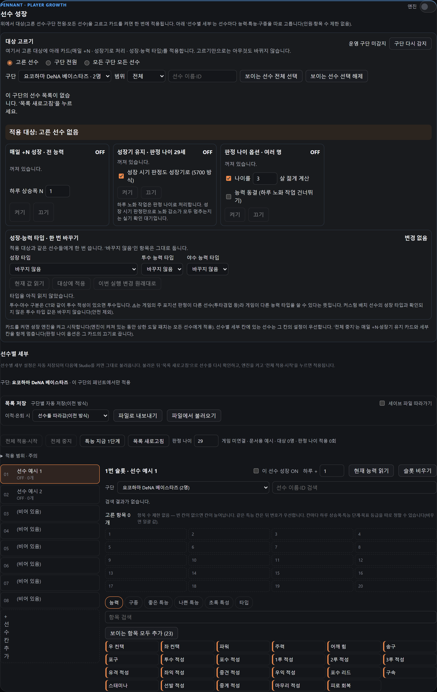

# PROSPI 26 STUDIO 사용 설명서

이 설명서는 0.7.206의 처음 실행부터 선수 편집, 경기 조작, 각 모드의 육성·관리, 설정 보관과 종료까지 안내합니다. 로컬·오프라인 싱글플레이 전용 비공식 도구이며 Cheat Engine을 별도로 실행하지 않습니다. 온라인 플레이는 지원하지 않습니다.

누적 비교 기준인 공개판 0.7.158 이후의 모든 버전별 변경은 별도 변경 기록에 있습니다. 직전 공개판 0.7.205에서 달라진 스피리츠 방향·S 채움과 이전 구종 방향·제구·자동 감지는 8장을 확인하세요. 화면 사진은 설치된 0.7.206 UI를 게임에 연결하지 않고 예시 데이터로 캡처한 것입니다. 실제 경기 성공 사례나 사용자의 저장 자료가 아닙니다.

## 1 처음 실행하기

게임 세이브를 먼저 별도 폴더에 백업하세요. 능력·아이템·성장·외모 변경은 게임 저장에 남을 수 있으며, Studio의 기능 OFF나 앱 버전 복구가 세이브 원복을 대신하지 않습니다.

GitHub Releases에서 Prospi26Studio.Single.exe를 받습니다. Source code 압축파일은 실행파일이 아닙니다. Windows x64, .NET 6 Desktop Runtime x64, Microsoft Edge WebView2 Runtime이 필요합니다. 단일 EXE에 이 런타임까지 포함된 것은 아닙니다. .NET 6은 지원 종료된 런타임이며 이번 배포에서 런타임 세대가 바뀌지는 않았습니다.

다른 Studio·트레이너·CT가 같은 게임을 수정하고 있다면 기능을 끄고 정상 종료합니다. 게임을 켜고 원하는 오프라인 모드의 저장을 불러온 뒤 Studio를 한 번 실행하세요. 게임 폴더의 실행파일을 덮어쓸 필요는 없습니다. 첫 실행은 내부 파일을 전용 캐시에 풀고 검사하므로 잠시 기다립니다.

대시보드에서 게임 인식과 호환성 안내를 확인합니다. 기준 게임 빌드는 2.2.0입니다. 같은 버전 표기라도 임의로 바뀐 실행파일은 지원되지 않을 수 있습니다. 호환성 경고는 문구를 확인하고, 설정 폴더를 삭제하거나 알 수 없는 패치를 강제로 허용하지 마세요.

## 2 화면을 찾고 상태를 읽기

왼쪽에서 스타플레이어·페넌트·고시엔·스피리츠·엑시비션을 고릅니다. 경기 중 공통 효과는 공통 기능, 한 선수의 상세 편집은 DIRECT 선수 편집, 연구·진단 및 이전 패널은 LAB에서 찾습니다.

Ctrl+K의 기능 찾기는 이름·설명·내장 ID와 초성으로 화면을 찾는 도구입니다. 검색 결과를 눌렀다고 기능이 켜지는 것은 아닙니다. 대시보드의 지금 켜진 기능을 누르면 해당 기능 화면으로 이동합니다. 상단 설명 스위치는 마우스나 키보드 초점에 따라 나오는 도움말을 제어합니다.

ON은 기능이 준비되었다는 뜻이지 모든 장면에서 효과가 난다는 뜻은 아닙니다. 게임 대기, 대상 불일치, 투구 선택 대기, 경로 통과, 최근 적용값을 함께 확인하세요. LAB·실험 표시는 별도 백업에서 먼저 확인할 기능입니다. 화면을 접거나 다른 탭으로 이동해도 켜진 유지 기능은 계속될 수 있습니다.

## 3 적용과 유지와 복원을 구분하기

| 조작 | 의미 |
| --- | --- |
| 읽기 또는 목록 새로고침 | 현재 값을 가져옵니다. 읽기만으로 게임 값을 바꾸지는 않습니다. |
| 적용 또는 한 번 적용 | 확인한 대상의 지원 값을 한 번 변경합니다. 다음 게임 처리에서 달라질 수 있습니다. |
| 유지 또는 ON | 해당 기능이 켜진 동안 조건을 확인하며 계속 개입합니다. |
| OFF 또는 전체 중지 | 추가 개입을 중단합니다. 이미 지급한 능력·자원·성장까지 되감지는 않습니다. |
| 되돌리기 또는 직전 복원 | 그 기능이 보관한 대상·세션·범위 안에서만 복원합니다. 무제한 실행 취소가 아닙니다. |
| 설정 저장 | 입력값이나 지원 목록을 보관합니다. 게임 저장과는 다른 파일입니다. |

한 기능의 웹 UI와 같은 기능의 내장 원본 패널을 중복으로 켜지 마세요. 충돌 안내가 나오면 이름이 표시된 쪽을 먼저 OFF합니다. 기존 기능을 모두 껐다는 뜻으로 창을 숨기거나 작업 관리자에서 종료하지 마세요.

## 4 공통 경기기능의 대상 고르기

공통 기능의 경기 조작 화면에서 공통 경기기능 적용 대상을 찾습니다. 기본은 직접 조작 선수이며 직접 조작 선수 포함은 ON입니다. 기능 자체는 시작할 때 켜지지 않습니다.

직접 조작 선수는 고정 조작 선수가 있는 선수 플레이용입니다. 내 팀 전체는 자동으로 움직이는 동료를 포함한 내 팀의 현재 행동 선수를 대상으로 합니다. 내 팀 선수 여러 명 선택은 지금 경기 명단에서 여러 명을 체크하는 방식입니다. 이 대상 설정은 F6·F7·F8·F9와 구속·타구·구위 계열의 관련 보정이 공유합니다.

동료 두 명만 고르려면 F8·수동 묶음·관련 개별 효과를 끄고 내 팀 명단 불러오기를 누릅니다. 여러 명 선택에서 동료 두 명을 체크하고 직접 조작 선수 포함을 OFF한 뒤 적용 대상 저장을 누릅니다. 대상 저장만으로 효과가 켜지지 않으므로 원하는 기능은 이후에 켭니다. 내 선수도 함께 쓰려면 포함 스위치를 ON으로 둡니다.

조작 선수 줄은 위 포함 스위치로 관리하므로 개별 체크가 잠겨 있을 수 있습니다. 투타 겸업 선수의 타자·투수 행은 한 선수로 묶입니다. 번호키만 켜진 경우에는 대상 변경 후 같은 값으로 다시 적용하지만, F8·묶음·개별 훅 때문에 잠긴 경우에는 안내된 기능부터 OFF하세요.

고시엔 및 스타·페넌트의 전술 경기는 고정 조작 선수가 없어 기본 대상도 내 팀 전체에 적용됩니다. 그 밖의 일반 팀 조작은 내 팀 전체나 여러 명 선택을 사용하세요. 고정 조작 선수가 없는 장면에서 포함을 OFF하면 제외할 선수를 확인할 수 없어 적용을 보류할 수 있습니다. 이는 현재 수비 커서의 선수만 자동으로 제외하는 기능이 아닙니다.

## 5 속도 기능의 범위

수비 이동·송구 공속·주루 속도는 이전 버전의 사용 범위를 유지합니다. 직접 조작 대상이라고 해서 속도 3종을 못 켜게 하지 않습니다. 동시에 이 세 가지가 기본적으로 모두 내 선수 한 명만 바꾼다는 뜻도 아닙니다.

주루만 선택한 선수에게 적용하고 싶으면 주루 속도도 이 대상에 맞춤을 켜고 대상을 저장합니다. 이 옵션은 기본 OFF입니다. ON에서는 주자마다 신원을 대조해 내 선수·내 팀·선택 선수 중 해당하는 주자의 경로 속도만 바꿉니다. 직접 조작 선수 모드에서는 그 선수가 주자일 때 적용하며, 전술 경기 기본 대상은 내 팀입니다.

수비·송구 속도는 위 주루 선택과 관계없이 기존 범위입니다. F8에서는 내 팀의 해당 공수 단계에 켜지만, 개별 훅을 켠 모든 순간에 선수별 필터가 생기는 것은 아닙니다. 주루의 별도 모션 배율 보조는 게임 2.2.0에서 효과가 확인되지 않았으므로 경로 속도 효과와 같은 것으로 보장하지 않습니다.

## 6 F6 F7 F8 F9 사용하기

F6은 투구·수비 묶음, F7은 공격 묶음입니다. 같은 키를 다시 누르면 해당 묶음을 끕니다. 반대 역할로 바꾸면 이전 역할 전용 기능을 복구합니다. 수동 F6에는 투수 체력·베스트 피치·존·도착점·수비·송구와 투구 무게 단계가, 수동 F7에는 타격면·타이밍 보정·표시·주루가 포함됩니다.

F8은 선택한 구성으로 공수를 자동 전환합니다. 자동 전환 패널에서 수비·공격 항목을 체크한 뒤 선택 적용·자동 ON을 누르세요. 이후 F8은 마지막으로 적용한 구성을 켜고 끕니다. 체크만 바꾸고 적용하지 않은 내용은 반영되지 않습니다. F8의 기본 구성은 수비 6개·공격 4개이며 타이밍은 별도입니다.

F9는 타이밍·정타 보정을 따로 제어합니다. F8 중에도 자동 감지를 유지하면서 선택할 수 있습니다. 수비 중 켜면 공격까지 기다립니다. 수동 F7에는 타이밍이 포함되지만, F8 공격 구성과 F9는 구분합니다. 자동 스윙을 해 주는 기능은 아니므로 타격 입력은 직접 해야 합니다.

F8의 수비 전환음은 짧게 한 번, 공격은 빠르게 두 번입니다. 메뉴·로딩·리플레이·대상 확인 대기에서는 효과를 해제하고 기다릴 수 있습니다. 일부 설치가 일시적으로 실패하면 구성요소별로 재시도하고, 세 번 실패한 구성요소는 상태에 알리고 건너뜁니다. 다른 구성요소의 실패 횟수를 합산하지 않습니다.

0.7.193 이후에는 반복 전환의 메모리 공간 소모를 줄였고, 0.7.204에서는 재시도 단위를 고쳤습니다. 장시간 실제 경기의 모든 전환을 보장한다는 뜻은 아닙니다. 다시 실패하면 기능명과 공격에서 수비인지 반대인지 함께 제보해 주세요.

## 7 번호키와 개별 경기 기능

| 키 | 기능 |
| --- | --- |
| Num 1 2 3 | 투구 구속 고정 999, 원본 ×3.0, 원본 ×1.1 |
| Num 4 5 6 | 타구 300km/h·30도, 450km/h·5도, 220km/h·28도 프리셋 |
| Num 7 8 9 | 투구 구위·무게 계열의 화면에 표시된 프리셋 |
| F2 | 베스트 피치. 투구 입력은 직접 수행 |
| F3 | 베스트 히팅. 스윙은 직접 수행 |
| F4 | 스트라이크 존 표시 |
| Num * | CPU 실제 헛스윙의 100% 전환 ON 또는 OFF |

키보드 윗줄 숫자와 숫자패드 키는 다릅니다. 선택 중인 번호를 다시 누르면 끕니다. 구속·타구·구위 계열을 함께 쓰려면 번호키 계열 제어의 동시 사용을 확인하세요. 세 계열 전체 OFF·ON과 마지막 선택 복원도 이 영역에서 관리합니다. F8 OFF와 번호키 OFF는 별개입니다.

직접 입력은 화면의 고정값·배율·상한 또는 속도·각도를 입력한 뒤 CUSTOM 적용을 누릅니다. 180m 목표는 프리셋 이름이며 모든 공의 비거리를 보장하지 않습니다. 스트라이크 존·두 번째 도착점·볼 커서는 표시 기능입니다. 도착점을 켠다고 실제 공이 그 점을 향해 바뀌는 것은 아닙니다.

간편 카운트 제어는 먼저 공통 패널의 부모 기능을 켭니다. Ctrl+1 스트라이크 3, Ctrl+2 볼 4, Ctrl+3 0아웃, Ctrl+4 0/0/0 유지, Ctrl+0 리셋을 사용합니다. 이미 끝난 득점과 경기 이력을 되돌리는 버튼은 아닙니다.

## 8 현재 투수의 구종별 설정

공통 기능의 인스턴트 투수·구종 규칙에서 사용자 투구 장면의 현재 투수 연결을 누릅니다. 투수 이름과 12개 구종 칸을 확인한 뒤 각 칸의 구속·구위·무게·변화 및 헛스윙 항목을 정합니다.

전역 번호키 따름은 전체 기본값을 사용하고, 이 구종 원본 유지는 그 구종의 해당 항목만 보정하지 않습니다. 구종별 프리셋·직접값은 해당 구종의 예외가 됩니다. 프리셋은 선택 시, 직접 입력은 적용 시 반영합니다. 여러 구종을 각각 다르게 설정할 수 있습니다.

선택형 스피리츠 UI는 같은 설정을 게임식 등급·막대로 보여 줍니다. 변화 직접 입력은 1~20, 예리함은 0~9의 지원 범위를 따릅니다. S+와 경기 중 배율은 저장된 기본 구종 등급을 무조건 그 값으로 바꾼다는 뜻이 아닙니다.

0.7.206의 스피리츠 UI ON에서는 구종 계열에 맞춰 변화 막대가 뻗습니다. 투수 뒤 게임 화면 기준으로 우투의 슬라이더계는 왼쪽, 커브계는 왼쪽 아래, 포크계는 아래, 싱커계는 오른쪽 아래, 슈트계는 오른쪽입니다. 좌투는 좌우를 반전하고 직구계에는 막대가 없습니다. 투타 정보가 아직 없으면 우투 방향으로 그리므로 연결 후 우투·좌투 표시를 확인하세요.

타일이 첫 단계이고 그 뒤에 다섯 칸과 화살촉이 있습니다. 변화량 6은 다섯 칸까지만, 7(S)은 화살촉까지 모두 채웁니다. 8·9처럼 7보다 큰 값은 가득 찬 상태에 S+가 붙습니다. 0.7.205보다 채워진 칸이 하나 적게 보여도 실제 변화값을 낮춘 것이 아닙니다. 선수 성장 능력 카드도 같은 채움 기준을 사용하며 카드 배치는 유지합니다.

스피리츠 UI는 기본 OFF이며 숫자 편집 화면도 그대로 사용할 수 있습니다. 등급·직접값 버튼의 명령과 범위는 0.7.205와 같고, 막대 방향은 구종 계열을 나타냅니다. 별도 변화 방향 LAB에서 계수를 반대로 넣었다고 구종 계열 타일이 다른 계열의 표시로 바뀌는 것은 아닙니다.

0.7.205의 투구 자동 감지는 기본 OFF입니다. OFF에서는 투수 교체 뒤 현재 투수로 다시 연결하는 기존 방식을 사용합니다. ON으로 두면 마운드의 사용자 투수를 따라 연결하고 방금 던진 구종에 표시를 붙여 해당 카드로 스크롤합니다. 개별 보정 규칙이 없어도 감지가 켜져 있으면 원본 변화값을 관측합니다.

자동 감지는 이번 Studio 실행에서 투수별 설정을 보관합니다. 이전 투수가 다시 나왔고 12개 구종 구성이 같으면 그 투수의 설정을 되찾습니다. 처음 보는 투수는 새로 연결하며 다른 투수의 규칙을 복제하지 않습니다. 인스턴트 OFF·모든 기능 OFF는 자동 감지도 끝냅니다. 게임 프로세스가 새로 시작되면 보관한 투수 설정을 잊으므로 다시 확인하세요. 저장형 프로필과 다른 현재 실행용 설정입니다.

변화 방향 LAB은 일반 구종과 오리지널 구종 모두에서 사용합니다. 각 구종의 우투·좌투 표시와 화살표를 먼저 확인하세요. 원본 유지는 게임이 계산한 방향을 그대로 씁니다. 직접을 고르고 횡·종 값을 입력한 뒤 적용을 누르면 그 구종의 방향 계수를 바꿉니다. 지원 범위는 각각 −20~+20이며 변화량 등급 1~20과는 다른 값입니다. 원본값·×1.5·×2·좌우 반전·위아래 반전으로 입력을 만들 수도 있습니다.

| 인스턴트 방향 입력 | 의미 |
| --- | --- |
| 횡 + | 투수의 슬라이더 쪽. 우투는 투수 뒤 화면에서 왼쪽, 좌투는 오른쪽 |
| 횡 − | 투수의 슈트 쪽. 우투는 오른쪽, 좌투는 왼쪽 |
| 종 + | 아래로 휘는 방향 |
| 종 − | 위로 휘는 방향 |

0.7.205에서 0.7.204 대비 바뀐 동작이며 0.7.206에서도 유지됩니다. 이전 인스턴트 오리지널 구종의 직접 계수는 좌투의 좌우 반전이 반영되지 않았고 종 +가 위였습니다. 0.7.205에서는 위 표의 부호로 바뀌었으므로 이전 숫자를 그대로 옮기지 말고 투타와 방향을 다시 확인하세요. 또한 구질·변화의 직접 설정이 오리지널 구종의 횡·종을 함께 덮어쓰지 않습니다. 방향은 별도 블록에서 설정하며 처음 연결할 때는 원본 유지입니다.

예를 들어 슬라이더의 원본 횡이 +0.20이면 직접 −0.20은 슈트 쪽으로 휘게 하는 설정입니다. 구종 이름 자체를 슈트로 바꾸는 기능은 아닙니다. 원본보다 크게 입력하면 존 중심을 노려도 밖으로 벗어날 수 있습니다. 화면은 최근 게임 계산값, 규칙상 예상값, 원본 대비 배율과 홈에서의 대략적인 cm를 구분합니다. 화살표·존 안내는 추정치이며 실제 궤적이나 스트라이크 판정을 보장하지 않습니다. 최근 값이 없으면 자동 감지를 켠 뒤 해당 구종을 실제로 던져 관측하세요.

오리지널 설정의 횡·종은 베이스 구종에 더하는 기록값입니다. DIRECT에서 싱커·슈트·투심 베이스의 횡 +는 그 베이스의 슈트 방향을 더합니다. 이는 인스턴트 최종 방향에서 횡 +가 슬라이더 쪽이라는 규칙과 다릅니다. 0.7.205는 DIRECT의 이 설명을 바로잡았으며 저장값과 쓰기 동작은 바꾸지 않았습니다. 카드의 베이스 기본값 → 오리지널 설정 반영 → 변화량 계산 줄을 함께 읽으세요.

제구 LAB의 원본은 현재 구종에 대해 게임이 계산한 제구를 유지합니다. 최근 계산값과 판정 S~G를 확인하고 직접 0~100을 입력한 뒤 적용합니다. 예를 들어 85는 판정 A이며 100은 S입니다. 스피리츠 UI의 제구 등급·직접 입력·원본 복귀도 같은 기능을 조작합니다. 등급 버튼은 G~S에 25~95, S+에 100을 넣습니다. 저장된 제구 등급과 컨디션 등을 반영한 실제 계산값·판정은 서로 다를 수 있습니다.

제구는 구속·변화 방향이나 무조건 스트라이크와 다릅니다. 사용자 릴리스 오차와 CPU 릴리스 판정에 쓰는 게임 계산값이며, 베스트 피칭이 켜져 있으면 사용자 쪽 제구 변화가 눈에 잘 드러나지 않을 수 있습니다. 비교하려면 베스트 피칭을 끄고 같은 구종을 던져 보세요. 원본으로 돌리면 게임 계산값을 다시 사용합니다. 이 조작은 세이브의 기본 제구 등급을 편집하지 않습니다.

진단 횟수는 계산 경로 횟수이며 투구 수와 일대일로 같지 않습니다. 이번 방향·제구·자동 감지는 코드·격리 테스트·UI·배포 검증을 통과했지만, 좌투 실제 궤적·교체 뒤 재연결·제구의 체감 차이 등 자연 경기 검증은 아직 남아 있습니다.

## 9 CPU 조준 오차와 실제 헛스윙

CPU 헛스윙·조준 오차 LAB은 조준 오차 배율과 그 배율을 사용할 확률을 정합니다. 적용 확률 50%는 헛스윙 50%가 아닙니다. 확률만 적용은 기존 배율을 유지하고 적용 빈도만 바꿉니다.

CPU 실제 헛스윙 LAB은 내 팀 수비 중 CPU가 공을 맞힐 것으로 판정된 스윙에 개입합니다. 단순 확률 또는 구위 등급 S~G와 구종 칸별 결과 비율을 사용합니다. 표에서는 헛스윙·파울·땅볼·뜬공 비율을 정하고 남는 비율은 자연 타격입니다. 자연 헛스윙도 있기 때문에 단순 확률은 전체 투구 중 헛스윙 비율과 같지 않습니다.

정밀 비율 맞춤은 관측 결과를 다음 추첨에 반영합니다. 짧은 몇 타석에서 표의 비율과 정확히 일치하지 않을 수 있습니다. 파울·땅볼·뜬공은 지원 타구 처리에 개입하는 것이며 주자 결과·안타·아웃까지 보장하지 않습니다.

Num *는 원래 맞을 CPU 스윙을 모두 헛스윙으로 바꾸는 빠른 전환입니다. 인스턴트 투수 연결이 필수는 아닙니다. 별도 옵션인 * 적용 범위는 예전대로, 넘버키와 같게, 적용 대상과 관계없이 중 고릅니다. 마지막 선택도 내 팀 수비의 CPU 스윙 조건까지 없애지는 않습니다.

인스턴트 구종별 설정 우선을 켜면 해당 구종의 설정이 *보다 우선합니다. 번호키 계열 규칙 따르기를 켜면 *도 계열 전체 ON·OFF, 마지막 선택, 동시 사용 규칙에 참여합니다. 이 옵션들은 기본적으로 예전 동작을 유지하며 현재 실행에 적용됩니다. 0.7.204에서는 *의 범위가 일반 LAB·인스턴트 규칙의 범위를 함께 넓히거나 막던 문제를 분리했습니다.

## 10 난입과 교체 요청

공통 경기 조작의 난입·교체 LAB에서 현재 모드·조작 선수·명단을 확인합니다. 스타플레이어와 페넌트·고시엔의 선수 플레이를 위한 요청이며 공통 효과의 선택 선수 목록을 난입 대상으로 쓰는 기능은 아닙니다.

Num /는 다음 수비 판단의 등판, Num -는 다음 공격 판단의 대타, Num +는 자진 강판, Num .은 물러나기입니다. 지원되는 요청은 같은 키로 취소할 수 있습니다. 후속 투수·대체 선수를 지정하거나 사용 가능한 선수를 찾도록 할 수 있습니다. 이미 교체됐거나 출전 자격이 없는 선수를 다시 투입하지 않습니다.

버튼을 눌러도 일시정지 중에는 교체 판단이 오지 않습니다. 요청 대기·판단 경로 통과·실제 적용·거부 사유를 나눠 확인하세요. 0.7.175부터 사용자 팀의 처리 경로도 연결했지만, 모든 자연 교체 상황이 실경기로 검증된 것은 아닙니다.

예약에서는 시작 이닝과 무관·리드·세이브 상황·동점·뒤질 때 같은 점수 조건, 이번 경기 또는 매 경기 적용을 고릅니다. 유지 옵션은 해당 선수의 지원 포지션에서 CPU 교체를 막습니다. 실제 교체 가능성과 남은 선수 조건은 여전히 적용됩니다.

## 11 캘린더의 날짜별 계획

난입·교체 LAB의 캘린더에서 경력과 오늘 날짜가 현재 게임과 맞는지 확인합니다. 날짜를 골라 선발·중간 투입·대타·물러날 이닝 및 유지 계획을 저장하고, 자동으로 실행하려면 캘린더 계획 자동 적용도 켭니다.

스타 투수형 선수의 미래 선발 투수 계획은 게임의 다음 선발 날짜와 연결됩니다. 오늘의 선발 일정은 다음 계획 때문에 되돌리지 않습니다. 계획 삭제·해제 시 복원은 같은 게임 세션·스타·시즌의 소유 범위 안에서만 처리합니다. 모든 야수의 경기 전 선발 라인업을 강제로 편성하는 기능은 아닙니다.

저장 계획과 실행 중 예약 의도는 다릅니다. 모든 기능 OFF는 자동 적용 의도를 멈추지만 저장된 계획을 모두 지우지 않습니다. 게임을 다시 불러온 뒤에는 경력·날짜를 재확인하세요.

## 12 회색 메뉴와 전술 경기

일시정지 메뉴 감독 기능은 하나의 ON으로 지원 메뉴와 선수 겸 감독 처리를 함께 켭니다. 일반 오프라인 모드에서 플레이 방식 때문에 회색인 교체·설정·가이드 등 지원 항목을 열고, 작전·교체 방식은 게임 옵션의 직접·가이드·자동을 따릅니다. 자동으로 두면 CPU가 계속 판단할 수 있습니다.

모든 회색 항목을 무조건 사용 가능하게 만드는 것은 아닙니다. 대주자에는 주자가 필요하고, 리플레이에는 기록이 있어야 하며, 이미 사용한 선수를 다시 넣을 수 없습니다. 특수 모드·제한 메뉴·고시엔 고유 메뉴에는 별도 규칙이 있습니다. 불가능한 상황을 선택 가능한 것처럼 안내하지 않습니다.

고시엔 전술 경기 페넌트·스타 LAB은 경기 전에 ON합니다. 페넌트에서는 스타일 선택의 멀티 플레이 자리가 전술 경기로 바뀌며 감독 플레이는 유지됩니다. ON 중에는 그 자리의 로컬 멀티 플레이를 선택하지 않습니다. 스타는 출전일 스타일 선택에서 전술 경기로 들어갑니다.

전술 경기에는 게임의 전술 카드·CPU 카드·효과와 관련 HUD·속도·짧은 연출 연결을 사용합니다. 고유 카드는 제공하지 않습니다. 명단이 26명을 넘거나 재개 경기 등의 조건에서는 원래 감독 플레이로 진행합니다. 스타 전술 경기에는 스타 미션·평가가 없고 스타 선수도 CPU 조작입니다. 백업한 세이브로 먼저 확인하세요.

자동 경기로 끝까지는 별도 LAB입니다. 지원 일반 경기의 일시정지 메뉴에서 남은 경기를 양 팀 자동 진행으로 넘기는 기능이며 전역 다이제스트 설정을 바꾸지 않습니다. 난입 요청·메뉴 감독·전술 경기와 서로 다른 목적입니다. 전술 카드와 모든 메뉴가 모든 모드의 모든 상황에서 검증된 완전 이식이라고 안내하지 않습니다.

## 13 DIRECT 선수 편집과 데이터 모드

DIRECT 선수 편집에서 선수 구조를 고르고 목록을 불러옵니다. 스타·페넌트에서는 조회할 구단을 선택한 다음 이름·ID로 검색합니다. 선수 줄을 누르고 상세 이름·구단·투타를 확인한 뒤 값을 수정하고 적용하세요. 구단이나 모드를 바꾸면 이전 편집 선택은 해제됩니다.

기본 능력·수비 적성·특수 능력·구종·외모 등은 탭으로 나뉩니다. 능력 카드는 게임식 등급·타일로 읽는 확인 화면입니다. 투타 방향 안내를 보고 구종 방향을 판단하세요. 청특 지우기는 지원되는 나쁜 특능 하나 또는 전체를 정리하며 좋은 특능을 통째로 초기화하지 않습니다.

선수 데이터 팀별·OB·커스텀에서는 NPB·국가대표·WBC·OB 원본을 조회하고 가져오기 원본으로 쓸 수 있습니다. 원본 데이터 뱅크는 읽기 전용이고 저장된 커스텀·다운로드 선수는 지원 범위 안에서 편집합니다. 편집 가능한 저장 선수와 원본을 혼동하지 마세요.

명단에는 보이는데 상세를 못 읽으면 목록을 새로 읽고 다시 선택합니다. 0.7.159·160에서 신원 재확인과 일부 구종의 추가 비트 때문에 발생하던 실패를 보완했습니다. 추가 비트가 미확인인 구종 칸의 직접 쓰기는 별도 제한을 따릅니다.

## 14 사진으로 외모 맞추기

DIRECT의 사진·외모 LAB에서 대상 선수의 현재 외모를 읽고 정면 목표 사진을 엽니다. 눈·코·입·턱이 잘 보이는 사진을 쓰세요. 영역 확대와 검출 점 수정을 사용해 눈동자와 윤곽의 점을 확인합니다. 필요하면 옆모습 사진에 안내된 6점을 지정합니다.

자동 맞춤 미리보기를 만들고 제안값을 검토합니다. 현재 게임 얼굴의 정면 스크린샷을 넣으면 예측만으로 맞추는 대신 실제 표시된 얼굴을 기준으로 작은 보정을 할 수 있습니다. 게임 얼굴과 사진은 가능한 한 같은 각도·거리·표정으로 비교하세요.

게임의 최상위 외모 에디트 화면까지 완전히 닫은 다음 허용된 적용을 사용합니다. 임시 에디트 화면과 저장 대상에 서로 다른 값을 쓰지 않도록 하는 절차입니다. 적용 뒤 다시 같은 카메라에서 비교하고 필요하면 제공되는 되돌리기나 추가 미세 보정을 사용합니다.

이 기능은 사진을 새 3D 메시·피부 텍스처로 바꾸는 얼굴 교체가 아닙니다. 게임의 확인된 숫자 파라미터 안에서 형태를 맞춥니다. 눈썹·눈꺼풀 종류, 조명, 피부, 표정 차이는 남을 수 있으며 입술 색 등 미해석 필드는 임의로 쓰지 않습니다. 유사도 점수는 기하 측정값이지 실제 인물 재현율이 아닙니다.

## 15 선수 보관과 가져오기

공통 패널의 선수 원본 보관소는 10슬롯에 지원 선수 정보를 보관합니다. 슬롯 이름과 원본을 확인하고 외모·음성콜, 능력·특능·구종·폼 등 필요한 범주만 대상에 주입하세요. 고시엔 환산 프리셋의 수치 비율이 특능 종류 코드까지 같은 비율로 바꾼다는 뜻은 아닙니다.

0.7.194부터 슬롯을 Studio 재시작 후 복원하고 외부 프로필 파일로 입출력하는 흐름을 보완했습니다. 내보낸 파일은 게임 세이브 전체가 아닙니다. 가져오기 뒤 대상과 복사 범주를 다시 확인하세요. 직전 주입 되돌리기는 현재 기능의 원복 자료가 있는 범위에 한합니다.

선수 가져오기·드래프트 후보 교체에서는 원본 선수 선택과 목적지 선수를 각각 확인합니다. 검색 입력 직후 선택이 풀리던 문제와 오리지널 구종 발음 때문에 원본이 거부되던 문제를 수정했습니다. 다른 인물의 ID·계약·세이브 전체를 무조건 복제하는 기능은 아닙니다.

## 16 스타플레이어 생활과 동료 훈련

스타플레이어에서 본인·소속 구단의 컨디션·부상·피로·애정도·아이템 사용 제한 및 성장·생활·교류 도구를 찾습니다. 재고를 채우는 것과 사용 횟수 제한을 유지하는 것은 별개입니다. 필요한 항목과 대상을 확인한 뒤 ON 또는 적용을 누릅니다.

동료 훈련은 게임의 선수교류에서 실제 연습이 가능한 때 사용합니다. 훈련 대상 구단을 고르고 선수 스캔 후 상대 동료를 선택합니다. 상승 배율, 상대 선택, 추가 보상은 다른 기능이므로 각각 적용 상태를 확인합니다. 입력칸에 채우기는 실제 적용과 다릅니다.

추가 보상은 기본 능력·수비 적성·보유 구종·포수 리드·특능·초록 성향·탄도 등 134항목을 개별 지정합니다. +N은 증가량이고 최종 상한은 별도입니다. 보유하지 않은 구종을 일반 증가 항목만으로 만드는 것은 아니며, 반대 성향 선택은 기존 성향을 대체할 수 있습니다. 좋은 효과인지 이름을 확인하세요.

0.7.187에서는 반대 성향과 나쁜 특능의 실제 저장값을 보완했습니다. 이미 보유한 보상을 중복 개수처럼 쌓거나 연습 이벤트 자체를 아무 때나 생성하는 기능은 아닙니다. 관계·학습 티켓 등은 해당 화면의 대상과 조건을 따릅니다.

## 17 페넌트 구단과 드래프트

페넌트는 한눈에 보기에서 작업 화면으로 이동합니다. 구단 통합 편집은 명단 갱신 뒤 대상 선수·범위를 골라 연봉·계약·FA·능력·아이템 효과를 적용합니다. 다른 구단을 열람하는 것과 자동 유지할 내 구단을 지정하는 것은 별개입니다.

자동 유지는 고정한 내 구단의 컨디션·부상·피로·애정도·사용 제한 등을 처리합니다. 구단 변경이 잠겨 있으면 관련 유지부터 OFF합니다. 0.7.201에서는 같은 선수·같은 칸으로 확인된 포스트시즌 사본을 함께 처리하도록 보완했습니다. 일본시리즈 경기 중 정규 표가 비는 경우에는 경기 사이에 값을 맞춥니다.

드래프트 후보 새로고침으로 현재 후보를 읽고 원본 검색으로 교체할 선수를 고릅니다. 게임에서 드래프트 발굴·조사 후보 목록을 열어 두라는 안내를 따르면 됩니다. 교체 시에도 현재 화면을 다시 확인합니다. 표시된 실제 능력은 게임의 조사 예상치와 다를 수 있습니다.

중복 지명 당첨 기능은 지원하는 일반 드래프트 1순위 추첨 전에 켭니다. 지명할 선수는 게임에서 직접 선택하며 이미 끝난 추첨을 바꾸지 않습니다. FA 취득 조정은 지원 취득 상태·현재 시즌 자격의 보정이며 이적 협상을 자동 완료하는 기능이 아닙니다.

## 18 페넌트와 스타의 선수 성장

선수 성장에서 모드와 운영 구단을 확인합니다. 페넌트는 고른 선수, 구단 전원, 모든 구단 모든 선수 중 대상을 고르고, 구단·1군/2군·투수/야수 등의 필터로 좁힐 수 있습니다. 선택만으로 값은 바뀌지 않습니다. 스타의 같은 화면은 동료 성장용이며 직접 조작하는 스타 본인은 제외합니다.

매일 +N은 일정 성장 처리에 증가분을 넣습니다. 성장기 유지는 판정 나이와 성장 시기 판정을 조절하고, 판정 나이 옵션은 더 젊게 계산하거나 능력 동결을 선택합니다. 생년을 직접 고치는 기능이 아닙니다. 동결은 감쇠뿐 아니라 해당 성장 처리도 막을 수 있으므로 성장 보너스와 구분하세요.

선수별 세부에서 선수를 배치하고 능력·구종·좋은 특능·나쁜 특능·초록 특성·타입을 고릅니다. 항목별 하루 상승폭, 특능 단계·목표 등급을 정하고 이 선수 성장 ON 및 전체 적용·시작을 사용합니다. 엔진 설치와 실행은 별도 상태입니다. 현재 능력 읽기 뒤 구종별 항목과 지원 구종 추가를 사용할 수 있습니다.

새 화면에는 선수 30명·항목 20개 고정 UI 제한이 없습니다. 필요한 슬롯과 항목이 늘어납니다. 같은 항목을 중복해서 넣으면 무조건 배수가 되는 방식은 아니며 화면 안내를 따릅니다. 원본 내장 패널은 LAB의 옮긴 원본에 남아 있고 그 패널 자체의 옛 제한은 별개입니다.

특능 지금 1단계는 즉시 지급 동작입니다. 전체 중지는 추가 성장을 멈출 뿐 이미 오른 능력을 돌려놓지 않습니다. 0.7.191은 일정 진행 충돌을 수정했고, 0.7.204는 한 번에 처리할 수 없는 남은 성장일을 다음 처리에 남깁니다. 하루·이벤트·프레임은 서로 다릅니다.

## 19 성장 목록 저장과 세이브 연결

기본은 페넌트·스타의 운영 구단별, 고시엔의 학교별 목록 자동 저장입니다. 재시작 후 설정은 불러오되 성장 엔진을 자동으로 시작하지 않습니다. 과거 단일 목록은 첫 해당 구단·학교에서 이어받고 원본 파일을 보존합니다.

목록 저장의 세이브 파일 따라가기는 선택 기능입니다. 게임 저장의 정보를 읽어 성장 목록을 연결하며 게임 세이브 파일 자체를 덮어쓰는 기능은 아닙니다. 같은 날짜의 저장이 여러 개라면 게임에서 불러온 세이브를 직접 고릅니다. 애매한 후보를 자동으로 같은 저장이라고 단정하지 않습니다.

이적·은퇴 시는 선수를 따라감, 이적은 물어보기·은퇴는 해제, 모두 자동 해제 중 고릅니다. 이적 확인에서 계속 키우기 또는 해제를 선택할 수 있습니다. 고시엔은 설정 유지 또는 졸업·퇴부는 해제입니다. 해제 기록이 있으면 되돌릴 수 있습니다.

파일로 내보내기와 파일에서 불러오기는 목록의 이동·백업용입니다. 0.7.204에서는 큰 목록의 입출력을 지원하고, 읽기 실패를 빈 목록으로 판단해 현재 설정이나 기존 파일·백업을 덮어쓰던 문제를 막았습니다. 읽기 실패가 나면 원본 파일을 지우지 말고 메시지와 파일을 보존하세요.

## 20 고시엔 확장 관리

고시엔의 확장 관리에 중복된 조작을 모았습니다. 학교·훈련·아이템과 자동 유지의 이전 위치에서는 상태와 이동 버튼으로 연결합니다. 기능이 사라진 것이 아니며 원본 확장 패널은 LAB의 옮긴 원본에 남습니다.

| 영역 | 사용하는 방법 |
| --- | --- |
| 학교와 자원 | 현재값을 읽고 바꿀 항목만 수정한 뒤 한 번 적용. 지속 고정과 직전 한 단계 복원은 별도 |
| 12칸 훈련표 | 칸별 훈련을 선택하거나 일괄 값을 채운 뒤 적용·고정 |
| 훈련장비 | 26종의 수량을 선택해 적용 또는 유지 |
| 감독 특능 후보 | 특수훈련에서 제시할 후보를 조정. 학생에게 즉시 지급하는 것과 다름 |
| 스카우트 제의 성공 | 지원 제의 판정 때 사용. 지역 후보를 직접 만드는 것과 다름 |
| 동경 선수 등장 | 등장 판정과 회당 설정을 조정 |
| 특수훈련 성공률 | 원하는 성공률과 적용 상태를 확인 |
| 경험치 배율 | 전체 부원의 훈련 경험치 ×2~×100. OFF가 기본 |

그라운드 레벨도 한 번 적용과 지속 유지를 구분합니다. 경험치 배율 DIRECT와 원본 패널의 같은 배율 페이지를 중복으로 켜지 마세요. 개별 선수 성장 배율과 전체 배율을 함께 사용하면 수치가 커질 수 있어 먼저 하나씩 확인하는 편이 좋습니다.

## 21 고시엔 부원 성장과 입학

고시엔 선수 성장에서 학교와 부원 목록을 읽습니다. 부원 전체 행 또는 부원별로 훈련 경험치 배율을 고르고, 전 능력 또는 선택한 능력만 대상으로 정합니다. 목록은 학교별로 보관하며 전체 적용·시작 뒤 실제 훈련 이벤트에서 적용됩니다. 이미 쌓인 능력을 한 번에 배율로 곱하는 기능은 아닙니다.

컨디션·아이템·사용 제한은 자동 유지의 대표 조작을 사용합니다. 현재 학교와 동일한 것으로 확인된 복제 명단도 처리하지만 모든 지역·예선·준결승·결승을 실제로 전부 검증했다는 뜻은 아닙니다. 대회 전환 뒤 대기하면 모드·명단을 다시 확인합니다.

스카우트·입학 도구는 지역 후보 교체, 등장·성공 판정, 입학 전 예약, 실제 일반 입학생 선택 교체를 구분합니다. 원본 선수와 목적지 지역·학년·학생을 확인한 뒤 적용하세요. 천재형, 이름 가져오기, 기존 선수·다운로드 선수 사용, 구종 중복 방지·오리지널 구종 예약도 각자의 적용 시점이 다릅니다.

이미 입학한 학생과 입학 예정자를 혼동하지 마세요. 감독의 특능 후보 목록을 바꾸는 것과 부원의 특능을 직접 지급하는 것도 다릅니다. 복원 버튼은 해당 기능이 기억하는 현재 대상 범위에서 사용합니다.

## 22 스피리츠와 엑시비션

스피리츠의 포인트·육성 화면은 실제 생성 선수 데이터가 로드된 뒤 새로고침해서 사용합니다. 셔플·더블업·특훈 횟수, 투구·스태미나·정신·구종·타격·수비·스피리츠 포인트 등 필요한 값을 입력하고 해당 페이지 적용을 누릅니다. 결합된 특능 원값이나 비트마스크를 무조건 최대로 넣는 방식은 피하세요.

생성 선수 가져오기와 DIRECT 편집은 현재 생성 대상의 신원을 확인합니다. 게임의 다른 모드 포인트까지 동시에 바꾸는 것이 아닙니다. 인스턴트 구종 화면의 스피리츠 UI 선택은 표시 방식이며 실제 스피리츠 경력으로 모드를 바꾸지 않습니다.

엑시비션 화면은 현재 경기 상태와 내 팀 컨디션·부상·피로 유지를 제공합니다. 스타 경력이 열린 상태는 엑시비션으로 잘못 처리하지 않습니다. 투타 겸업의 투수 행도 조작 선수로 연결하는 처리가 포함됐습니다. 일반 팀 조작의 공통 효과는 대상 카드에서 내 팀 전체 또는 여러 명 선택을 확인하세요.

## 23 공통 패널과 카메라

공통 패널에는 카운트, 홈런·더그아웃 세리머니, NPB 뉴스 보조, 선수 보관, 구종 유지 등 기존 도구가 있습니다. 자동 랜덤 세리머니는 별도로 OFF해야 하며 뉴스 보조는 프로그램 전체 언어를 영구 변경하는 기능이 아닙니다.

카메라·옵션의 58항목은 투타·수비·주루 카메라, 표시·조작 방식, CPU 난이도 등 게임 옵션을 조정합니다. 패널 열기만으로 적용하지 않으며 원하는 선택 후 게임이 옵션을 구성하는 장면에서 반영됩니다. 게임 설정 유지는 그 항목의 강제를 멈춥니다. 이미 열린 장면은 재진입이 필요할 수 있습니다.

전체 네이티브 기능 목록은 고급 호환 경로입니다. 옮긴 원본과 현재 웹 화면이 같은 효과를 쓰는 경우 중복 실행하지 마세요. 사용자 대상·부모 기능·자식 값·적용 버튼을 차례로 확인합니다. 상세 보상·아이템·옵션의 개별 목록은 GitHub README의 기능별 안내와 표를 함께 보세요.

## 24 설정 보관과 종료

지원 카드의 현재 입력 설정 저장은 입력값을 보관합니다. 설정만 불러오기와 자동 ON 요청은 다릅니다. 설정 파일을 가져왔다고 현재 경기의 선수 신원과 주소까지 유효해지지는 않습니다. 공통 대상의 선택 명단과 인스턴트 투수 설정 등은 현재 세션용입니다.

종료 전 필요한 게임 저장을 별도로 관리하고 모든 기능 OFF 또는 해당 기능의 OFF를 사용한 뒤 Studio 메뉴에서 정상 종료합니다. 창 숨기기나 패널 닫기와 구분하세요. 게임이 켜진 상태에서 Studio를 강제 종료하면 활성 코드의 복원이 끝나지 않을 수 있습니다.

업데이트는 Studio 정상 종료 후 새 EXE로 바꾸면 됩니다. 게임 설치 파일이나 LocalAppData 설정 폴더 전체를 삭제하지 않습니다. 앱 이전 버전으로 돌아가도 이미 수정된 게임 저장은 되돌아가지 않습니다.

## 25 문제를 확인하고 제보하기

실행이 안 되면 .NET Desktop Runtime과 WebView2 설치 상태, 표시된 오류를 확인합니다. 흰 화면·실행 직후 종료는 startup 로그가 도움이 됩니다. 이미 실행 중이면 다른 창이나 트레이 아이콘을 먼저 확인하고 강제 중복 실행하지 마세요.

ON인데 효과가 없으면 모드·선수/팀 조작 방식, 대상과 포함 스위치, 실제 투구·타격 역할, 현재 투수 연결, 상태의 대기·거부 이유를 봅니다. 모든 기능을 한꺼번에 바꿔 보기보다 해당 기능 하나의 메시지를 확인하는 편이 원인을 찾기 쉽습니다.

버전, 모드, 경기 방식, 켠 기능과 설정값, 기대한 결과, 실제 결과, 발생 직전 동작과 오류 문구를 제보에 포함해 주세요. 사진과 로그에 계정·경로·개인 저장 자료가 있으면 공개 전에 가립니다. 자동 검사 통과는 모든 실경기와 모든 PC의 정상 동작 보장이 아닙니다.

## 26 다운로드와 참고

공식 배포와 오류 제보: https://github.com/PrimeTimerer/ProspiStudio

전체 변경 기록: CHANGES_0_7_159_TO_206.ko.md

배포 파일은 Prospi26Studio.Single.exe이며 0.7.206 공개 패키지는 20,130,842바이트입니다. SHA-256은 CAE139B183213256102566D63662024F51AFFFD8D1E7ED8EE358864C84F07693입니다.

이 문서의 적용 범위는 0.7.206입니다. 이후 게임 또는 Studio 업데이트에서는 화면·조건이 달라질 수 있습니다.
